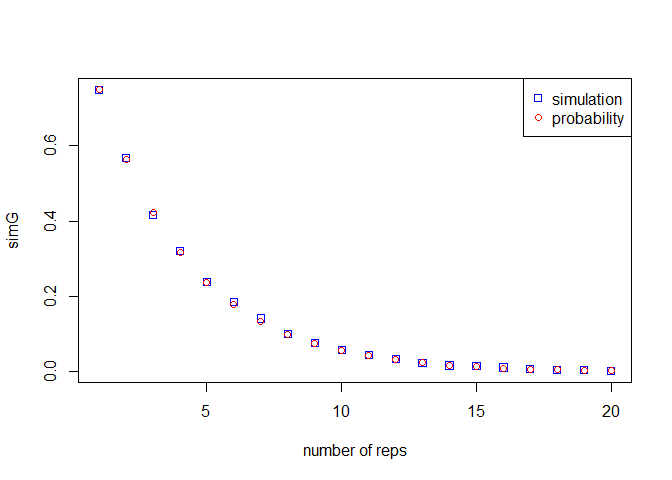
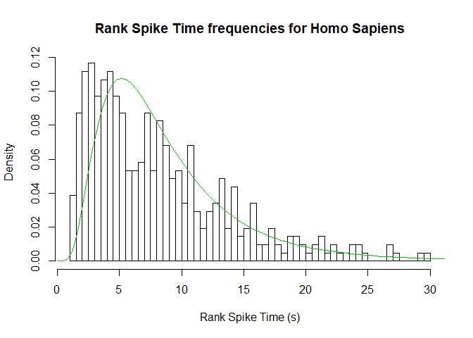

Assignment 1
================

# 1 Blood types genetics

### Ex 1.1

 =
{I<sup>A</sup>, I<sup>A</sup>i, I<sup>B</sup>I<sup>B</sup>,
I<sup>B</sup>i, I<sup>A</sup>I<sup>B</sup>, ii}

### Ex 1.2

P(ii) = 0.25  
P(I<sup>A</sup>i, ii) = 0.75

### Ex 1.3

P(C = I<sup>A</sup>I<sup>B</sup>) = 0.25

### Ex 1.4

Phenotypes: AB, A, B  
Distribution: AB = 0.25; A = 0.375; B = 0.375

### Ex 1.5

P(I<sup>B</sup>i, I<sup>B</sup>I<sup>B</sup> | B =
I<sup>A</sup>I<sup>B</sup>) = 0.375

## 1.1 Some simulation in R

### Ex 2.1

``` r
sample(c("ii", "iB", "iA", "BB", "AA", "AB"), size = 1, replace = TRUE)
```

### Ex 2.2

``` r
offspringG <- function(Parent1, Parent2){
  Allele1 <- sample(unlist(strsplit(Parent1, split = "")), replace = TRUE, size=1)
  Allele2 <- sample(unlist(strsplit(Parent2, split = "")), replace = TRUE, size=1)
  return(paste(Allele1, Allele2, sep = ""))
}


offspringP <- function(Genotype){
  Phenotype <- ""
  if (Genotype == "ii"){
    Phenotype <- "Type O"
  }
  if (Genotype == "AB" | Genotype == "BA"){
    Phenotype <- "Type AB"
  }
  if (Genotype == "iB" | Genotype == "Bi" | Genotype == "BB"){
    Phenotype <- "Type B"
  }
  if (Genotype == "iA" | Genotype == "Ai" | Genotype == "AA"){
    Phenotype <- "Type A"
  }
  return(Phenotype)
}
```

### Ex 2.3

``` r
offspingiAiA <- c()
for(i in 1:1000){
  offspingiAiA[i] <- offspringG("iA", "iA")
}
sum(offspingiAiA == "ii")/length(offspingiAiA)
```

    ## [1] 0.241

``` r
sum(offspingiAiA != "AA")/length(offspingiAiA)
```

    ## [1] 0.743

### Ex 2.4

``` r
secondGen <- c()

for(i in 1:1000){
  A <- offspringG("iA", "iB")
  B <- offspringG("AB", "AB")
  C <- offspringP(offspringG(A, B))
  secondGen[i] <- C
}

secondGen
```

    ##    [1] "Type A"  "Type A"  "Type A"  "Type B"  "Type B"  "Type B"  "Type AB"
    ##    [8] "Type A"  "Type A"  "Type B"  "Type A"  "Type A"  "Type B"  "Type AB"
    ##   [15] "Type B"  "Type AB" "Type A"  "Type A"  "Type A"  "Type AB" "Type AB"
    ##   [22] "Type A"  "Type A"  "Type B"  "Type AB" "Type AB" "Type B"  "Type A" 
    ##   [29] "Type AB" "Type A"  "Type B"  "Type B"  "Type A"  "Type B"  "Type A" 
    ##   [36] "Type AB" "Type B"  "Type A"  "Type A"  "Type B"  "Type AB" "Type A" 
    ##   [43] "Type A"  "Type B"  "Type B"  "Type AB" "Type B"  "Type AB" "Type AB"
    ##   [50] "Type AB" "Type B"  "Type AB" "Type A"  "Type B"  "Type A"  "Type B" 
    ##   [57] "Type B"  "Type B"  "Type B"  "Type B"  "Type B"  "Type A"  "Type AB"
    ##   [64] "Type B"  "Type AB" "Type A"  "Type B"  "Type B"  "Type AB" "Type A" 
    ##   [71] "Type AB" "Type A"  "Type A"  "Type AB" "Type AB" "Type AB" "Type A" 
    ##   [78] "Type A"  "Type AB" "Type A"  "Type B"  "Type A"  "Type A"  "Type A" 
    ##   [85] "Type B"  "Type B"  "Type B"  "Type B"  "Type A"  "Type AB" "Type A" 
    ##   [92] "Type B"  "Type A"  "Type B"  "Type A"  "Type A"  "Type A"  "Type AB"
    ##   [99] "Type B"  "Type B"  "Type B"  "Type A"  "Type A"  "Type A"  "Type B" 
    ##  [106] "Type A"  "Type B"  "Type B"  "Type A"  "Type AB" "Type A"  "Type A" 
    ##  [113] "Type A"  "Type B"  "Type AB" "Type B"  "Type A"  "Type B"  "Type A" 
    ##  [120] "Type B"  "Type B"  "Type AB" "Type B"  "Type A"  "Type B"  "Type A" 
    ##  [127] "Type A"  "Type AB" "Type AB" "Type B"  "Type B"  "Type A"  "Type A" 
    ##  [134] "Type AB" "Type A"  "Type A"  "Type AB" "Type AB" "Type B"  "Type AB"
    ##  [141] "Type B"  "Type B"  "Type A"  "Type A"  "Type A"  "Type B"  "Type A" 
    ##  [148] "Type A"  "Type B"  "Type A"  "Type AB" "Type B"  "Type A"  "Type A" 
    ##  [155] "Type A"  "Type B"  "Type A"  "Type A"  "Type AB" "Type B"  "Type B" 
    ##  [162] "Type A"  "Type A"  "Type B"  "Type AB" "Type AB" "Type AB" "Type A" 
    ##  [169] "Type A"  "Type B"  "Type A"  "Type AB" "Type AB" "Type B"  "Type A" 
    ##  [176] "Type A"  "Type B"  "Type A"  "Type B"  "Type AB" "Type B"  "Type AB"
    ##  [183] "Type B"  "Type B"  "Type B"  "Type B"  "Type AB" "Type A"  "Type AB"
    ##  [190] "Type AB" "Type A"  "Type AB" "Type B"  "Type B"  "Type B"  "Type B" 
    ##  [197] "Type B"  "Type B"  "Type A"  "Type A"  "Type AB" "Type AB" "Type AB"
    ##  [204] "Type AB" "Type B"  "Type A"  "Type A"  "Type B"  "Type A"  "Type AB"
    ##  [211] "Type B"  "Type B"  "Type A"  "Type B"  "Type B"  "Type AB" "Type A" 
    ##  [218] "Type A"  "Type B"  "Type B"  "Type A"  "Type B"  "Type AB" "Type A" 
    ##  [225] "Type A"  "Type AB" "Type B"  "Type A"  "Type AB" "Type AB" "Type A" 
    ##  [232] "Type AB" "Type A"  "Type AB" "Type B"  "Type B"  "Type A"  "Type AB"
    ##  [239] "Type A"  "Type B"  "Type A"  "Type A"  "Type B"  "Type B"  "Type B" 
    ##  [246] "Type AB" "Type B"  "Type AB" "Type B"  "Type AB" "Type A"  "Type B" 
    ##  [253] "Type A"  "Type A"  "Type A"  "Type A"  "Type AB" "Type B"  "Type AB"
    ##  [260] "Type A"  "Type AB" "Type B"  "Type AB" "Type A"  "Type A"  "Type A" 
    ##  [267] "Type A"  "Type B"  "Type B"  "Type A"  "Type AB" "Type B"  "Type B" 
    ##  [274] "Type A"  "Type B"  "Type B"  "Type AB" "Type A"  "Type AB" "Type B" 
    ##  [281] "Type B"  "Type AB" "Type A"  "Type B"  "Type A"  "Type A"  "Type A" 
    ##  [288] "Type B"  "Type A"  "Type AB" "Type AB" "Type AB" "Type A"  "Type A" 
    ##  [295] "Type A"  "Type A"  "Type AB" "Type A"  "Type A"  "Type A"  "Type A" 
    ##  [302] "Type A"  "Type AB" "Type A"  "Type AB" "Type A"  "Type A"  "Type A" 
    ##  [309] "Type B"  "Type B"  "Type B"  "Type A"  "Type AB" "Type AB" "Type A" 
    ##  [316] "Type B"  "Type B"  "Type AB" "Type A"  "Type B"  "Type A"  "Type A" 
    ##  [323] "Type B"  "Type A"  "Type B"  "Type AB" "Type A"  "Type B"  "Type A" 
    ##  [330] "Type A"  "Type A"  "Type B"  "Type B"  "Type A"  "Type AB" "Type AB"
    ##  [337] "Type B"  "Type A"  "Type B"  "Type AB" "Type A"  "Type A"  "Type A" 
    ##  [344] "Type A"  "Type A"  "Type B"  "Type B"  "Type A"  "Type A"  "Type A" 
    ##  [351] "Type B"  "Type AB" "Type AB" "Type A"  "Type B"  "Type B"  "Type A" 
    ##  [358] "Type A"  "Type B"  "Type B"  "Type B"  "Type B"  "Type B"  "Type AB"
    ##  [365] "Type AB" "Type B"  "Type AB" "Type AB" "Type A"  "Type B"  "Type AB"
    ##  [372] "Type AB" "Type A"  "Type A"  "Type AB" "Type B"  "Type AB" "Type B" 
    ##  [379] "Type B"  "Type B"  "Type A"  "Type B"  "Type B"  "Type AB" "Type B" 
    ##  [386] "Type A"  "Type B"  "Type AB" "Type B"  "Type A"  "Type B"  "Type A" 
    ##  [393] "Type B"  "Type B"  "Type A"  "Type A"  "Type A"  "Type A"  "Type B" 
    ##  [400] "Type B"  "Type A"  "Type A"  "Type AB" "Type A"  "Type A"  "Type B" 
    ##  [407] "Type A"  "Type B"  "Type A"  "Type AB" "Type A"  "Type AB" "Type A" 
    ##  [414] "Type AB" "Type A"  "Type A"  "Type B"  "Type B"  "Type AB" "Type AB"
    ##  [421] "Type B"  "Type AB" "Type B"  "Type A"  "Type AB" "Type B"  "Type AB"
    ##  [428] "Type AB" "Type A"  "Type B"  "Type B"  "Type B"  "Type A"  "Type B" 
    ##  [435] "Type A"  "Type B"  "Type B"  "Type AB" "Type B"  "Type AB" "Type B" 
    ##  [442] "Type AB" "Type B"  "Type B"  "Type B"  "Type B"  "Type AB" "Type A" 
    ##  [449] "Type B"  "Type AB" "Type AB" "Type AB" "Type AB" "Type B"  "Type B" 
    ##  [456] "Type A"  "Type A"  "Type B"  "Type AB" "Type AB" "Type B"  "Type B" 
    ##  [463] "Type B"  "Type A"  "Type B"  "Type A"  "Type A"  "Type AB" "Type A" 
    ##  [470] "Type B"  "Type A"  "Type A"  "Type B"  "Type A"  "Type AB" "Type A" 
    ##  [477] "Type AB" "Type A"  "Type A"  "Type B"  "Type AB" "Type A"  "Type B" 
    ##  [484] "Type A"  "Type A"  "Type B"  "Type B"  "Type A"  "Type B"  "Type AB"
    ##  [491] "Type A"  "Type A"  "Type B"  "Type B"  "Type B"  "Type AB" "Type A" 
    ##  [498] "Type AB" "Type B"  "Type B"  "Type B"  "Type B"  "Type AB" "Type A" 
    ##  [505] "Type AB" "Type B"  "Type A"  "Type AB" "Type A"  "Type A"  "Type B" 
    ##  [512] "Type B"  "Type B"  "Type AB" "Type B"  "Type A"  "Type B"  "Type AB"
    ##  [519] "Type A"  "Type A"  "Type AB" "Type AB" "Type B"  "Type B"  "Type A" 
    ##  [526] "Type A"  "Type AB" "Type AB" "Type B"  "Type B"  "Type A"  "Type A" 
    ##  [533] "Type AB" "Type B"  "Type AB" "Type A"  "Type A"  "Type A"  "Type B" 
    ##  [540] "Type B"  "Type B"  "Type AB" "Type B"  "Type AB" "Type A"  "Type B" 
    ##  [547] "Type B"  "Type A"  "Type A"  "Type A"  "Type A"  "Type AB" "Type B" 
    ##  [554] "Type AB" "Type AB" "Type B"  "Type B"  "Type AB" "Type A"  "Type A" 
    ##  [561] "Type A"  "Type AB" "Type AB" "Type A"  "Type B"  "Type B"  "Type B" 
    ##  [568] "Type AB" "Type A"  "Type A"  "Type B"  "Type AB" "Type A"  "Type AB"
    ##  [575] "Type B"  "Type A"  "Type A"  "Type B"  "Type B"  "Type AB" "Type A" 
    ##  [582] "Type A"  "Type A"  "Type B"  "Type B"  "Type A"  "Type B"  "Type B" 
    ##  [589] "Type B"  "Type B"  "Type B"  "Type AB" "Type AB" "Type A"  "Type B" 
    ##  [596] "Type A"  "Type A"  "Type B"  "Type B"  "Type B"  "Type B"  "Type A" 
    ##  [603] "Type AB" "Type B"  "Type A"  "Type AB" "Type A"  "Type B"  "Type A" 
    ##  [610] "Type AB" "Type A"  "Type AB" "Type B"  "Type B"  "Type A"  "Type B" 
    ##  [617] "Type B"  "Type B"  "Type A"  "Type A"  "Type B"  "Type B"  "Type AB"
    ##  [624] "Type AB" "Type B"  "Type A"  "Type AB" "Type AB" "Type B"  "Type AB"
    ##  [631] "Type B"  "Type AB" "Type AB" "Type A"  "Type AB" "Type AB" "Type B" 
    ##  [638] "Type B"  "Type AB" "Type A"  "Type B"  "Type AB" "Type B"  "Type A" 
    ##  [645] "Type A"  "Type A"  "Type AB" "Type AB" "Type A"  "Type A"  "Type B" 
    ##  [652] "Type A"  "Type B"  "Type A"  "Type A"  "Type AB" "Type A"  "Type B" 
    ##  [659] "Type AB" "Type A"  "Type A"  "Type A"  "Type A"  "Type AB" "Type A" 
    ##  [666] "Type B"  "Type B"  "Type A"  "Type B"  "Type A"  "Type A"  "Type A" 
    ##  [673] "Type B"  "Type B"  "Type B"  "Type A"  "Type B"  "Type B"  "Type A" 
    ##  [680] "Type A"  "Type A"  "Type B"  "Type B"  "Type A"  "Type A"  "Type B" 
    ##  [687] "Type AB" "Type B"  "Type AB" "Type A"  "Type AB" "Type B"  "Type A" 
    ##  [694] "Type B"  "Type AB" "Type A"  "Type B"  "Type AB" "Type AB" "Type A" 
    ##  [701] "Type B"  "Type B"  "Type A"  "Type A"  "Type B"  "Type A"  "Type B" 
    ##  [708] "Type A"  "Type A"  "Type B"  "Type B"  "Type B"  "Type B"  "Type B" 
    ##  [715] "Type AB" "Type B"  "Type A"  "Type B"  "Type B"  "Type B"  "Type AB"
    ##  [722] "Type B"  "Type A"  "Type AB" "Type B"  "Type A"  "Type B"  "Type A" 
    ##  [729] "Type B"  "Type B"  "Type A"  "Type A"  "Type A"  "Type A"  "Type A" 
    ##  [736] "Type A"  "Type AB" "Type A"  "Type A"  "Type B"  "Type AB" "Type B" 
    ##  [743] "Type A"  "Type A"  "Type AB" "Type A"  "Type B"  "Type B"  "Type A" 
    ##  [750] "Type AB" "Type B"  "Type A"  "Type AB" "Type AB" "Type A"  "Type AB"
    ##  [757] "Type AB" "Type A"  "Type AB" "Type AB" "Type B"  "Type AB" "Type B" 
    ##  [764] "Type AB" "Type A"  "Type A"  "Type B"  "Type A"  "Type A"  "Type B" 
    ##  [771] "Type B"  "Type B"  "Type B"  "Type B"  "Type AB" "Type B"  "Type B" 
    ##  [778] "Type A"  "Type A"  "Type B"  "Type A"  "Type A"  "Type AB" "Type A" 
    ##  [785] "Type AB" "Type A"  "Type B"  "Type B"  "Type A"  "Type AB" "Type B" 
    ##  [792] "Type B"  "Type B"  "Type B"  "Type B"  "Type B"  "Type B"  "Type A" 
    ##  [799] "Type A"  "Type B"  "Type AB" "Type B"  "Type A"  "Type B"  "Type B" 
    ##  [806] "Type AB" "Type AB" "Type AB" "Type A"  "Type B"  "Type A"  "Type A" 
    ##  [813] "Type AB" "Type A"  "Type AB" "Type AB" "Type B"  "Type AB" "Type B" 
    ##  [820] "Type B"  "Type B"  "Type AB" "Type A"  "Type A"  "Type A"  "Type A" 
    ##  [827] "Type AB" "Type AB" "Type A"  "Type AB" "Type AB" "Type AB" "Type AB"
    ##  [834] "Type AB" "Type B"  "Type A"  "Type B"  "Type B"  "Type AB" "Type A" 
    ##  [841] "Type A"  "Type A"  "Type A"  "Type A"  "Type A"  "Type AB" "Type A" 
    ##  [848] "Type B"  "Type B"  "Type AB" "Type B"  "Type B"  "Type AB" "Type A" 
    ##  [855] "Type A"  "Type A"  "Type B"  "Type A"  "Type B"  "Type B"  "Type A" 
    ##  [862] "Type B"  "Type A"  "Type AB" "Type A"  "Type B"  "Type B"  "Type B" 
    ##  [869] "Type B"  "Type A"  "Type A"  "Type A"  "Type A"  "Type A"  "Type B" 
    ##  [876] "Type B"  "Type A"  "Type AB" "Type B"  "Type AB" "Type A"  "Type A" 
    ##  [883] "Type A"  "Type AB" "Type AB" "Type AB" "Type AB" "Type AB" "Type B" 
    ##  [890] "Type AB" "Type B"  "Type AB" "Type AB" "Type A"  "Type A"  "Type B" 
    ##  [897] "Type AB" "Type A"  "Type A"  "Type A"  "Type A"  "Type A"  "Type AB"
    ##  [904] "Type A"  "Type B"  "Type A"  "Type A"  "Type B"  "Type A"  "Type B" 
    ##  [911] "Type A"  "Type B"  "Type AB" "Type A"  "Type A"  "Type A"  "Type A" 
    ##  [918] "Type A"  "Type A"  "Type A"  "Type A"  "Type B"  "Type AB" "Type B" 
    ##  [925] "Type A"  "Type AB" "Type B"  "Type B"  "Type B"  "Type A"  "Type AB"
    ##  [932] "Type AB" "Type A"  "Type B"  "Type B"  "Type A"  "Type AB" "Type AB"
    ##  [939] "Type A"  "Type AB" "Type B"  "Type B"  "Type A"  "Type A"  "Type AB"
    ##  [946] "Type A"  "Type B"  "Type B"  "Type B"  "Type B"  "Type A"  "Type A" 
    ##  [953] "Type A"  "Type A"  "Type B"  "Type A"  "Type B"  "Type A"  "Type A" 
    ##  [960] "Type B"  "Type B"  "Type AB" "Type B"  "Type B"  "Type B"  "Type B" 
    ##  [967] "Type A"  "Type A"  "Type AB" "Type AB" "Type A"  "Type A"  "Type B" 
    ##  [974] "Type AB" "Type AB" "Type AB" "Type B"  "Type B"  "Type B"  "Type B" 
    ##  [981] "Type B"  "Type AB" "Type AB" "Type B"  "Type B"  "Type AB" "Type B" 
    ##  [988] "Type A"  "Type A"  "Type B"  "Type AB" "Type AB" "Type B"  "Type A" 
    ##  [995] "Type A"  "Type AB" "Type A"  "Type AB" "Type A"  "Type A"

# 2 A case study of DNA sequence

### Ex 3.1

 =
{AA, AT, AC, AG, TA, TT, TC, TG, CA, CT, CC, CG, GA, GT, GC, GG}

### Ex 3.2

P(ACG) = (0.25  0.25  0.25)
 3 =
0.047

### Ex 3.3

 =
{Ø, A, T, C, AA, AT, AC, AAA, …}  
P(length 10 G<sup>C</sup>) = (0.75)<sup>10</sup> = 0.05

### Ex 3.4

1: P(CG|C) = 0.5
 0.1
= 0.05  
2: P(CG|C) = 0.3
 0.4
= 0.12

## 2.1 Some simulations in R

### Ex 4.1

``` r
ACGsim <- function(reps){
  count = 0
  
  for(i in 1:reps){
    sqce_5 <- paste(sample(c("A", "T", "G", "C"), replace = TRUE, size = 5), collapse = "")
    
    if(grepl("ACG", sqce_5, fixed = TRUE)){
      count <- count + 1
    }
  }
  return(count/reps)
}
ACGsim(10000)
```

    ## [1] 0.0437

### Ex 4.2

``` r
Gsim <- function(reps, length = 10){
  sqces_with_G <- 0
  for(i in 1:reps){
    seq <- sample(c("A", "C", "T", "G"), replace =TRUE, size = length)
    if ("G" %in% seq){
      sqces_with_G <- sqces_with_G + 1
    }
  }
  sqces_with_no_G <- reps - sqces_with_G
  return(sqces_with_no_G/reps)
}

Gsim(10000)
```

    ## [1] 0.057

### Ex 4.3

``` r
simG <- c()
pG <- c()
for(i in 1:20){
  simG[i] <- Gsim(10000, length = i)
  pG[i] <- dbinom(i, size = i, prob = 0.75)
}

plot(1:20, simG, col = "blue", pch = 0, xlab = "number of reps")
points(1:20, pG, col = "red", pch = 1)
legend("topright",legend = c("simulation", "probability"), 
       col = c("blue", "red"), pch = c(0, 1))
```

<!-- -->

# 3 A case study of neuronal data

### Ex 5.1 and 5.2

``` r
isidata <- read.table("neuronspikes.txt", col.names = "isi")
hist(isidata$isi, breaks = 50, probability = TRUE)

for(i in seq(0.5, 1.5, 0.1)){
  curve(dexp((x), rate = i), from = 0, to = 5, col= (i*10)-3, add = TRUE)
}

legend("topright", legend=c(seq(0.5,1.5,0.1)), 
       col=c(2:length(seq(0.5,1.5,0.1))), lty = 1)
```

<!-- -->

A 
value of 1.5 fits the data the best.

### Ex 5.3

``` r
pexp(1, rate = 1.5)
```

    ## [1] 0.7768698

``` r
pexp(1.5, rate = 1.5) - pexp(0.5, rate = 1.5)
```

    ## [1] 0.3669673

# 4 Brain cell database

### Ex 6.1

The option na.strings converts empty strings to NA values.

### Ex 6.2

The donor species column indicates which values are humans and which are
mice.

``` r
sum(cells$donor__species == "Homo Sapiens") / length(cells[,1])
```

    ## [1] 0.1770253

### Ex 6.3

``` r
hist(cells$ef__peak_t_ramp[cells$donor__species == "Homo Sapiens"], 
     proba = TRUE,  xlab = "Rank Spike Time (s)", 
     breaks = 50, main = "Rank Spike Time frequencies for Homo Sapiens")
```

<!-- -->

``` r
hist(cells$ef__peak_t_ramp[cells$donor__species == "Mus musculus"], 
     proba = TRUE, xlab = "Rank Spike Time (s)", 
     breaks = 50, main = "Rank Spike Time frequencies for Mus musculus")
```

<!-- -->

### Ex 6.4

``` r
first_plot = FALSE

for(i in 1:3){
  curve(dlnorm(x, sdlog = 0.6, meanlog = i), from = 0, to = 40, 
        add = first_plot, col = i+1, ylab = "log density function")
  first_plot = TRUE
}

legend("topright", legend = 1:3, col = 2:4, lty = 1)
```

<!-- -->

### Ex 6.5

**meanlog = 2** is best, based on the fit of the corresponding density
function in the plot.

### Ex 6.6

``` r
hist(cells$ef__peak_t_ramp[cells$donor__species == "Homo Sapiens"], 
     proba = TRUE,  xlab = "Rank Spike Time (s)", 
     breaks = 50, main = "Rank Spike Time frequencies for Homo Sapiens")

curve(dlnorm(x, sdlog = 0.6, meanlog = 2), 
      from = 0, to = 40, add = TRUE, 
      col = 3, ylab = "log density function")
```

<!-- -->

Yes, the density fits the
data.

### Ex 6.7

``` r
sum(cells$donor__species == "Homo Sapiens" & cells$donor__sex == "Male")
```

    ## [1] 234

``` r
sum(cells$donor__species == "Homo Sapiens" & cells$donor__sex == "Female")
```

    ## [1] 179
