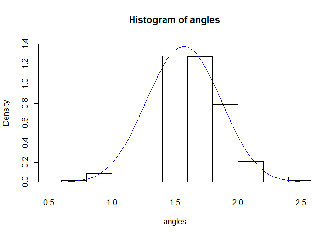
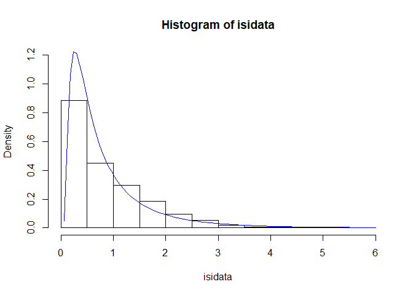
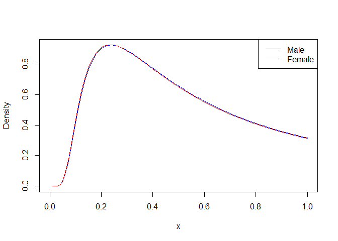
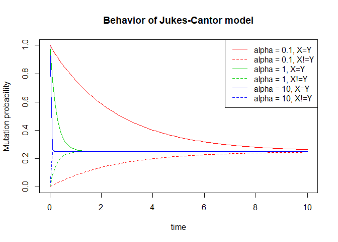

Assignment 3
================

\#1 A Trignonometric Density \#\#\#Ex 1.0 How can you compute the
normalization of
?

  
 = C_{k}sin(x)^{k}")  
  
}{sin(x)^{k}} ")  

We can use this equation to caclulate the value of
. But
to solve this equation, we need to find the value of
")
first.

We know that ") is porportional to the probability densiy of
^{k}"), which just means
") is
a probability of
^{k}"). In order to calculate the probability of something, we
just need to divide it by the total number of possibilities, which in
this case is the area under the curve
^{k}"). Therefore:

  
 = \\frac{sin(x)^{k}}{\\int_0^\\pi\\!sin(x)^{k} dx} ")  

We can substitute this value into our previous equation for
 to
get:

  
^{k}}{\\int_0^\\pi\\!sin(x)^{k} dx}}{sin(x)^{k}} ")  
  
^{k} dx} ")  

\#\#\#Ex 1.1 The model is parametric? Which are the parameters of the
model?

Yes, the model is parametric. It has one parameter which is
.

### Ex 1.2 Write the minus log-likelihood function of the model and implement it in an R function.

The minus log likelihood function is:   
 = -\\sum_{i=1}^nlog\\frac{sin(X_{i})^{k}}{\\int_0^\\pi\\!sin(x)^{k} dx}")  

The R implementation of this minus log likelihood function:

``` r
dSinK <- function(x, k = 1, lg = FALSE) {
  #returns a vector of sinx^k or log(sin^k)
  sinintegral <- integrate(function(x) sin(x) ^ k, lower = 0, upper = pi)$value
  if (lg == FALSE) {
    return(sin(x) ^ k / sinintegral)
  }
  else{
    return(log(sin(x) ^ k / sinintegral))
  }
}

dSinKMLL <- function(k, xvals) {
  return(-sum(dSinK(xvals, k, lg=TRUE)))
}
```

\#\#\#Ex 1.3 Use numerical optimization method to find the maximum
likelihood estimator.

``` r
optimize(f = dSinKMLL, xvals = angles, interval = c(0, 50))
```

    ## $minimum
    ## [1] 11.40039
    ## 
    ## $objective
    ## [1] 158.3675

\#\#\#Ex 1.4 Plot the histogram of the data and the density
corresponding to the MLE.

``` r
hist(
  angles,
  xlim = c(0.5, 2.5),
  ylim = c(0, 1.4),
  probability = TRUE
)
minK <- optimize(f = dSinKMLL, xvals = angles, interval = c(0, 50))$minimum
curve(dSinK(x, k = minK), add = TRUE, col = "blue")
```

<!-- -->

\#2 A case study of neuronal data \#\#\#Ex 2.1 If we assume the ISI
observations are i.i.d. following an exponential distribution with
parameter . Compute the maximum likelihood estimate of
.

If we assume the ISI data follows an exponential distribution with
parameter , then
") is given by the following equation:   
 = nlog(\\lambda)-\\lambda\\sum_{i=1}^nX_i")  
The first derivative of
") is given by the following equation:   
 = \\frac{n}{\\lambda}-\\sum_{i=1}^{n}X_i")  
We know that the maximum value of

will occur when  = 0"). Therefore:   
  
  
  
  
  
  
  

``` r
ISImean <- mean(isidata)
lambda <- 1/ISImean
```

    ## [1] "Lambda = 1.14689142797908"

\#\#\#Ex 2.2 Assume now that the ISI observations are i.i.d. following a
gamma distribution with parameters

(shape) and  (rate), find the MLE estimates of the parameters
 and
.

``` r
gammaMLH <- function(parameters, xvals){
  return(-sum(dgamma(xvals, shape = parameters[1], rate = parameters[2], log = TRUE)))
}

parametersGamma <- optim(par = c(1, 1), fn = gammaMLH, xvals = isidata)$par
```

    ## [1] "Alpha = 1.56231848686039"

    ## [1] "Beta = 1.79165490720006"

\#\#\#Ex 2.3 Try to find the method of moments estimator of
 and
. The
method of moments can be used to find the first estimation to initialize
the MLE iterative algorithm. We know that:   
=\\frac{\\alpha}{\\beta}\\ \\text{and} \\ V(X)=\\frac{\\alpha}{\\beta^2}")  
Therefore:
  
=\\frac{\\alpha}{\\beta}\\times\\frac{1}{\\beta}")  
  
=E(X)\\times\\frac{1}{\\beta}")  
  
/V(X)")  
We can caclulate the value of
 by
subsituting this value of
 into
the equation for "):   
\\times\\beta")  

``` r
beta_estimator <- mean(isidata)/var(isidata)
```

    ## [1] 1.472556

``` r
alpha_estimator <- mean(isidata)*beta_estimator
```

    ## [1] 1.283954

\#\#Ex 3 \#\#\#Ex 3.1 Write (analytically) the formula for the
log-likelihood given n i.i.d. observations.   
=\\frac{\\lambda}{2\\pi x^3}exp(\\frac{-\\lambda(x-\\mu)^2}{2\\mu^2x})")  
  
=\\prod_{i=1}^n(\\frac{\\lambda}{2\\pi X_i^3})^\\frac{1}{2}exp(\\frac{-\\lambda(x-\\mu)^2}{2\\mu^2x})")  
  
=\\sum_{i=1}^nln(\\frac{\\lambda}{2\\pi X_i^3})^\\frac{1}{2}+\\sum_{i=1}^nln(exp(\\frac{-\\lambda(x-\\mu)^2}{2\\mu^2x}))")  
  
=\\sum_{i=1}^nln\\lambda^\\frac{1}{2}-\\sum_{i=1}^nln2\\pi X_i^3+\\sum_{i=1}^n\\frac{-\\lambda(x-\\mu)^2}{2\\mu^2x}")  
  
=\\frac{n}{2}ln\\lambda-\\sum_{i=1}^nln2\\pi X_i^3+\\frac{\\lambda}{2}\\sum_{i=1}^n\\frac{(X_i-\\mu)^2}{\\mu^2X_i}")  

\#\#\#Ex 3.2 Try to derive the formula for the maximum likelihood
estimators for  and 

\#\#\#Ex 3.3 Apply the MLE estimators in the previous step to the
experimental ISI data, that is calculate the theoretical estimates of
 and

for the ISI data.

\#\#\#Ex3.4 Find the maximum likelihood estimators using numerical
methods.

``` r
dInvNorm <- function(x, mu, lambda, lg = FALSE){
  if(lg == TRUE){
    return(log(sqrt(lambda/(2*pi*(x^3)))*exp(-lambda*((x-mu)^2)/(2*(mu^2)*x))))
  }
  else{
    return(sqrt(lambda/(2*pi*(x^3)))*exp(-lambda*((x-mu)^2)/(2*(mu^2)*x)))
  }
}

invNormMLH <- function(parameters, xvals){
  return(-sum(dInvNorm(xvals, mu=parameters[1], lambda = parameters[2], lg = TRUE)))
}

parametersinvNorm <- optim(par = c(1, 1), fn = invNormMLH, xvals = isidata)$par
```

    ## [1] "Mu =  0.871873219725603"

    ## [1] "Lambda = 0.867973616707968"

\#Ex 3.5 Plot the estimated inverse Gaussian density on top of the
histogram of the ISI data and with the kernel density estimation.

``` r
hist(
  isidata,
  xlim = c(0, 6),
  ylim = c(0, 1.2),
  probability = TRUE
)
curve(dInvNorm(x, parametersinvNorm[1], parametersinvNorm[2]), col = "blue", add = TRUE)
```

<!-- -->

\#3 Brain cell dataset \#\#\#Ex 4.1 Find numerically the MLE estimates
of the parameters of the log-normal distribution for the ramp spike time
observations.

``` r
dlnormMLL <- function(parameters, xvals){
  return(-sum(dlnorm(xvals, meanlog = parameters[1], sdlog = parameters[2], log = TRUE)))
}

parametersDlnorm <- optim(par = c(1, 1), fn = dlnormMLL, xvals = rampSpike)$par
```

    ## [1] "Meanlog =  1.66883532639348"

    ## [1] "SDlog =  0.605661842011454"

\#\#\#Ex 4.2 Transform the ramp spike time observations using the
logarithm and then obtain the MLE of the parameters for a Gaussian
distribution using the transformed data. Check that the results you
obtain are equal to the MLE estimates obtained numerically in point 4.1.

``` r
logRampSpike <- log(rampSpike)

dnormMLL <- function(parameters, xvals){
  return(-sum(dnorm(xvals, mean = parameters[1], sd = parameters[2], log = TRUE)))
}

parametersDnorm <- optim(par = c(1, 1), fn = dnormMLL, xvals = logRampSpike)$par
```

    ## [1] "Mean =  1.66895647611618"

    ## [1] "SD = 0.605623564290239"

\#\#\#Ex 4.3 Find now the MLE estimates for the parameters of the
log-normal distribution using only the male human observations and the
female human observations. Plot the two obtained log-normal densities in
the same plot.

``` r
parametersDlnormMale <- optim(par = c(1, 1), fn = dlnormMLL, 
                              xvals = maleRampSpike)$par
parametersDlnormFemale <- optim(par = c(1, 1), fn = dlnormMLL, 
                                xvals = femaleRampSpike)$par

curve(dInvNorm(x, parametersDlnormMale[1], parametersDlnormMale[2]), 
      col = "blue", ylab = "Density")
curve(dInvNorm(x, parametersDlnormFemale[1], parametersDlnormFemale[2]), 
      col = "red", add = TRUE)
legend("topright",legend = c("Male", "Female"), col = c("blue", "red"), lty = c(1, 1))
```

<!-- -->

\#4 Molecular evolution, Jukes-Cantor model \#\#\#Ex 5.1

``` r
JKprob <- function(X, Y, alpha, t=1000){
  if(X==Y){
    return(0.25+0.75*exp(-4*alpha*t))
  }
  else{
    return(0.25-0.25*exp(-4*alpha*t))
  }
}

plot(
  1,  type = "n",  xlab = "time",  xlim = c(0, 10),  ylim = c(0, 1),
  ylab = "Mutation probability",
  main = "Behavior of Jukes-Cantor model"
)
for (i in-1:1) {
  curve(
    JKprob(X = "A", Y = "A", alpha = 10 ^ i, t=x),
    from = 0, to = 10, add = TRUE, col = i + 3, lty = 1
  )
  curve(
    JKprob(X = "A", Y = "C", alpha = 10 ^ i, t=x),
    from = 0, to = 10, add = TRUE, col = i + 3, lty = 2
  )
}
legend(
  "topright", col = rep(2:4, each=2), lty = rep(1:2, 3),
  legend = c(
    "alpha = 0.1, X=Y",
    "alpha = 0.1, X!=Y",
    "alpha = 1, X=Y",
    "alpha = 1, X!=Y",
    "alpha = 10, X=Y",
    "alpha = 10, X!=Y"
  )
)
```

<!-- -->

\#\#\#Ex 5.2 Write the log-likelihood function for the observations as a
function of . Our observations are
 pairs of i.i.d
nucleotides:   
,...,(X_n, Y_n)")  
Therefore our likelihood function should be:   
=\\prod_{i=1}^nP(X= X_i,Y=Y_i)")  
We know that the joint probability of observing ") is:
  
=P(Y=y|X=x)P(X=x)")  
And we assume all nucleotides have equal marginal probabilities, such
that:   
 = 0.25\\quad x\\in \\{A,T,C,G\\}")  
Therefore our likelihood function becomes:
  
=\\prod_{i=1}^nP(Y=Y_i|X=X_i)P(X=x)")  
  
=\\prod_{i=1}^n0.25P(Y=Y_i|X=X_i)")  
The Jukes-Cantor model tells us:   
=\\begin{cases}
  0.25 + 0.75 exp(-4\\alpha t),\\quad \\text{if } x = y \\\\
  0.25 - 0.25 exp(-4\\alpha t),\\quad \\text{if } x \\neq y
\\end{cases}")  
Since the Jukes-Cantor model only depends on whether  or not, let
 be the number of
times 
in our data and 
be the number of times  in our data. Therefore our likelihood function becomes:
  
=(0.25(0.25+0.75exp(-4\\alpha t)))^{n_1}(0.25(0.25-0.25exp(-4\\alpha t)))^{n_2}")  
  
=log((0.25(0.25+0.75exp(-4\\alpha t)))^{n_1}(0.25(0.25-0.25exp(-4\\alpha t)))^{n_2})")  
  
=log(0.25(0.25+0.75exp(-4\\alpha t)))^{n_1}+log(0.25(0.25-0.25exp(-4\\alpha t)))^{n_2})")  
  
=n_1log(0.25(0.25+0.75exp(-4\\alpha t))+n_2log(0.25(0.25-0.25exp(-4\\alpha t))")  

\#\#\#Ex 5.3 Try to find the theoretical maximum likelihood estimator
for .

\#\#\#Ex 5.4 Try to implement the Jukes-Cantor model in R:

``` r
#Implement probability function
distJK <- function(pair, alpha){
  A <- sapply(JK_pairs,function(x) x[1]) #select first element of each vector inside list
  B <- sapply(JK_pairs,function(x) x[2])#select second element (list of letters)
  n <- length(pair)
  n1 <- sum(A == B)
  n2 <- n - n1
  match <- n1*log(JKprob(X="X", Y="X", alpha=alpha)*0.25)
  mismatch <- n2*log(JKprob(X="X", Y="Y", alpha=alpha)*0.25)
  return(match+mismatch)
}

#Implement sampling procedure
simulate_JKpair <- function(start="A", alpha=1e-5, t = 1000){
  mutations <- rpois(1, lambda = 4*alpha*t)
  if(mutations == 0){
    end <- start
    return(c(start, end))
  } 
  else {
    for (i in 1:mutations){
      end <- sample(c("A", "C", "T", "G"), size = 1)
    }
  }
  return(c(start, end))
}

JK_pairs <- list()
for (i in 1:1000){
  JK_pairs[[i]] <- simulate_JKpair(t=1000) 
}

#Minus log likelihood function
distJKMLL <- function(alpha, xvals){
  return(-sum(distJK(xvals, alpha)))
}

#Solving numerically
optimize(f = distJKMLL, xvals = JK_pairs, interval = c(-100, 100))
```

    ## Warning in log(JKprob(X = "X", Y = "Y", alpha = alpha) * 0.25): NaNs produced

    ## Warning in optimize(f = distJKMLL, xvals = JK_pairs, interval = c(-100, : NA/Inf
    ## replaced by maximum positive value

    ## Warning in log(JKprob(X = "X", Y = "Y", alpha = alpha) * 0.25): NaNs produced

    ## Warning in optimize(f = distJKMLL, xvals = JK_pairs, interval = c(-100, : NA/Inf
    ## replaced by maximum positive value

    ## $minimum
    ## [1] 23.60665
    ## 
    ## $objective
    ## [1] 2772.589
