Assignment 5
================

# Ex 1 Simple linear regression

## Ex 1.1 Generate some data. Plot the observations in a scatter plot. Which one is the true regression function? Plot the true regression function in red in the same plot together with the observations.

  
 \\\\
Y | X=x & \\sim N\\left(a x+b, \\sigma_{2}^{2}\\right)
\\end{aligned}
")  

``` r
sigma = 1
sigma2 = 2
a = 2
b = 0
n = 50

x <- rnorm(n, mean = 0, sd = sigma)
y <- b + a * x + sigma2 * rnorm(n)

# or
x <- rnorm(n, mean = 0, sd = sigma)     # a = b1, b = b0, rnorm(50) = independent noise
y <- b + a * x + rnorm(n, sd = sigma2)                  
```

Or in a more fancy way

``` r
gen_xy <- function(n=50, a, b, sigma1 = 1, sigma2 = 2){
  x <- rnorm(n, mean = 0, sigma1)
  y <- b + a * x + rnorm(50, sd = sigma2)
  df <- data.frame("x" = x, "y" = y)
  return(df)
}

xy <- gen_xy(a = 2, b = 0)
plot(xy$x, xy$y, main = "Observation scatter plot", ylab = "y", xlab = "x")

a = 2
b = 0
curve(b + a * x , add = TRUE, col = "red")
legend("bottomright", legend = ("True regression function"), col = "red", lty = 1)
```

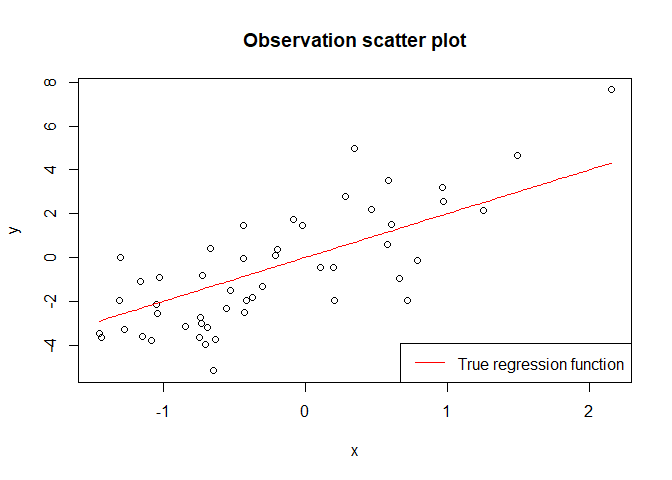<!-- -->

``` r
# In order to use the fit_and_plot function we need to return also a and b
gex_xy_ab <- function(n=50, a, b, sigma1 = 1, sigma2 = 2){
  x <- rnorm(n, mean = 0, sigma1)
  y <- b + a * x + rnorm(50, sd = sigma2)
  return(list(xy = data.frame("x" = x, "y" = y), a = a, b = b))
}
```

## 1.2 Fit now a linear regression using the lm function. Plot the fitted regression line on top of the previous plot using a different color.

``` r
plot(xy$x, xy$y, main = "Observation scatter plot", ylab = "y", xlab = "x")
curve(b + a * x , add = TRUE, col = "red")
  # or
abline(b, a, col = "green")

model <- lm(xy$y ~ xy$x)
abline(model, col = "blue")
legend("bottomright", legend = c("True regression function", "Fitted regression line"), 
       col = c("red", "blue"), lty = 1)
```

<!-- -->

## 1.3 Use the function summary to obtain informations on the cofficients of the model.

``` r
summary(model)  
```

    ## 
    ## Call:
    ## lm(formula = xy$y ~ xy$x)
    ## 
    ## Residuals:
    ##     Min      1Q  Median      3Q     Max 
    ## -3.7070 -1.4248 -0.1446  1.4727  4.1152 
    ## 
    ## Coefficients:
    ##             Estimate Std. Error t value Pr(>|t|)    
    ## (Intercept) -0.04939    0.27103  -0.182    0.856    
    ## xy$x         1.79068    0.26359   6.793 1.52e-08 ***
    ## ---
    ## Signif. codes:  0 '***' 0.001 '**' 0.01 '*' 0.05 '.' 0.1 ' ' 1
    ## 
    ## Residual standard error: 1.916 on 48 degrees of freedom
    ## Multiple R-squared:  0.4902, Adjusted R-squared:  0.4796 
    ## F-statistic: 46.15 on 1 and 48 DF,  p-value: 1.525e-08

## 1.4 Repeat from point 1.1 but setting the intercept b in the true model to 2. Check now if in the fitted linear regression we reject the null hypothesis, play with the standard deviation value and the sample size to see when we reject and not reject the null hypothesis that the intercept is equal to 0.

  
  

``` r
model_xy <- function(data){
  return(summary(lm(data$y ~ data$x)))
}
model_xy(gen_xy(n = 50, a = 2, b = 2, sigma2 = 2))  
```

    ## 
    ## Call:
    ## lm(formula = data$y ~ data$x)
    ## 
    ## Residuals:
    ##     Min      1Q  Median      3Q     Max 
    ## -4.7119 -1.1485  0.1079  0.9822  4.7216 
    ## 
    ## Coefficients:
    ##             Estimate Std. Error t value Pr(>|t|)    
    ## (Intercept)   1.8430     0.2876   6.409 5.94e-08 ***
    ## data$x        2.4793     0.2797   8.864 1.12e-11 ***
    ## ---
    ## Signif. codes:  0 '***' 0.001 '**' 0.01 '*' 0.05 '.' 0.1 ' ' 1
    ## 
    ## Residual standard error: 2.021 on 48 degrees of freedom
    ## Multiple R-squared:  0.6208, Adjusted R-squared:  0.6129 
    ## F-statistic: 78.58 on 1 and 48 DF,  p-value: 1.124e-11

``` r
model_xy(gen_xy(n = 50, a = 2, b = 2, sigma2 = 100))   
```

    ## 
    ## Call:
    ## lm(formula = data$y ~ data$x)
    ## 
    ## Residuals:
    ##      Min       1Q   Median       3Q      Max 
    ## -289.578  -28.767   -2.795   56.935  167.118 
    ## 
    ## Coefficients:
    ##             Estimate Std. Error t value Pr(>|t|)
    ## (Intercept)    1.205     11.313   0.106    0.916
    ## data$x        -7.490      9.464  -0.791    0.433
    ## 
    ## Residual standard error: 79.98 on 48 degrees of freedom
    ## Multiple R-squared:  0.01288,    Adjusted R-squared:  -0.007683 
    ## F-statistic: 0.6264 on 1 and 48 DF,  p-value: 0.4326

``` r
model_xy(gen_xy(n = 50000, a = 2, b = 2, sigma2 = 100))
```

    ## 
    ## Call:
    ## lm(formula = data$y ~ data$x)
    ## 
    ## Residuals:
    ##     Min      1Q  Median      3Q     Max 
    ## -240.92  -84.97   -2.30   74.23  368.15 
    ## 
    ## Coefficients:
    ##             Estimate Std. Error t value Pr(>|t|)    
    ## (Intercept)   -6.470      0.537 -12.048   <2e-16 ***
    ## data$x         1.275      0.537   2.374   0.0176 *  
    ## ---
    ## Signif. codes:  0 '***' 0.001 '**' 0.01 '*' 0.05 '.' 0.1 ' ' 1
    ## 
    ## Residual standard error: 120.1 on 49998 degrees of freedom
    ## Multiple R-squared:  0.0001127,  Adjusted R-squared:  9.274e-05 
    ## F-statistic: 5.637 on 1 and 49998 DF,  p-value: 0.01759

When :

If the standard deviation is small, the p-value  and we reject the null hypothesis;

If the standard deviation is large, the p-value  and we don’t reject the null hyphotesis;

If the standard deviation is large and the sample size is very large,
the p-value  and we reject the null hypothesis.

### We could do the same with a function that plot and fit the model

``` r
plot_and_fit <- function(data){
  temp_model <- lm(data$xy$y ~ data$xy$x, data = data$xy) # fit the model to data
  print(summary(temp_model))                              # print summary
  
  plot(data$xy)                                           # plot data
  abline(data$a, data$b, col = "red")                     # plot true regression f.
  abline(temp_model, col = "blue")                        # plot fitted regression f.
  legend("right", legend = c("true reg.", "fitted reg."),
         col = c("red", "blue"), lty = 1)

}

plot_and_fit(gex_xy_ab(n = 50, a = 2, b = 2, sigma2 = 2))
```

    ## 
    ## Call:
    ## lm(formula = data$xy$y ~ data$xy$x, data = data$xy)
    ## 
    ## Residuals:
    ##     Min      1Q  Median      3Q     Max 
    ## -4.8118 -1.3676  0.0673  1.2958  5.3918 
    ## 
    ## Coefficients:
    ##             Estimate Std. Error t value Pr(>|t|)    
    ## (Intercept)   1.7354     0.3004   5.777 5.49e-07 ***
    ## data$xy$x     1.8544     0.3807   4.872 1.25e-05 ***
    ## ---
    ## Signif. codes:  0 '***' 0.001 '**' 0.01 '*' 0.05 '.' 0.1 ' ' 1
    ## 
    ## Residual standard error: 2.124 on 48 degrees of freedom
    ## Multiple R-squared:  0.3308, Adjusted R-squared:  0.3169 
    ## F-statistic: 23.73 on 1 and 48 DF,  p-value: 1.247e-05

<!-- -->

``` r
plot_and_fit(gex_xy_ab(n = 50, a = 2, b = 2, sigma2 = 100))
```

    ## 
    ## Call:
    ## lm(formula = data$xy$y ~ data$xy$x, data = data$xy)
    ## 
    ## Residuals:
    ##      Min       1Q   Median       3Q      Max 
    ## -297.332  -55.166    2.618   66.728  228.829 
    ## 
    ## Coefficients:
    ##             Estimate Std. Error t value Pr(>|t|)
    ## (Intercept)    4.609     14.449   0.319    0.751
    ## data$xy$x     22.224     14.138   1.572    0.123
    ## 
    ## Residual standard error: 99.72 on 48 degrees of freedom
    ## Multiple R-squared:  0.04896,    Adjusted R-squared:  0.02914 
    ## F-statistic: 2.471 on 1 and 48 DF,  p-value: 0.1225

<!-- -->

``` r
plot_and_fit(gex_xy_ab(n = 50000, a = 2, b = 2, sigma2 = 100))
```

    ## 
    ## Call:
    ## lm(formula = data$xy$y ~ data$xy$x, data = data$xy)
    ## 
    ## Residuals:
    ##      Min       1Q   Median       3Q      Max 
    ## -221.872  -71.941   -3.879   67.305  268.946 
    ## 
    ## Coefficients:
    ##             Estimate Std. Error t value Pr(>|t|)    
    ## (Intercept)   1.4154     0.4315   3.280  0.00104 ** 
    ## data$xy$x     1.8451     0.4314   4.278 1.89e-05 ***
    ## ---
    ## Signif. codes:  0 '***' 0.001 '**' 0.01 '*' 0.05 '.' 0.1 ' ' 1
    ## 
    ## Residual standard error: 96.49 on 49998 degrees of freedom
    ## Multiple R-squared:  0.0003658,  Adjusted R-squared:  0.0003458 
    ## F-statistic:  18.3 on 1 and 49998 DF,  p-value: 1.893e-05

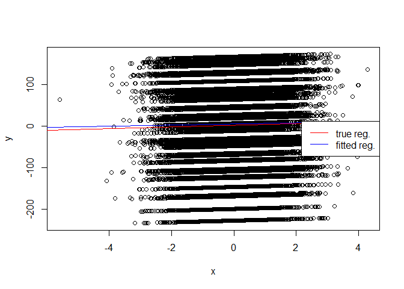<!-- -->

## Ex 1.5 Fit now a regression model without intercept. Compute AIC, BIC for the models with and without intercept. Perform the F-test. Comment the results.

``` r
xy <- gen_xy(n = 50, a = 2, b = 0, sigma1 = 1, sigma2 = 1)
model_normal <- lm(xy$y ~ xy$x, data = data.frame(x = xy$x, y = xy$y))
model_no.intercept <- lm(xy$y ~ xy$x - 1, data = data.frame(x = xy$x, y = xy$y))

AIC(model, model_no.intercept)
```

    ##                    df      AIC
    ## model               3 210.8903
    ## model_no.intercept  2 148.8925

``` r
BIC(model, model_no.intercept)
```

    ##                    df      BIC
    ## model               3 216.6263
    ## model_no.intercept  2 152.7165

We are now performing different tests to understand if it is better to
use the model without intercept (nested model) or the larger model. All
tests agree that is better to use the smaller one.

In both AIC and BIC tests the smaller model perform better.

``` r
anova(model_no.intercept, model, test = "F") 
```

    ## Analysis of Variance Table
    ## 
    ## Model 1: xy$y ~ xy$x - 1
    ## Model 2: xy$y ~ xy$x
    ##   Res.Df    RSS Df Sum of Sq F Pr(>F)
    ## 1     49  53.09                      
    ## 2     48 176.26  1   -123.17

The F-test tests whether the reduction in the residual sum of squares
(RSS) is statistically significant or not. The null hypothesis is that
the reduction is not significant, p-value  so we don’t reject the null hypothesis and we should use
the smaller
model.

### The previous result was obvius since the intercept (b) was set to 0, let’s try with b = 2

``` r
xy <- gen_xy(n = 50, a = - 1, b = 2, sigma1 = 1, sigma2 = 1)
model_normal <- lm(xy$y ~ xy$x, data = data.frame(x = xy$x, y = xy$y))
model_no.intercept <- lm(xy$y ~ xy$x - 1, data = data.frame(x = xy$x, y = xy$y))

sapply(list(model_normal = model_normal, model_no.intercept = model_no.intercept), function(m){
return(list(AIC = AIC(m), BIC = BIC(m)))
})
```

    ##     model_normal model_no.intercept
    ## AIC 150.2412     226.2009          
    ## BIC 155.9772     230.0249

We can see that for both AIC and BIC the lower values are obtained by
the normal model this time, which is the model with intercept.

``` r
anova(model_no.intercept, model, test = "F") 
```

    ## Analysis of Variance Table
    ## 
    ## Model 1: xy$y ~ xy$x - 1
    ## Model 2: xy$y ~ xy$x
    ##   Res.Df    RSS Df Sum of Sq      F    Pr(>F)    
    ## 1     49 249.18                                  
    ## 2     48 176.26  1    72.919 19.858 4.992e-05 ***
    ## ---
    ## Signif. codes:  0 '***' 0.001 '**' 0.01 '*' 0.05 '.' 0.1 ' ' 1

This time the p-value is very small and thus we have a very strong
evidence against the null hypothesis that the model without without
intercept is sufficient to describe the data. We remind that the F-test
is just an exact version of the likelihood-ratio test and can be applied
to nested models.

# Ex 2 Polynomial linear regression

## Ex 2.1 Generate data and plot the true regression function.

  
} \\\\
{Y | X=x \\sim N\\left(x^{2}-x+1,2\\right)}
\\end{array}")  

``` r
x <- rnorm(50, mean = 0, sd = 1)      
y <- 1 - x + (x^2) + rnorm(50, sd = sqrt(2))# since R use sd, we have to do sqrt(var) 
plot(x,y, main = "Observation scatter plot", ylab = "y", xlab = "x")

curve(1 - x + (x^2), add = TRUE, col = "red")
legend("topright", legend = ("True regression function"), col = "red", lty = 1)
```

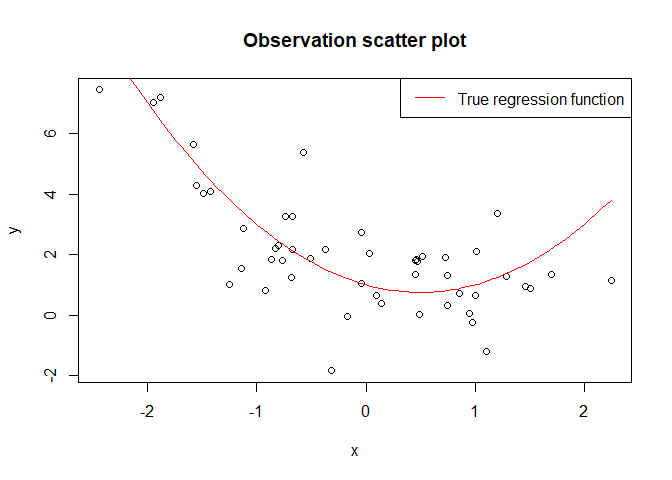<!-- -->

``` r
# or from Gherardo solutions
n <- 50
x <- rnorm(n)
regr <- function(x){ 
  1 - x + x^2
}
y <- regr(x) + rnorm(n, sd = sqrt(2))
plot(x,y)
curve(regr(x), add = T, col = "red")
```

<!-- -->

## Ex 2.2 Fit a simple linear regression model to the data generated in 2.1. Plot the fitted line on top of the scatter plot as usual.

``` r
plot(x,y, main = "Observation scatter plot", ylab = "y", xlab = "x")

curve(1 - x + (x^2), add = TRUE, col = "red")
model <- lm(y ~ x)
abline(model, col = "blue")

legend("topright", legend = c("True regression function", "Fitted regression line"), col = c("red", "blue"), lty = 1)
```

<!-- -->

## Ex 2.3 Plot the predictor variable vs the residuals and the Q-Q plot of the residuals vs the normal quantiles (qqnorm and qqline functions), comment the plots.

``` r
model_res <- resid(model)
plot(x, model_res, xlab = "predictors", ylab = "residuals", main = "Redisuals VS Predictors")
abline(0,0, col = "red")
```

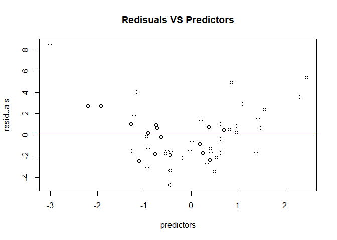<!-- -->

From the plot we can observe if the residuals are homoscedastic, so we
check if they are randomly dispersed around the horizontal line. In this
case there is a certain trend, in particular the residuals do not seem
independent from the predictor and not distributed around 0.

In residual plots, we are looking for the absence of pattern. Any type
of pattern exhibited in a residual plot may indicates a problem with the
model, typically either due to lack of fit or variance heterogeneity.
Basically in it typically means that the model daesn’t fit really well
the data.

``` r
qqnorm(model_res, ylab = "residuals", xlab = "normal scores", 
       main = " Q-Q plot of the residuals vs the normal quantiles")
qqline(model_res, col = "red")
```

<!-- -->

There is a certain degree of dispersion in the tails, but we are not
completely sure if this is conclusive or
not.

## Ex 2.4 Fit now the true degree 2 polynomial model. Plot the result in the same graph with a different color.

``` r
plot(x,y, ylim = c(-3, 8), xlim = c(-3, 4))         
curve(1 - x + (x^2), add = TRUE, col = "red")
abline(model, col = "blue")                  # 1) Simple model plot

model_poly <- lm(y ~ x + I(x^2))             # 2) Poly model plot

xx <- seq(-5, 5, length.out = 100)
yy <- predict(model_poly, newdata = data.frame(x=xx))

lines(xx, yy, col = "green")
                            # we have to create a coordinate system for our plot (xx)

legend("topright", c("True function", "Simple regression", "Advanced regression"), 
       col = c("red", "blue", "green"), lty = 1)
```

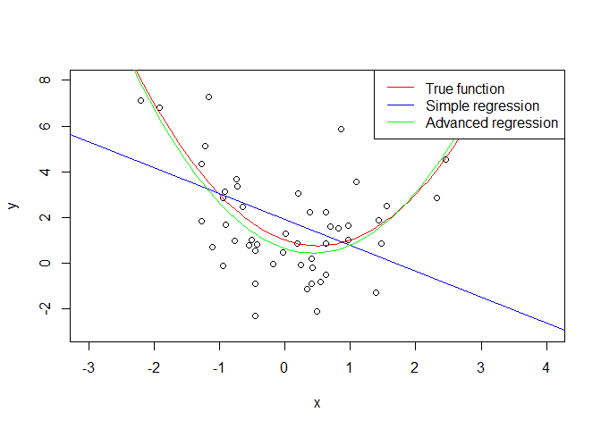<!-- -->

## Ex 2.5 As in 2.3 obtain also for the polynomial regression model the predictor-residuals plot and the Q-Q plot vs the normal quantiles.

``` r
plot(x, residuals(model_poly),          # residuals vs predictors plot
     xlab = "predictors", ylab = "residuals", main = "Redisuals VS Predictors")
abline(0,0, col = "red")
```

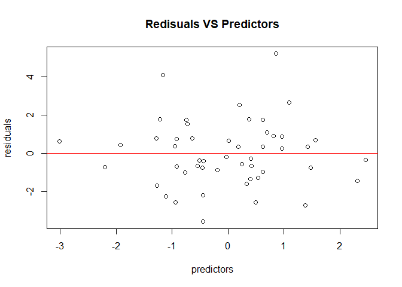<!-- -->

``` r
                                        # QQ-norm residuals plot
qqnorm(residuals(model_poly), ylab = "Sample Quantiles", xlab = "Theoretical Quantiles", 
       main = " Q-Q plot of the residuals vs the normal quantiles")
qqline(model_res, col = "red")
```

<!-- -->
From the comparison of the Q-Q plot of this model and Q-Q plot of the
previous one, we can’t really say anything conclusive.

From the two predictors vs residuals plots we can say that the plot from
the simple model exibit a clear trend while in the polynomial model the
residuals are randomly dispersed around the horizontal line. So from
these plots the more complex model seems to fit better our
data.

## Ex 2.6 Perform model selection between the simple linear regression of point 2.2 and the polynomial regression in point 2.4. Use the log-likelihood ratio test, the F-test (both with anova). Moreover perform model selection also using AIC and BIC score (AIC, BIC).

``` r
anova(model, model_poly, test = "LRT")
```

    ## Analysis of Variance Table
    ## 
    ## Model 1: y ~ x
    ## Model 2: y ~ x + I(x^2)
    ##   Res.Df    RSS Df Sum of Sq  Pr(>Chi)    
    ## 1     48 246.83                           
    ## 2     47 121.84  1    124.99 3.819e-12 ***
    ## ---
    ## Signif. codes:  0 '***' 0.001 '**' 0.01 '*' 0.05 '.' 0.1 ' ' 1

``` r
anova(model, model_poly, test = "F")    
```

    ## Analysis of Variance Table
    ## 
    ## Model 1: y ~ x
    ## Model 2: y ~ x + I(x^2)
    ##   Res.Df    RSS Df Sum of Sq      F    Pr(>F)    
    ## 1     48 246.83                                  
    ## 2     47 121.84  1    124.99 48.215 9.948e-09 ***
    ## ---
    ## Signif. codes:  0 '***' 0.001 '**' 0.01 '*' 0.05 '.' 0.1 ' ' 1

``` r
AIC(model, model_poly)                 
```

    ##            df      AIC
    ## model       3 227.7273
    ## model_poly  4 194.4276

``` r
BIC(model, model_poly)
```

    ##            df      BIC
    ## model       3 233.4634
    ## model_poly  4 202.0757

All the tests agree that the larger and more advanced model (polynomial
regression model) perform better than the simple
one.

## Ex 2.7 Try to fit now a polynomial of higher degree. Perform also here model selection. In particular plot the AIC (or BIC) score as a function of the polynomial degree. Plot also the log-likelihood as a function of the polynomial degree. What can you observe ? What is the difference between the pure log-likelihood and the AIC and BIC scores?

``` r
AIC_BIC_LL_poly <- function (n) {        
  degree <- c()
  BIC <- c()
  AIC <- c()
  LL <- c()
  for(i in 1:n){
    tmp_model <- lm(y ~ poly(x,i), data = data.frame(x = x, y = y)) 
    degree <- c(degree, i)
    AIC <- c(AIC, AIC(tmp_model))
    BIC <- c(BIC, BIC(tmp_model))
    tmp_loglikelihood <- logLik(tmp_model)
    LL <- c(LL, tmp_loglikelihood)
  }
  
  output <- list()
  output$degree <- degree
  output$AIC <- AIC
  output$BIC <- BIC
  output$LL <- LL
  return (output)
}

AIC_BIC_LL <- AIC_BIC_LL_poly(10)
plot(AIC_BIC_LL$degree, AIC_BIC_LL$AIC, 
     type = "line", col = "red", ylim = c(175, 210),
     main = "AIC, BIC score as function of polynomial degree", 
     ylab = "AIC or BIC scores", xlab = "polynomial degree")
lines(AIC_BIC_LL$degree, AIC_BIC_LL$BIC, 
      type = "line", col = "blue")
legend("bottomright",legend = c("AIC", "BIC"), 
        col = c("red", "blue"), lty = 1)
```

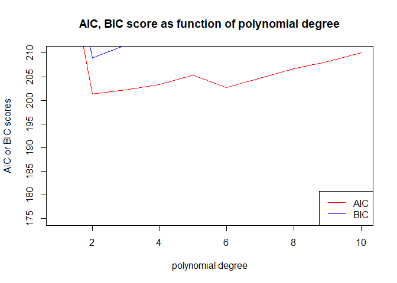<!-- -->

The AIC and BIC scores (lower the better) reach the lowest point at
, then they
start to increase.

``` r
plot(AIC_BIC_LL$degree, AIC_BIC_LL$LL,
     type = "line", col = "red",
     main = "Log-likelihood as function of polynomial degree",
     ylab = "log-likelihood score", xlab = "polynomial degree")
legend("bottomright",legend = c("Log-likelihood"), 
       col = c("red"), lty = 1)
```

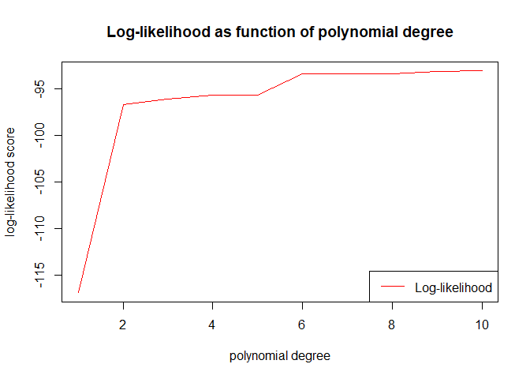<!-- -->

The log-likelihood score (larger the better) increases rapidly from
 to
 and then
continue to increase in a minor degree. The difference between the
BIC/AIC scores (which reach the best score at
) and the pure
log-likelihood should be due to the fact that the latter doesn’t take
into account the increase in the complexity of the model and in theory a
slightly larger model should have a slightly larger log-likelihood than
a nested one.

### From Gherardo solution

We can see that the log likelihood is an increasing function of the
degree of the polynomial (or in general of the number of parameters).
That is, the more parameters we have in the model, the better it will
fit a given data set. That is why we can not use the pure likelihood for
model selection because we will always choose the more complex model.
AIC and BIC are two ways of penalizing the complexity of the model, so
that we choose the more complex model only if it obtain a significant
increase in the log-likelihood.

#### Elegant solution code

``` r
scores <- sapply(1:10, function(deg){
fit <- lm(y ~ poly(x, degree = deg), data = data.frame(x = x, y = y))
return(c(AIC = AIC(fit), BIC= BIC(fit), LL = logLik(fit)))
})                        # return a list/dataframe (not clear)
colnames(scores) <- 1:10  # set the col names of the dataframe
plot(scores[1,], type = "l", xlab = "degree", ylab = "AIC" )
```

<!-- -->

# Ex 3 Non linear regression

## Ex 3.1 Generate data and plot the true regression function.

  
 \\\\ Y | X=x & \\sim N\\left(e^{-3 x}+2 x, 2\\right) \\end{aligned}")  

``` r
x <- rnorm(50, mean = 0, sd = 0.5)
y <- sapply(x, function(x) rnorm(1, mean = exp(-3 * x) + 2 * x, sd = sqrt(2)))
plot(x,y)
```

<!-- -->

``` r
# or grom Gherardo solution
n <- 50
x <- rnorm(n, sd = 1/2)
regr <- function(x){ 
  exp(-3 * x) + 2 * x
}
y <- regr(x) + rnorm(n, sd = sqrt(2))
plot(x,y)
```

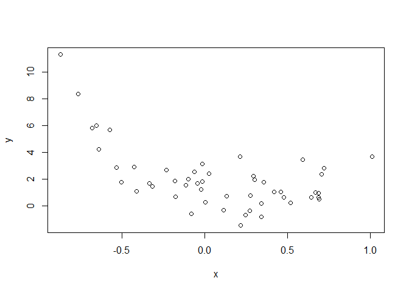<!-- -->

## Ex 3.2 Fit a simple linear model and polynomial regression models up to degree 5.

``` r
exp_lm_list <- lapply(1:5, function(i) lm(y ~ poly(x, degree = i)) )

# or from Gherardo solution
candidates <- lapply(1:5, function(d){
lm(y ~ poly(x, degree = d), data = data.frame(x = x, y = y))
})
```

## Ex 3.3 Perform model selection of the previous models using AIC and BIC.

First I try to plot all regression functions

``` r
plot(x,y)
xx <- seq(from = min(x) -1, to = max(x) + 1, length.out = 100) # generate coordinates
newdata <- data.frame(x = xx)

invisible(lapply(exp_lm_list, function(m){ # Gherardo magic trick
  k <- length(m$coefficients) # in order to set the color on the plot
  lines(xx, predict(m, newdata = newdata), col = k)
}))
legend("topright", legend = paste("degree = ", 1:5),
col = 2:6, lty = 1)
```

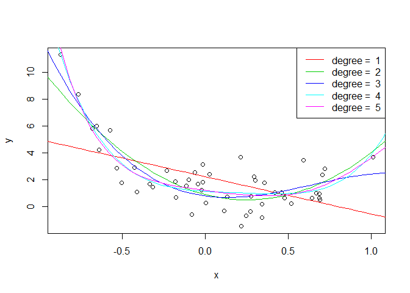<!-- -->

``` r
exp_lm_AIC <- sapply(exp_lm_list, function(x) AIC(x))
exp_lm_BIC <- sapply(exp_lm_list, function(x) BIC(x))  
AIC_BIC_df <- data.frame("Poly degree" = 1:5, "AIC" = exp_lm_AIC, "BIC" = exp_lm_BIC)
AIC_BIC_df
```

    ##   Poly.degree      AIC      BIC
    ## 1           1 246.1823 251.9184
    ## 2           2 196.5527 204.2008
    ## 3           3 184.5809 194.1411
    ## 4           4 186.0502 197.5223
    ## 5           5 186.2103 199.5945

``` r
# or from Gherardo solution faster way
sapply(exp_lm_list, function(m){
return(list(AIC = AIC(m), BIC = BIC(m)))
})
```

    ##     [,1]     [,2]     [,3]     [,4]     [,5]    
    ## AIC 246.1823 196.5527 184.5809 186.0502 186.2103
    ## BIC 251.9184 204.2008 194.1411 197.5223 199.5945

Sometimes the third model perform better, sometimes the fourth one or
the fifth. It really depends from the sample generated which is the best
model, that may be because we are trying to fit a non linear
distribution with a linear
model.

## Ex 3.4 Check the residuals distribution and plot the predictor observations vs the residuals. Comment.

### First we check that the residuals are normally distributed.

``` r
qqnorm(resid(exp_lm_list[[5]]), ylab = "Sample Quantiles", xlab = "Theoretical Quantiles", 
       main = " Q-Q plot of the residuals vs the normal quantiles of x^5")
qqline(resid(exp_lm_list[[5]]), col = "red")
```

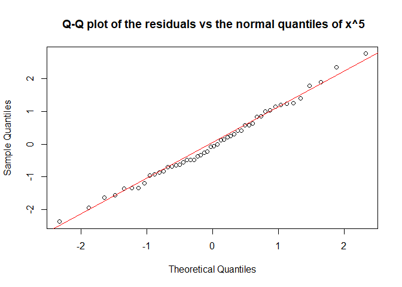<!-- -->

### Then we plot the predictors vs the residuals.

``` r
plot(x, resid(exp_lm_list[[5]]), xlab = "predictors", 
     ylab = "residuals", main = "Redisuals VS Predictors of x^2")
abline(0,0, col = "red")
```

<!-- -->

``` r
qqnorm(resid(exp_lm_list[[2]]), ylab = "Sample Quantiles", xlab = "Theoretical Quantiles", 
       main = " Q-Q plot of the residuals vs the normal quantiles of x^2")
qqline(resid(exp_lm_list[[2]]), col = "red")
```

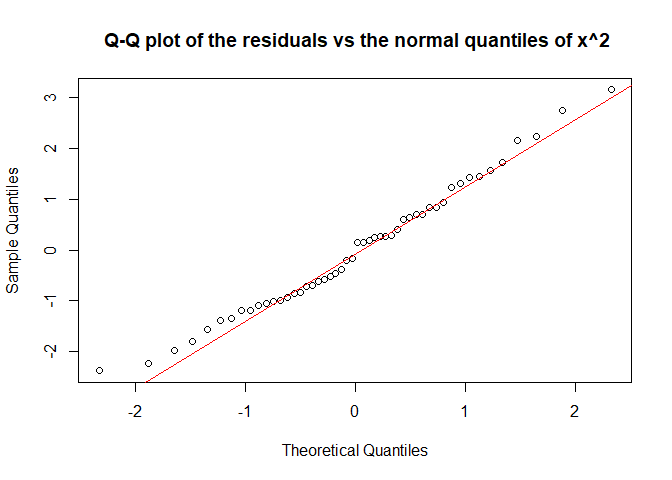<!-- -->

``` r
plot(x, resid(exp_lm_list[[5]]), xlab = "predictors", 
     ylab = "residuals", main = "Redisuals VS Predictors of x^2")
abline(0,0, col = "red")
legend("topleft", c("X^5"), col = c(2), cex = 0.75, pch = 21)
```

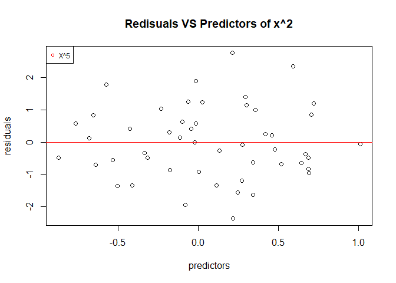<!-- -->

From these plots it is really hard to conclude how well the models fit
and if one is better than the other. We know that the true regression
function is not polynomial.

### We can try to plot all the residuals together.

``` r
plot(x, resid(exp_lm_list[[1]]), type = "n", xlab = "predictors", 
     ylab = "residuals", main = "Redisuals VS Predictors")
for(i in 1:5){
  points(x, resid(exp_lm_list[[i]]), col = i+1)
}
abline(0,0, col = "red")
legend("topleft", c("X^1", "X^2", "X^3", "X^4", "X^5"), col = c(2:6), cex = 0.75, pch = 21)
```

<!-- -->

Even if there is a bit of confusion in the plot, it’s possible to
observe that the red points (simple model) are the points that show a
more divergence from the central line (they draw a sort of smooth U
shape
line)

### We can try to plot all the regression function outside the range of data.

``` r
plot(x,y, ylim = c(-25,25), xlim = range(x) + c(-5 , 5))
xx <- seq(from = min(x) -10, to = max(x) + 10, length.out = 300) # generate coordinates
newdata <- data.frame(x = xx)

invisible(lapply(exp_lm_list, function(m){ # Gherardo magic trick
  k <- length(m$coefficients)
  lines(xx, predict(m, newdata = newdata), col = k)
}))
legend("topright", legend = paste("degree = ", 1:5),
col = 2:6, lty = 1)
```

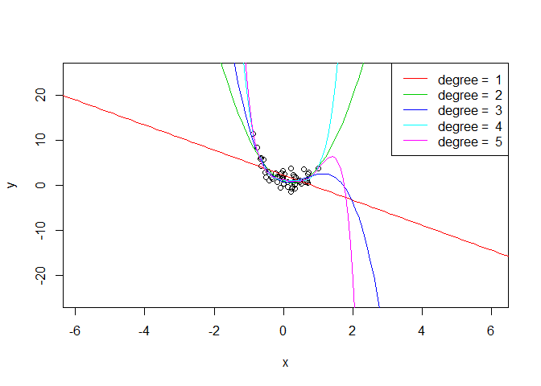<!-- -->

We can observe that depending on the degree of the polynomial used the
models behave very differently, especially outside of the range of the
data.

## 3.5 Now fit the true model with Gaussian noise.

  
=\\beta_{0}+\\beta_{1} x+\\exp \\left(\\beta_{2} x\\right)")  

### Try to implement manually the residual sum of squares and minimize it using the optim function.

``` r
# First I need the regression function. 
# Then I should train/fit the model with nls (nonlinear least squares) because lm              works only with linear models, but exercise ask first to implementent manually the           training/fitting algorithm [we need a residual sum of squares (rss) function and             we need to minimize its score with optim()] and then compare it to the nls().                nls estimates the parameters of a nonlinear model that gives the lowest residual             least squares (train/fit the model).

# the true non linear regression function (just to show in the most simple way)
regr <- exp(-3 * x) + 2 * x 

  # or
b0 = 0
b1 = 2
b2 = -3
regr <- b0 + b1 * x + exp(b2 * x)         

# if we want a real function to plot it (from Ex 3.1)
x <- rnorm(n, sd = 1/2)
regr <- function(x){ 
  exp(-3 * x) + 2 * x
}
y <- regr(x) + rnorm(n, sd = sqrt(2))

plot(x,y)
curve(regr, add = TRUE, col = "red")
```

<!-- -->

``` r
# but we need a regr f. that can be optimized                                     
regr <- function(x, b){                       # it takes x values and the parameters b
  return( b[1] + b[2] * x + exp(b[3] * x))    # then b0 = b[1], b1 = b[2], b2 = b[3]
}                                             # b = c(b0, b1, b2) = par (from minusll) 

rss <- function(b){                           # residual sum squares
  sum( (y - regr(x, b))^2 )
}
result <- optim(par = c(0, 0, -1), fn = rss)  # optim obtains the values of the model
result                                        # parameters that minimize the used 
```

    ## $par
    ## [1] -0.2333052  2.0865111 -3.0939230
    ## 
    ## $value
    ## [1] 98.0356
    ## 
    ## $counts
    ## function gradient 
    ##      216       NA 
    ## 
    ## $convergence
    ## [1] 0
    ## 
    ## $message
    ## NULL

``` r
                                              # fn (in this case rss)
plot(x,y)
curve(regr(x, result$par), add = TRUE, col = "red")
```

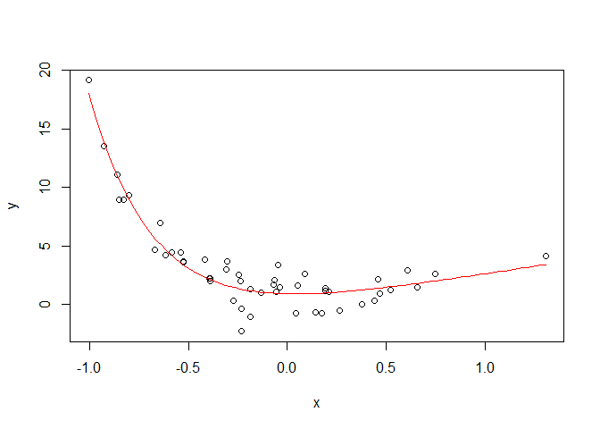<!-- --> The
values of the parameters obtained with optim, using the rss function to
evaluate the model fit, are really close to the true
values.

### We now want to fit the model using nls built-in R function and compare it to our impementation.

``` r
fitnls <- nls(formula = y ~ b0 + b1*x + exp(b2*x), start = list(b0 = 0, b1 = 0, b2 = -1),
data = data.frame(x = x, y = y))
summary(fitnls)
```

    ## 
    ## Formula: y ~ b0 + b1 * x + exp(b2 * x)
    ## 
    ## Parameters:
    ##    Estimate Std. Error t value Pr(>|t|)    
    ## b0 -0.23320    0.24650  -0.946  0.34897    
    ## b1  2.08655    0.65195   3.200  0.00246 ** 
    ## b2 -3.09389    0.07197 -42.986  < 2e-16 ***
    ## ---
    ## Signif. codes:  0 '***' 0.001 '**' 0.01 '*' 0.05 '.' 0.1 ' ' 1
    ## 
    ## Residual standard error: 1.444 on 47 degrees of freedom
    ## 
    ## Number of iterations to convergence: 5 
    ## Achieved convergence tolerance: 3.6e-07

The nls algorithm is very sensitive to the starting points, especially
if we start from a positive value for the b2 parameter. In this case our
implementation using rss and optim is better than the built nls built-in
function (you can try for par = 0, 0,
1).

### We can now check the residuals of the model (Q-Q plot and Residuals vs Predictors plot)

``` r
qqnorm(residuals(fitnls))
qqline(residuals(fitnls))
```

<!-- -->

``` r
res_fitnls <- residuals(summary(fitnls))
plot(x, res_fitnls, xlab = "predictors", 
     ylab = "residuals", main = "Redisuals VS Predictors of non linear model")
abline(0,0, col = "red")
```

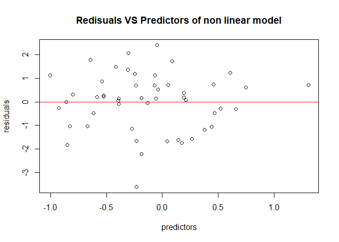<!-- -->

From the residuals vs predictors and the residuals Q-Q plot it seems
ok.

### We can also fit the model maximizing the log-likelihood (or minimizing the minus log-likelihood).

``` r
mll <- function(pars){
  - sum( sapply(1:n, function(i){
return(dnorm(y[i], mean = regr(x[i], pars[1:3]), sd = pars[4], log = T))
}))
}
optim(mll, par = c(0,0,-5,1)) # The last parameter is the estimated value of the noise                                          # (standard deviation).
```

    ## $par
    ## [1] -0.2323186  2.0849133 -3.0931642  1.4001234
    ## 
    ## $value
    ## [1] 87.77971
    ## 
    ## $counts
    ## function gradient 
    ##      185       NA 
    ## 
    ## $convergence
    ## [1] 0
    ## 
    ## $message
    ## NULL

# Ex 4 Wine quality

## Ex 4.1 Fit a linear regression model using all the regressors. Use the function summary, based on the results of the t-test which are the important regressors?

``` r
wines <- read.csv("winequality-red.csv", sep =";")
model <- lm(quality ~ ., data = wines)
summary(model)
```

    ## 
    ## Call:
    ## lm(formula = quality ~ ., data = wines)
    ## 
    ## Residuals:
    ##      Min       1Q   Median       3Q      Max 
    ## -2.68911 -0.36652 -0.04699  0.45202  2.02498 
    ## 
    ## Coefficients:
    ##                        Estimate Std. Error t value Pr(>|t|)    
    ## (Intercept)           2.197e+01  2.119e+01   1.036   0.3002    
    ## fixed.acidity         2.499e-02  2.595e-02   0.963   0.3357    
    ## volatile.acidity     -1.084e+00  1.211e-01  -8.948  < 2e-16 ***
    ## citric.acid          -1.826e-01  1.472e-01  -1.240   0.2150    
    ## residual.sugar        1.633e-02  1.500e-02   1.089   0.2765    
    ## chlorides            -1.874e+00  4.193e-01  -4.470 8.37e-06 ***
    ## free.sulfur.dioxide   4.361e-03  2.171e-03   2.009   0.0447 *  
    ## total.sulfur.dioxide -3.265e-03  7.287e-04  -4.480 8.00e-06 ***
    ## density              -1.788e+01  2.163e+01  -0.827   0.4086    
    ## pH                   -4.137e-01  1.916e-01  -2.159   0.0310 *  
    ## sulphates             9.163e-01  1.143e-01   8.014 2.13e-15 ***
    ## alcohol               2.762e-01  2.648e-02  10.429  < 2e-16 ***
    ## ---
    ## Signif. codes:  0 '***' 0.001 '**' 0.01 '*' 0.05 '.' 0.1 ' ' 1
    ## 
    ## Residual standard error: 0.648 on 1587 degrees of freedom
    ## Multiple R-squared:  0.3606, Adjusted R-squared:  0.3561 
    ## F-statistic: 81.35 on 11 and 1587 DF,  p-value: < 2.2e-16

The most important regressors are alcohol, volatile.acidity, sulphates,
chlorides, total.sulfur.dioxide and also ph and free.sulfur.dioxide (low
p-value).

## Ex 4.2 Use forward stepwise selection with the AIC score to select the relevant covariates.

``` r
wine_model_intercept <- lm(quality ~ 1, data = wines)
wine_model_intercept                                       # model with just intercept
```

    ## 
    ## Call:
    ## lm(formula = quality ~ 1, data = wines)
    ## 
    ## Coefficients:
    ## (Intercept)  
    ##       5.636

``` r
wine_model_fitall <- lm(quality ~ ., data = wines)
```

``` r
wine_model_forward_step <- step(wine_model_intercept, 
                                scope = formula(wine_model_fitall), 
                                direction = "forward",
                                trace = 0)
summary(wine_model_forward_step)
```

    ## 
    ## Call:
    ## lm(formula = quality ~ alcohol + volatile.acidity + sulphates + 
    ##     total.sulfur.dioxide + chlorides + pH + free.sulfur.dioxide, 
    ##     data = wines)
    ## 
    ## Residuals:
    ##      Min       1Q   Median       3Q      Max 
    ## -2.68918 -0.36757 -0.04653  0.46081  2.02954 
    ## 
    ## Coefficients:
    ##                        Estimate Std. Error t value Pr(>|t|)    
    ## (Intercept)           4.4300987  0.4029168  10.995  < 2e-16 ***
    ## alcohol               0.2893028  0.0167958  17.225  < 2e-16 ***
    ## volatile.acidity     -1.0127527  0.1008429 -10.043  < 2e-16 ***
    ## sulphates             0.8826651  0.1099084   8.031 1.86e-15 ***
    ## total.sulfur.dioxide -0.0034822  0.0006868  -5.070 4.43e-07 ***
    ## chlorides            -2.0178138  0.3975417  -5.076 4.31e-07 ***
    ## pH                   -0.4826614  0.1175581  -4.106 4.23e-05 ***
    ## free.sulfur.dioxide   0.0050774  0.0021255   2.389    0.017 *  
    ## ---
    ## Signif. codes:  0 '***' 0.001 '**' 0.01 '*' 0.05 '.' 0.1 ' ' 1
    ## 
    ## Residual standard error: 0.6477 on 1591 degrees of freedom
    ## Multiple R-squared:  0.3595, Adjusted R-squared:  0.3567 
    ## F-statistic: 127.6 on 7 and 1591 DF,  p-value: < 2.2e-16

### The exercise ask us to implement manually the forward stepwise selection with AIC score (hint: use the update function that updates linear models).

``` r
fit <- lm(quality ~ 1, data = wines) # we need a model with only the intercept
regressors <- colnames(wines)[-12] # we select the regressors
selected <- c()
score <- AIC(fit)
score.best <- score
done <- FALSE   
# continue to add regressors until there is not decrease in AIC (done = TRUE)
while (!done){                     
# for regressors in regressors list exept the regressors already used 
  for (reg in regressors[!(regressors %in% selected)]){ 
    # update the fit model adding one regressor each time
    tmp <- update(fit, formula = paste(". ~ . + ", reg)) 
    # calculate AIC score
    score.tmp <- AIC(tmp)
    # if scores is smaller (smaller = better) than the best score obtained
    if (score.tmp < score.best){
      # change the best score in to this one
      score.best <- score.tmp
      # store the updated model that just give the best score
      best <- tmp
      # store the
      selected.best <- c(selected, reg)
    }
  }
  if (score.best < score){
    fit <- best                         # store best model to fit
    score <- score.best                 # score best score to score
    selected <- selected.best  # store select models that score
  }else{ # if there is no decrease
  done <- TRUE
  }
}
fit # that is the updated model with step forward selection
```

    ## 
    ## Call:
    ## lm(formula = quality ~ alcohol + volatile.acidity + sulphates + 
    ##     total.sulfur.dioxide + chlorides + pH + free.sulfur.dioxide, 
    ##     data = wines)
    ## 
    ## Coefficients:
    ##          (Intercept)               alcohol      volatile.acidity  
    ##             4.430099              0.289303             -1.012753  
    ##            sulphates  total.sulfur.dioxide             chlorides  
    ##             0.882665             -0.003482             -2.017814  
    ##                   pH   free.sulfur.dioxide  
    ##            -0.482661              0.005077

``` r
    # we can extract $coefficients, $residuals etc
```

``` r
summary(fit) # just to show the p-values
```

    ## 
    ## Call:
    ## lm(formula = quality ~ alcohol + volatile.acidity + sulphates + 
    ##     total.sulfur.dioxide + chlorides + pH + free.sulfur.dioxide, 
    ##     data = wines)
    ## 
    ## Residuals:
    ##      Min       1Q   Median       3Q      Max 
    ## -2.68918 -0.36757 -0.04653  0.46081  2.02954 
    ## 
    ## Coefficients:
    ##                        Estimate Std. Error t value Pr(>|t|)    
    ## (Intercept)           4.4300987  0.4029168  10.995  < 2e-16 ***
    ## alcohol               0.2893028  0.0167958  17.225  < 2e-16 ***
    ## volatile.acidity     -1.0127527  0.1008429 -10.043  < 2e-16 ***
    ## sulphates             0.8826651  0.1099084   8.031 1.86e-15 ***
    ## total.sulfur.dioxide -0.0034822  0.0006868  -5.070 4.43e-07 ***
    ## chlorides            -2.0178138  0.3975417  -5.076 4.31e-07 ***
    ## pH                   -0.4826614  0.1175581  -4.106 4.23e-05 ***
    ## free.sulfur.dioxide   0.0050774  0.0021255   2.389    0.017 *  
    ## ---
    ## Signif. codes:  0 '***' 0.001 '**' 0.01 '*' 0.05 '.' 0.1 ' ' 1
    ## 
    ## Residual standard error: 0.6477 on 1591 degrees of freedom
    ## Multiple R-squared:  0.3595, Adjusted R-squared:  0.3567 
    ## F-statistic: 127.6 on 7 and 1591 DF,  p-value: < 2.2e-16

We obtained the same result of Using the built-in R function
step().

## Ex 4.3 The Zheng-Loh Model Selection Method.

### First of all we fit the full model and we obtain the Wald statistics. Then we sort the absolute values of the Wald statistics.

``` r
# store the st.errors of the initial model (where we used all regressors) coefficients       # (except the intercept) = remove row 1 and select col 2 
st.errors <- summary(model)$coefficients[-1,2] 
# calculate w by k_est / st.errors. k_est = model$coefficient[-row 1] (no intercept) 
W <- model$coefficients[-1] / st.errors            
# sort and store absolute value of w. sort(index.return) return the index of the sorted w
ix <- sort(abs(W), decreasing = TRUE, index.return = TRUE)$ix    
# store by w value names of the estimated regressors 
reg.names <- names(model$coefficients[-1])[ix] 
# its not clear why sigma2_est = sum of squared redisuals / n
sigma2_est <- sum(model$residuals^2) / nrow(wines)
```

### Now we select the model that minimize RSS

  
+j \\hat{\\sigma}^{2} \\log (n)")  

``` r
s <- Inf                                      # j is n of parameter you are going to use
for (j in 1:length(reg.names)){
  fit.tmp <- lm(paste("quality ~", 
                      paste(reg.names[1 : j], collapse = "+")), data = wines)
s.tmp <- sum(fit.tmp$residuals^2) + j * (sigma2_est) * log(nrow(wines))
  if (s.tmp < s ){
    J <- j
    s <- s.tmp
   }

}
fit.final <- lm(paste("quality ~", 
                      paste(reg.names[1 : J], collapse = "+") ), data = wines)
summary(fit.final)
```

    ## 
    ## Call:
    ## lm(formula = paste("quality ~", paste(reg.names[1:J], collapse = "+")), 
    ##     data = wines)
    ## 
    ## Residuals:
    ##      Min       1Q   Median       3Q      Max 
    ## -2.60575 -0.35883 -0.04806  0.46079  1.95643 
    ## 
    ## Coefficients:
    ##                        Estimate Std. Error t value Pr(>|t|)    
    ## (Intercept)           4.2957316  0.3995603  10.751  < 2e-16 ***
    ## alcohol               0.2906738  0.0168108  17.291  < 2e-16 ***
    ## volatile.acidity     -1.0381945  0.1004270 -10.338  < 2e-16 ***
    ## sulphates             0.8886802  0.1100419   8.076 1.31e-15 ***
    ## total.sulfur.dioxide -0.0023721  0.0005064  -4.684 3.05e-06 ***
    ## chlorides            -2.0022839  0.3980757  -5.030 5.46e-07 ***
    ## pH                   -0.4351830  0.1160368  -3.750 0.000183 ***
    ## ---
    ## Signif. codes:  0 '***' 0.001 '**' 0.01 '*' 0.05 '.' 0.1 ' ' 1
    ## 
    ## Residual standard error: 0.6487 on 1592 degrees of freedom
    ## Multiple R-squared:  0.3572, Adjusted R-squared:  0.3548 
    ## F-statistic: 147.4 on 6 and 1592 DF,  p-value: < 2.2e-16

# Ex 5 Logistic regression

We transform the quality variable to a binary variable indicating if a
wine is good or bad.

``` r
wines <- read.csv("winequality-red.csv", sep =";") 
good <- wines$quality > 5                            
wines$quality <- "bad"                               
wines[good, "quality"] <- "good" 
wines[,"quality"] <- as.factor(wines[, "quality"])   
```

## Ex 5.1 Fit a logistic regression model using all the other variables in the dataset as predictors.

``` r
wine_model_logistic <- glm(quality ~ ., data = wines, family = "binomial" )
wine_model_logistic
```

    ## 
    ## Call:  glm(formula = quality ~ ., family = "binomial", data = wines)
    ## 
    ## Coefficients:
    ##          (Intercept)         fixed.acidity      volatile.acidity  
    ##             42.94995               0.13598              -3.28169  
    ##          citric.acid        residual.sugar             chlorides  
    ##             -1.27435               0.05533              -3.91571  
    ##  free.sulfur.dioxide  total.sulfur.dioxide               density  
    ##              0.02222              -0.01639             -50.93239  
    ##                   pH             sulphates               alcohol  
    ##             -0.38061               2.79511               0.86682  
    ## 
    ## Degrees of Freedom: 1598 Total (i.e. Null);  1587 Residual
    ## Null Deviance:       2209 
    ## Residual Deviance: 1656  AIC: 1680

## Ex 5.2 Implement a forward feature selection based on the AIC or the BIC score.

``` r
aic.bic_ft.selection_glm <- function(bic.or.aic){
  fit <- glm(quality ~ 1, data = wines, family = "binomial")
    regressors <- colnames(wines)[-12] 
    selected <- c()
    score <- bic.or.aic(fit)
    score.best <- score
    done <- FALSE   
    # continue to add regressors until there is not decrease in AIC/BIC (done = TRUE)
    while (!done){                     
      # for regressors in regressors list exept the regressors already used 
      for (reg in regressors[!(regressors %in% selected)]){ 
        # update the fit model adding one regressor each time
        tmp <- update(fit, formula = paste(". ~ . + ", reg)) 
        # calculate AIC or BIC score
        score.tmp <- bic.or.aic(tmp)
        # if scores is smaller (smaller = better) than the best score obtained
        if (score.tmp < score.best){
          # change the best score in to this one
          score.best <- score.tmp
          # store the updated model that just give the best score
          best <- tmp
          # store the
          selected.best <- c(selected, reg)
        }
      }
      # when the for loop finish, if score.best < score (isn't it always true???)
      if (score.best < score){
        fit <- best                         # store best model to fit
        score <- score.best                 # score best score to score
        selected <- selected.best  # store select models that score
      }else{ # if there is no decrease
      done <- TRUE
      }
    }
  return(fit)
}
aic.bic_ft.selection_glm(BIC)
```

    ## 
    ## Call:  glm(formula = quality ~ alcohol + volatile.acidity + total.sulfur.dioxide + 
    ##     sulphates + chlorides + free.sulfur.dioxide, family = "binomial", 
    ##     data = wines)
    ## 
    ## Coefficients:
    ##          (Intercept)               alcohol      volatile.acidity  
    ##             -8.14984               0.85938              -2.89594  
    ## total.sulfur.dioxide             sulphates             chlorides  
    ##             -0.01751               2.70588              -4.42103  
    ##  free.sulfur.dioxide  
    ##              0.02386  
    ## 
    ## Degrees of Freedom: 1598 Total (i.e. Null);  1592 Residual
    ## Null Deviance:       2209 
    ## Residual Deviance: 1665  AIC: 1679

### Implement a forward feature selection based on the log-likelihood score.

``` r
fit <- glm(quality ~ 1, data = wines, family = "binomial")
  regressors <- colnames(wines)[-12] 
  selected <- c()
  score <- -logLik(fit)          ### <- change scoring f. here
  score.best <- score                 # I use a -ll so lower = better like AIC/BIC
  done <- FALSE   
  # continue to add regressors until there is no decrease in score (done = TRUE)
  while (!done){                     
    # for regressors in regressors list exept the regressors already used 
    for (reg in regressors[!(regressors %in% selected)]){ 
      # update the fit model adding one regressor each time
      tmp <- update(fit, formula = paste(". ~ . + ", reg))  
      # calculate AIC or BIC score
      score.tmp <- -logLik(tmp)     ### <- change scoring f. here
      # if scores is smaller (smaller = better) than the best score obtained
      if (score.tmp < score.best){
        # change the best score in to this one
        score.best <- score.tmp
        # store the updated model that just give the best score
        best <- tmp
        # store the
        selected.best <- c(selected, reg)
      }
    }
    # when the for loop finish, if score.best < score (isn't it always true???)
    if (score.best < score){
      fit <- best                         # store best model to fit
      score <- score.best                 # score best score to score
      selected <- selected.best  # store select models that score
    }else{ # if there is no decrease
    done <- TRUE
    }
  }
fit
```

    ## 
    ## Call:  glm(formula = quality ~ alcohol + volatile.acidity + total.sulfur.dioxide + 
    ##     sulphates + chlorides + free.sulfur.dioxide + pH + citric.acid + 
    ##     fixed.acidity + residual.sugar + density, family = "binomial", 
    ##     data = wines)
    ## 
    ## Coefficients:
    ##          (Intercept)               alcohol      volatile.acidity  
    ##             42.94995               0.86682              -3.28169  
    ## total.sulfur.dioxide             sulphates             chlorides  
    ##             -0.01639               2.79511              -3.91571  
    ##  free.sulfur.dioxide                    pH           citric.acid  
    ##              0.02222              -0.38061              -1.27435  
    ##        fixed.acidity        residual.sugar               density  
    ##              0.13598               0.05533             -50.93239  
    ## 
    ## Degrees of Freedom: 1598 Total (i.e. Null);  1587 Residual
    ## Null Deviance:       2209 
    ## Residual Deviance: 1656  AIC: 1680

## Ex 5.3 Can you explain why we should not use just the log-likelihood in model selection?

Using log-likelihood to select the model we will always select the more
complex model, since more complex models will always fit better the data
than simpler ones.

That is why we need to penalize complexity as in AIC or
BIC.

## Ex 5.4 Observe the output of the call predict(model) where model is one of the above logistic regression model fitted with the gml function. Try to write a function in this case that transform the output of predict into the class value.

``` r
preds <- predict(fit)

## To class method 1)
linkinv <- binomial()$linkinv
                       # From the doc of binomial() :
                       # As a factor: ‘success’ is interpreted
                       # as the factor not having the first
                       # level (and hence usually of having the
                       # second level).
linkinv(preds)[1] # prob of success
```

    ##         1 
    ## 0.2159705

``` r
toClass <- function(predictions, levels, linkinv = binomial()$linkinv){
  # set threshold of the prob of success
  a <- linkinv(predictions) > 0.5
  b <- array(dim = c(length(predictions)))
  # if prob succ > 0.5 => success
  b[a] <- levels[2] # success = second lvl
  # otherwise not success (first lvl)
  b[!a] <- levels[1]
  # we should return a factor
  return(factor(b, levels = levels))
}
preds.class <- toClass(preds, levels(wines$quality)) # return vectors of predicted class

## To class method 2)
                  # the f. need a linkinv function, if the prediction was done with linkinv f.                            (type = "response") select linkinv_conv = FALSE or TRUE otherwise 
toClass2 <- function(predictions, linkinv_conv = FALSE){
  if (linkinv_conv){
    predictions <- linkinv(predictions)
  }
  predclass <- factor(sapply(predictions, function(x)
    ifelse(x < 0.5, "Bad", "Good")), levels = c("Bad", "Good"))
}
preds.class2 <- toClass2(preds, linkinv_conv = TRUE)
```

## Ex 5.5 Compute the model accuracy over the data set, that is the proportion of correctly classified observations.

``` r
                        # the function table builds contingency
                        # tables for the given factor variables
                        # be careful that they should have the
                        # same levels
# Accuracy method 1)
confusion <- table(preds.class, wines$quality)
confusion2 <- table(preds.class2, wines$quality)
confusion
```

    ##            
    ## preds.class bad good
    ##        bad  549  214
    ##        good 195  641

``` r
confusion2
```

    ##             
    ## preds.class2 bad good
    ##         Bad  549  214
    ##         Good 195  641

``` r
                        # preds.class bad good
                        # bad         546 208
                        # good        198 647
accuracy <- sum(diag(confusion)) / sum(confusion) # (T positive + T negative) / n
accuracy
```

    ## [1] 0.7442151

``` r
# Accuracy method 2)
errs <- sum(confusion2) - sum(diag(confusion2))
accuracy <- 1 - errs/sum(confusion2)
accuracy
```

    ## [1] 0.7442151

# Ex 6 CORIS data

``` r
coris <- read.table(
  "coris.dat",
  skip = 4,
  sep = ",",
  col.names = c("row.names", "sbp", "tobacco", "ldl", "adiposity", "famhist",
                "typea", "obesity", "alcohol", "age", "chd")
  )[, -1] # leave out first column (rownames)
colnames(coris)
```

    ##  [1] "sbp"       "tobacco"   "ldl"       "adiposity" "famhist"   "typea"    
    ##  [7] "obesity"   "alcohol"   "age"       "chd"

## Ex 6.1 Use backward stepwise selection for logistic regression, use AIC as score and summarize your results.

``` r
coris_model_full <- glm(chd ~ ., data = coris, family = "binomial")
coris_aic_backward <- step(coris_model_full, trace = 0, direction = "backward")
summary(coris_aic_backward)
```

    ## 
    ## Call:
    ## glm(formula = chd ~ tobacco + ldl + famhist + typea + age, family = "binomial", 
    ##     data = coris)
    ## 
    ## Deviance Residuals: 
    ##     Min       1Q   Median       3Q      Max  
    ## -1.9165  -0.8054  -0.4430   0.9329   2.6139  
    ## 
    ## Coefficients:
    ##             Estimate Std. Error z value Pr(>|z|)    
    ## (Intercept) -6.44644    0.92087  -7.000 2.55e-12 ***
    ## tobacco      0.08038    0.02588   3.106  0.00190 ** 
    ## ldl          0.16199    0.05497   2.947  0.00321 ** 
    ## famhist      0.90818    0.22576   4.023 5.75e-05 ***
    ## typea        0.03712    0.01217   3.051  0.00228 ** 
    ## age          0.05046    0.01021   4.944 7.65e-07 ***
    ## ---
    ## Signif. codes:  0 '***' 0.001 '**' 0.01 '*' 0.05 '.' 0.1 ' ' 1
    ## 
    ## (Dispersion parameter for binomial family taken to be 1)
    ## 
    ##     Null deviance: 596.11  on 461  degrees of freedom
    ## Residual deviance: 475.69  on 456  degrees of freedom
    ## AIC: 487.69
    ## 
    ## Number of Fisher Scoring iterations: 5

## Ex 6.2 Fit the complete model for logistic regression, that is using all the variables in the data set. What is curious about the coefficients? Which coefficient is a very important indicator of coronary risk? Comment the results.

``` r
summary(coris_model_full)
```

    ## 
    ## Call:
    ## glm(formula = chd ~ ., family = "binomial", data = coris)
    ## 
    ## Deviance Residuals: 
    ##     Min       1Q   Median       3Q      Max  
    ## -1.7781  -0.8213  -0.4387   0.8889   2.5435  
    ## 
    ## Coefficients:
    ##               Estimate Std. Error z value Pr(>|z|)    
    ## (Intercept) -6.1507209  1.3082600  -4.701 2.58e-06 ***
    ## sbp          0.0065040  0.0057304   1.135 0.256374    
    ## tobacco      0.0793764  0.0266028   2.984 0.002847 ** 
    ## ldl          0.1739239  0.0596617   2.915 0.003555 ** 
    ## adiposity    0.0185866  0.0292894   0.635 0.525700    
    ## famhist      0.9253704  0.2278940   4.061 4.90e-05 ***
    ## typea        0.0395950  0.0123202   3.214 0.001310 ** 
    ## obesity     -0.0629099  0.0442477  -1.422 0.155095    
    ## alcohol      0.0001217  0.0044832   0.027 0.978350    
    ## age          0.0452253  0.0121298   3.728 0.000193 ***
    ## ---
    ## Signif. codes:  0 '***' 0.001 '**' 0.01 '*' 0.05 '.' 0.1 ' ' 1
    ## 
    ## (Dispersion parameter for binomial family taken to be 1)
    ## 
    ##     Null deviance: 596.11  on 461  degrees of freedom
    ## Residual deviance: 472.14  on 452  degrees of freedom
    ## AIC: 492.14
    ## 
    ## Number of Fisher Scoring iterations: 5

The importants indicators of coronary risk are the indicators with a low
p-value (they all have a positive value, meaning that they increase the
risk of CHD), we can find them in the model obtained by backward model
selection.

We think that it is curious that obesity (even if it is not an important
indicator) has a negative value. One explaination could be that obese
people in Africa have a better quality of life than others.

The most important contributor is the family history of heart disease,
the second most important is the age.

### From Gherardo solutions.

We can see that the p-values for the coefficient of obesity and alcohol
are not small, thus those variables seems to be less important in
predicting coronary hear disease.
