Final exam
================

# Problem 1

## Question 1.1 Plot the histogram of the values and the kernel density estimation (you can try different bandwith and bandwith rules and/or different type of kernel, report the one that you think obtain a good result). Moreover plot the empirical distribution function and compute and report the first, second and third empirical quantile (Hint: the quantile function in R).

``` r
hist(obs, probability = TRUE, breaks = 20)
for (bw in seq(1,5,1)){
  lines(density(obs, bw = bw), col = bw + 1)
}
legend("topright", legend = seq(1,5,1), 
                   col = seq(1,5,1), 
                   lty = 1, title = "Kernel Densities")
```

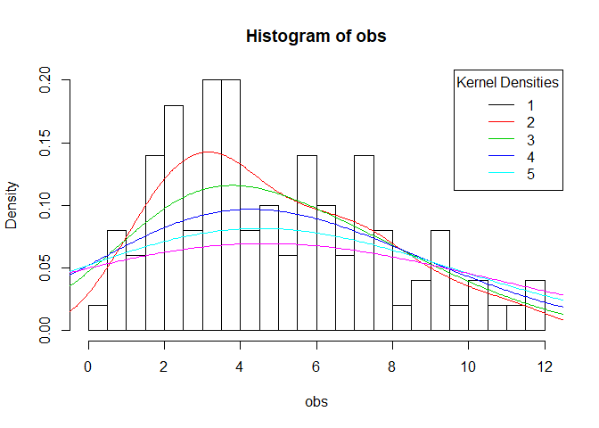<!-- -->

I think that the kernel density with bandwith 2 obtain a good result.

``` r
# Plot the empirical distribution function 
plot(ecdf(obs))
```

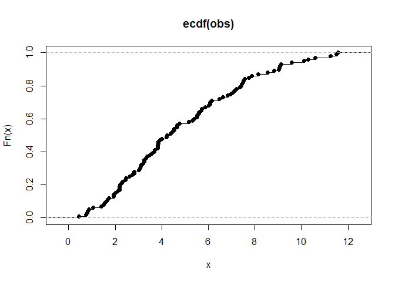<!-- -->

``` r
# To obtain empirical quantiles (1°, 2°, 3°)
quantile(x = obs, probs = c(0.25, 0.5, 0.75))
```

    ##      25%      50%      75% 
    ## 2.714263 4.302654 6.978805

## Question 1.2 Question 1.2 Fit the following models to the data in obs:

• Gaussian distribution.

• Log-normal distribution.

• Gamma distribution.

• Exponential distribution.

``` r
# Plot
hist(obs, probability = TRUE, breaks = 20)

# Gaussian
mu = mean(obs) 
sigma = sd(obs)
curve(dnorm(x, mean = mu, sd = sigma), add = TRUE, col = "red")

# Log-normal
mulog = mean(log(obs))
sigmalog = sd(log(obs))
curve(dlnorm(x, meanlog = mulog,  sdlog = sigmalog), add = TRUE, col = "blue")

# Gamma
shape_mmest <- mean(obs)^2 / var(obs) # methods of moments to initialize the est
rate_mmest <- mean(obs) / var(obs)
gamma_mll <- function(par, data){
  -sum(dgamma(data, shape = par[1], rate = par[2], log = TRUE))
} 
gamma_par <- optim(f = gamma_mll, par = c(shape_mmest, rate_mmest), 
                   data = obs)$par
curve(dgamma(x, shape = gamma_par[1], rate = gamma_par[2]), 
      add = TRUE, col = "orange")

# Exponential
rate_est = 1 / mean(obs)
curve(dexp(x, rate = rate_est), add = TRUE, col = "dark green")
legend("topright", 
       legend = c("Gaussian", "Log-normal", "Gamma", "Exponential"), 
       col = c("red", "blue", "orange", "dark green"), 
       lty = 1, title = "Models density")
```

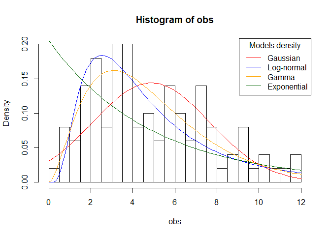<!-- -->

## Question 1.3 Judge how the Gaussian distribution and the exponential distribution fit the data using Q-Q plots; What can you observe? Do you think the Gaussian distribution is a good candidate model? Why? Do you think the exponential model fit well the data judging from the Q-Q plot?

``` r
th <- qnorm(ppoints(obs), mean = mu, sd = sigma)
plot(sort(obs), th, xlab = "Empirical",
     ylab = "Theoretical", main = "Q-Q plot (Gaussian)")
abline(0, 1, col = "red")
```

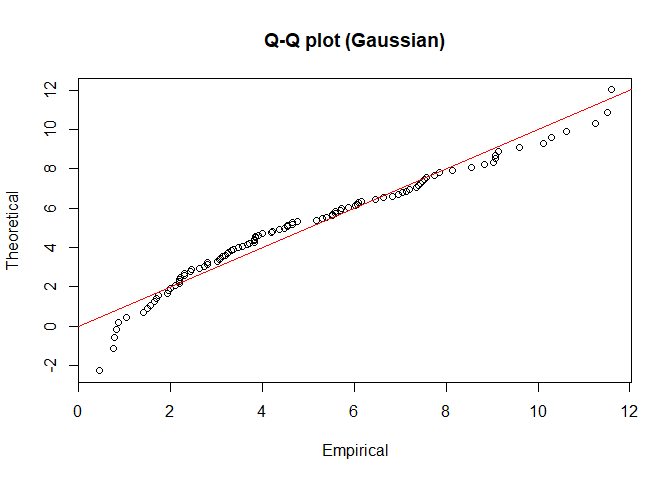<!-- -->

``` r
th <- qexp(ppoints(obs), rate = rate_est)
plot(sort(obs), th, xlab = "Empirical",
     ylab = "Theoretical", main = "Q-Q plot (Exponential)")
abline(0, 1, col = "red")
```

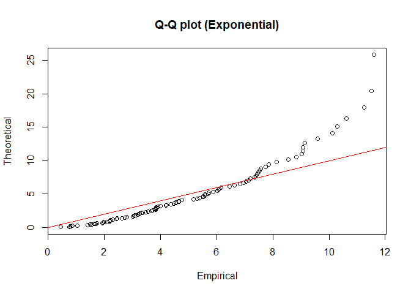<!-- -->

We read a Q-Q plot by looking at how many points fall along the
reference line, in this case the gaussian model doesn’t fit our data in
a perfect way but it fit better than the exponential model. So I can say
that the gaussian model, even if it is not the perfect model, coul’d be
a good candidate or at least a better candidate than the exponential
one.

Judging from the Q-Q plot the exponential model doesn’t fit well the
data.

## Question 1.4 Can we use the likelihood-ratio test to compare the Exponential and Gamma model? Justify your answer and eventually perform the likelihood ratio test, report the obtained p-value and comment the results.

Yes, I can perform the LRT because exponential and gamma distribution
are nested models, indeed gamma include the parameter
 of the
exponential and it has also the additional parameter
.

LRT:

  
=-2\\left(\\log \\left(\\mathcal{L}_{1}\\right)-\\log \\left(\\mathcal{L}_{2}\\right)\\right)=2\\left(\\ell_{2}-\\ell_{1}\\right)")  

  
\\right)")  

``` r
# l1 is the maximum value of the log-likelihood for the exponential model
# l2 is the maximum value of the log-likelihood for the gamma model
l1 = sum(dexp(obs, rate = rate_est, log = TRUE))
l2 = sum(dgamma(obs, shape = gamma_par[1], rate = gamma_par[2], log = TRUE))

# lambda is the statistic of the likelihood ratio test
lambda_chisq <- 2 * (l2 - l1)
lambda_chisq
```

    ## [1] 43.18753

``` r
# the p-value
pvalue <- 1 - pchisq(lambda_chisq, df = 1)
pvalue
```

    ## [1] 4.973677e-11

The null hypothesis of the LRT is that the two nested models are not
significantly different.

The p-value obtained is really small, so I can reject the null
hypothesis at a level 0.001 and I can state that it is preferable to use
the gamma model to describe our obs
data.

## Question 1.5 Use AIC to select among all the models fitted in Question 1.2, report the computed AIC scores and report the selected model.

``` r
# I obtain first the minus log likelihood for each model
mll_gauss <- -sum(dnorm(obs, mean = mu, sd = sigma, 
                        log = TRUE))
mll_lognorm <- -sum(dlnorm(obs, meanlog = mulog,  sdlog = sigmalog, 
                           log = TRUE))
mll_gamma <- -sum(dgamma(obs, shape = shape_mmest, rate = rate_mmest, 
                         log = TRUE))
mll_exp <- -sum(dexp(obs, rate = rate_est, 
                     log = TRUE))

# Calculate the AIC
aic_gauss <- 2 * mll_gauss + 2 * 2        # k = 2
aic_lognorm <- 2 * mll_lognorm + 2 * 2    
aic_gamma <- 2 * mll_gamma + 2 * 2        
aic_exp <- 2 * mll_exp + 2                # k = 1

# Output
data.frame(Models = c("Gauss", "Log-norm", "Gamma", "Exp"), 
           AIC = c(aic_gauss, aic_lognorm, aic_gamma, aic_exp))
```

    ##     Models      AIC
    ## 1    Gauss 490.7249
    ## 2 Log-norm 488.2278
    ## 3    Gamma 478.4828
    ## 4      Exp 518.7414

From the AIC scores I can state that gamma is the best model, that
confirm the initial selection we performed by visualizing the density of
each model on top of the histogram of obs
data.

## Question 1.6 Consider now the exponential model for the data in obs, build a 95% confidence interval for the rate parameter lambda.

To build a confidence interval we need first to obtain an estimate of
the standard error of lambda, in general we can do that by closed form
expression or by bootstrap.

``` r
# Lambda standard error by non-parametric bootstrap
lambda_bt <- replicate(1000, {
  obs_bt <- sample(obs, size = length(obs), replace = TRUE)
  lambda_est <- 1 / mean(obs_bt)
})
se_lambda <- sd(lambda_bt)

alpha <- 0.05
z <- qnorm(1 - alpha / 2)
a <- rate_est - se_lambda * z
b <- rate_est + se_lambda * z
paste("95% CI for lambda: a =", a, ", b = ", b)
```

    ## [1] "95% CI for lambda: a = 0.181837757735132 , b =  0.228588098402948"

Is there enough evidence to say that ?

Yes. As it is possible to observe from its confidence interval, I can
state, with 95% confidence, that .

Compute and report the p-value for the corresponding Wald test.

``` r
# Two side wald test. Ho: lambda = 0.5
w <- abs(rate_est - 0.5) / se_lambda
# Ho is extreme when w is much larger than 0, so when it is larger than z
w > z
```

    ## [1] TRUE

``` r
p_value <- 2 * pnorm(-w)
p_value
```

    ## [1] 6.962932e-135

I have enough evidence to reject the null hypothesis: .

So I can state that at alpha level 0.05 (actually also at level 0.01 and
0.001) I have enough evidence to say that .

## Question 1.7 Obtain 95% confidence intervals for the parameters of the Gamma distribution using non-parametric bootstrap.

``` r
# First I obtain the standard error of the parameters by non-parametric bootstrap
gamma_par_bt <- replicate(1000, {
  obs_bt <- sample(obs, size = length(obs), replace = TRUE)
  shape_mmest_bt <- mean(obs_bt)^2 / var(obs_bt) 
  rate_mmest_bt <- mean(obs_bt) / var(obs_bt)
  optim(f = gamma_mll, par = c(shape_mmest_bt, rate_mmest_bt), data = obs_bt)$par
})

rate_bt <- gamma_par_bt[1,]
shape_bt <- gamma_par_bt[2,]
se_rate <- sd(rate_bt)
se_shape <- sd(shape_bt)

# Compute the 95% confidence interval for the parameters

# Rate
alpha <- 0.05
z <- qnorm(1 - alpha / 2)
a <- gamma_par[1] - se_rate * z
b <- gamma_par[1] + se_rate * z
paste("95% CI for rate: a =", a, ", b = ", b)
```

    ## [1] "95% CI for rate: a = 2.02326132767076 , b =  3.42170555927681"

``` r
# Shape
alpha <- 0.05
z <- qnorm(1 - alpha / 2)
a <- gamma_par[2] - se_shape * z
b <- gamma_par[2] + se_shape * z
paste("95% CI for shape: a =", a, ", b = ", b)
```

    ## [1] "95% CI for shape: a = 0.418471553251972 , b =  0.698941222224628"

# Problem 2

``` r
head(applejuice)
```

    ##    ph nisin temp brix growth
    ## 1 5.5    70   50   11      0
    ## 2 5.5    70   43   19      0
    ## 3 5.5    50   43   13      1
    ## 4 5.5    50   35   15      1
    ## 5 5.5    30   35   13      1
    ## 6 5.5    30   25   11      0

## Question 2.1 Using the data in applejuice fit a simple logistic regression model for the variable growth using all the other variables as covariates. Report the estimated coefficients, the standard errors and comment on which coefficient is significant at a level 0.01.

``` r
fit_simple <- glm(growth ~ ., family = binomial, data = applejuice)
summary(fit_simple)$coefficients
```

    ##                Estimate Std. Error   z value     Pr(>|z|)
    ## (Intercept) -7.24633384 3.21863772 -2.251367 0.0243623202
    ## ph           1.88595099 0.54122982  3.484566 0.0004929361
    ## nisin       -0.06627626 0.01904888 -3.479273 0.0005027758
    ## temp         0.11042240 0.04768831  2.315502 0.0205854662
    ## brix        -0.31173235 0.14317366 -2.177302 0.0294580129

Looking at the coefficients and their p-values I can state that only ph
and nisin are significant at a level 0.01. Since the others coefficients
have a p-value larger than 0.01 but smaller than 0.05, I can say that
they are significant only at level 0.05.

This is confirmed by the significant codes reported by R in the summary
of the model. Anyway, since the p-value can be misleading, it is always
better to report the confidence intervals.

``` r
summary(fit_simple)
```

    ## 
    ## Call:
    ## glm(formula = growth ~ ., family = binomial, data = applejuice)
    ## 
    ## Deviance Residuals: 
    ##     Min       1Q   Median       3Q      Max  
    ## -2.3614  -0.3990  -0.1585   0.6306   1.6200  
    ## 
    ## Coefficients:
    ##             Estimate Std. Error z value Pr(>|z|)    
    ## (Intercept) -7.24633    3.21864  -2.251 0.024362 *  
    ## ph           1.88595    0.54123   3.485 0.000493 ***
    ## nisin       -0.06628    0.01905  -3.479 0.000503 ***
    ## temp         0.11042    0.04769   2.316 0.020585 *  
    ## brix        -0.31173    0.14317  -2.177 0.029458 *  
    ## ---
    ## Signif. codes:  0 '***' 0.001 '**' 0.01 '*' 0.05 '.' 0.1 ' ' 1
    ## 
    ## (Dispersion parameter for binomial family taken to be 1)
    ## 
    ##     Null deviance: 95.945  on 73  degrees of freedom
    ## Residual deviance: 52.331  on 69  degrees of freedom
    ## AIC: 62.331
    ## 
    ## Number of Fisher Scoring iterations: 6

## Question 2.2 Using the data in applejuice, fit the logistic regression model where we add three more terms corresponding to the products between brix and the remaining variables:

``` r
fit_product <- glm(growth ~ ph + nisin + temp + brix + 
                            I(brix * ph) + I(brix * temp) + I(brix * nisin), 
                            family = binomial, data = applejuice)
summary(fit_product)$coefficients
```

    ##                     Estimate   Std. Error   z value   Pr(>|z|)
    ## (Intercept)     -260.7453040 129.81297434 -2.008623 0.04457715
    ## ph                43.0019046  21.91532830  1.962184 0.04974108
    ## nisin             -1.9031460   0.95384330 -1.995240 0.04601675
    ## temp               3.1852345   1.53654865  2.072980 0.03817415
    ## brix              13.4122468   6.82053559  1.966451 0.04924658
    ## I(brix * ph)      -2.2148523   1.14186340 -1.939682 0.05241830
    ## I(brix * temp)    -0.1688439   0.08321463 -2.029017 0.04245653
    ## I(brix * nisin)    0.1002039   0.05028277  1.992807 0.04628258

## Question 2.3 Perform model selection using AIC and BIC between the two models obtained in Questions 2.1 and 2.2. Can we use the likelihood ratio test to select between the two models? If yes perform the likelihood ratio test and comment the results, otherwise justify your answer.

``` r
AIC(fit_simple, fit_product)
```

    ##             df      AIC
    ## fit_simple   5 62.33065
    ## fit_product  8 37.95315

``` r
BIC(fit_simple, fit_product)
```

    ##             df      BIC
    ## fit_simple   5 73.85098
    ## fit_product  8 56.38567

``` r
anova(fit_simple, fit_product, test = "LRT")
```

    ## Analysis of Deviance Table
    ## 
    ## Model 1: growth ~ ph + nisin + temp + brix
    ## Model 2: growth ~ ph + nisin + temp + brix + I(brix * ph) + I(brix * temp) + 
    ##     I(brix * nisin)
    ##   Resid. Df Resid. Dev Df Deviance  Pr(>Chi)    
    ## 1        69     52.331                          
    ## 2        66     21.953  3   30.378 1.149e-06 ***
    ## ---
    ## Signif. codes:  0 '***' 0.001 '**' 0.01 '*' 0.05 '.' 0.1 ' ' 1

Here we are testing if the increase in complexity of the more advanced
model can be justified by a significant increase of its performance.

From the both BIC and AIC scores, we can state that the more advanced
model is better than the smaller one.

Yes, we can use the likelihood ratio test since they are two nested
model (one model contains all the terms of the other, and at least one
additional term).

The anova LRT test if we have enough evidence to reject the null
hypothesis that the more advanced model is not significantly better than
the simple one. In this case I have enough evidence, at level 0.001, to
reject the null hypothesis, so from both BIC/AIC scores and LRT I can
state that the more complex moodel is
better.

## Question 2.4 Compute 99% confidence intervals for the coefficients in the simple logistic regression model fitted in Question 2.1. (You can use the built-in function confint). Then, based on the computed confidence intervals, answer the following questions:

``` r
confint(fit_simple, level = 0.99)
```

    ## Waiting for profiling to be done...

    ##                     0.5 %      99.5 %
    ## (Intercept) -17.281191477  0.03982106
    ## ph            0.666526559  3.56603330
    ## nisin        -0.127816521 -0.02548041
    ## temp          0.001884823  0.25743121
    ## brix         -0.744106674  0.01941213

Can we state, with 99% confidence, that the ph coefficient is greater
than zero?

Yes. Since we can state that, with 99% confidence, the ph confidence
interval is between 0.66 and 3.56, we can therefore state, with 99%
confidence, that it is greate than 0.

What can we say about the brix coefficient?

We don’t have enough evidence to state, with 99% confidence, that brix
is smaller (or different) than 0.

Can we say, that an higher value of ph will result in a predicted higher
probability of growth of Alicyclobacillus?

Yes. Since we are 99% confident that the ph coefficients is positive, we
can state, with 99% confidence, that an higher value of ph will result
in a predicted higher probability of growth of Alicyclobacillus.

``` r
# 95% confidence interval (not requested)
confint(fit_simple, level = 0.95)
```

    ## Waiting for profiling to be done...

    ##                    2.5 %      97.5 %
    ## (Intercept) -14.52333524 -1.57332614
    ## ph            0.93273433  3.10391785
    ## nisin        -0.11059321 -0.03402458
    ## temp          0.02595675  0.21734625
    ## brix         -0.62743045 -0.05472753

Not requested in the exam: With 95% confidence I can state (at level
0.05) that all the coefficients, brix included, are different from 0.
But, as I previously observed, I can’t say so with 99% confidence (at
level
0.01).

## Questin 2.5 For both models fitted in Question 2.1 compute the predicted probabilities of growth for the data in applejuice test.

``` r
pred_simple <- predict(fit_simple, newdata = applejuice_test, 
                       type = "response")
pred_product <- predict(fit_product, newdata = applejuice_test, 
                        type = "response")

data.frame(Prob_test.data = applejuice_test$growth_p, 
           Prob_simple.model = pred_simple, 
           Prob_adv.mondel = pred_product)
```

    ##   Prob_test.data Prob_simple.model Prob_adv.mondel
    ## 1            0.0        0.29484940    3.072582e-04
    ## 2            0.2        0.42405198    5.582004e-02
    ## 3            1.0        0.82917472    9.999996e-01
    ## 4            0.0        0.03948246    2.220446e-16
    ## 5            0.0        0.06749440    2.287283e-13
    ## 6            0.0        0.32303048    9.396739e-06

``` r
# I can square the differences of the probabilities and take their mean 
paste("Simple model:  ", mean(pred_simple - applejuice_test$growth_p)^2)
```

    ## [1] "Simple model:   0.0168170512648696"

``` r
paste("Advanced model:", mean(pred_product - applejuice_test$growth_p)^2)
```

    ## [1] "Advanced model: 0.000574910276073982"

The more advanced model seems to perform better in estimating the
probability of growth under the conditions in the applejuice\_test data.
That confirm the result obtained in Question 2.3.

If I want to be more precise in assessing which model perform a better
prediction, I can also calculate the accuracy of both models by leave 1
out cross validation.

``` r
accuracy_cv_calc <- function(model){ 
correct_pred = 0
  for(i in 1:nrow(applejuice)) {      
    cv_model <- glm(formula(model), family ="binomial", data = applejuice[-i,])
    pred <- as.numeric(predict(cv_model, newdata = applejuice[i,], 
                               type = "response") > 0.5)
    correct_pred <- correct_pred + (applejuice[i,]$growth == pred)   
  } 
  return(correct_pred/nrow(applejuice))
}
paste("Simple model:   ", accuracy_cv_calc(fit_simple))
```

    ## [1] "Simple model:    0.810810810810811"

``` r
paste("Advanced model: ", accuracy_cv_calc(fit_product))
```

    ## [1] "Advanced model:  0.918918918918919"

The accuracy of the models obtained by leave 1 out cross validation
confirm that the more advanced model perform a better
prediction.

## Question 2.6 Use the model obtained in Question 2.2 to estimate the probability of growth of Alicyclobacillus Acidoterrestris as a function of the temperature and the Nisin concentration when the Brix concentration is fixed at 14 and the ph is equal to 5.

``` r
# Fix the ph and brix and create all combinations
nisin <- seq(from = 0, to = 80, length.out = 100)
temp <- seq(from = 20, to = 60, length.out = 100)
nisin.ph_fixed <- expand.grid(ph = 5, nisin = nisin, 
                              temp = temp, brix = 14)

# Estimate probabilities
pred_fixed <- predict(fit_product, newdata = nisin.ph_fixed, type = "response")
Z <- matrix(data = pred_fixed, byrow = F, nrow = 100)

# Resume the different estimated probabilities in a plot.
filled.contour(x = nisin, y = temp, z = Z, xlab = "Nisin", ylab = "Temperature",
        levels = seq(from = 0, to = 1, by = 0.1), 
        main = paste("Growth as a function of Temperature and Nisin"))
```

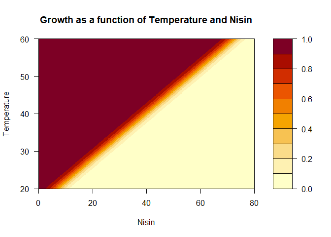<!-- -->

``` r
summary(fit_product)$coefficients
```

    ##                     Estimate   Std. Error   z value   Pr(>|z|)
    ## (Intercept)     -260.7453040 129.81297434 -2.008623 0.04457715
    ## ph                43.0019046  21.91532830  1.962184 0.04974108
    ## nisin             -1.9031460   0.95384330 -1.995240 0.04601675
    ## temp               3.1852345   1.53654865  2.072980 0.03817415
    ## brix              13.4122468   6.82053559  1.966451 0.04924658
    ## I(brix * ph)      -2.2148523   1.14186340 -1.939682 0.05241830
    ## I(brix * temp)    -0.1688439   0.08321463 -2.029017 0.04245653
    ## I(brix * nisin)    0.1002039   0.05028277  1.992807 0.04628258

From the contour plot I can observe that the increase in nisin
concentration has the effect of decreasing Alicyclobacillus
Acidoterrestris growth, while the temperature has the opposite effect.
This behaviour was expected since the model has a negative nisin
coefficient and a positive temperature coefficient.

# Problem 3

First I convert the agerange independent variable into a factor and
change the levels name.

``` r
brainhead$agerange[brainhead$agerange == 1] <- "young"
brainhead$agerange[brainhead$agerange == 2] <- "old"
brainhead$agerange <- factor(brainhead$agerange)
levels(brainhead$agerange) 
```

    ## [1] "old"   "young"

## Question 3.1 and 3.2 Check (and comment) if the distribution of the brain weight can be assumed Gaussian, use the tools we have seen in the course (Q-Q plot, histogram). Fit now the Gaussian distribution to the brain weight values using all the observations in the data frame brainhead. Report the estimated parameters and plot the obtained density on top of the histogram of the data.

``` r
brain.w <- brainhead$brainweight
  
hist(brain.w, probability = TRUE, breaks = 20)
lines(density(brain.w, bw = 30), col = "blue")

mu.w = mean(brain.w) 
paste("Mu estimated: ", mu.w)
```

    ## [1] "Mu estimated:  1282.87341772152"

``` r
sigma.w = sd(brain.w)
paste("Sigma estimated: ", sigma.w)
```

    ## [1] "Sigma estimated:  120.340445786457"

``` r
curve(dnorm(x, mean = mu.w, sd = sigma.w), add = TRUE, col = "red")
legend("topright", legend = c("Kernel density", "Gaussian density"), 
       col = c("blue", "red"), lty = 1)
```

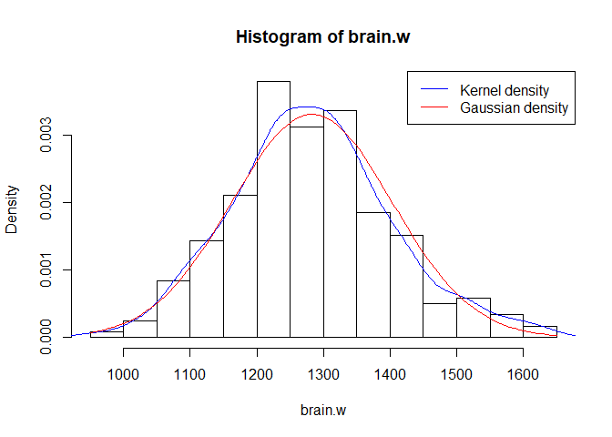<!-- -->

From this first plot the brain weight seems to follow a gaussian
distribution, I will now continue with the Q-Q plot.

``` r
th <- qnorm(ppoints(brain.w), mean = mu.w, sd = sigma.w)
plot(sort(brain.w), th, 
     xlab = "Empirical", ylab = "Theoretical", 
     main = "Q-Q plot (Gaussian)")
abline(0, 1, col = "red")
```

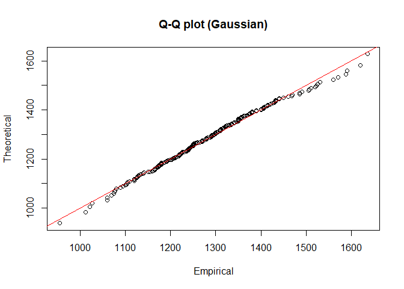<!-- -->

Also from the Q-Q plot the Gaussian seems to fit really well (most of
the points fall along the reference line), so I can say that the
distribution of the brain weight can be assumed to be
Gaussian.

### Obtain and report a 95% confidence interval for the mean parameter, use the method you think is the most appropriate and comment the choice (you can also use different methods and comment the differences).

``` r
## Method 1

# Standard error of the mean by closed form expression
se_mean_formula <- sd(brain.w) / sqrt(length(brain.w))
se_mean_formula
```

    ## [1] 7.816952

``` r
# Quantile confidence interval
alpha <- 0.05
z <- qnorm(1 - alpha / 2)
a <- mu.w - se_mean_formula * z
b <- mu.w + se_mean_formula * z
c(a, b)
```

    ## [1] 1267.552 1298.194

``` r
## Method 2

# Standard error of the mean by non-parametric bootstrap (or by parametric bt)
gaussian_bt <- replicate(1000, {
  brain.w_bt <- sample(brain.w, size = length(brain.w), replace = TRUE)
  mean(brain.w_bt)
})
mu_bt <- gaussian_bt
se_mean_bt <- sd(mu_bt)
se_mean_bt
```

    ## [1] 7.774651

``` r
# Percentile confidence interval
quantile(gaussian_bt, c(alpha/2, 1 - alpha/2))
```

    ##     2.5%    97.5% 
    ## 1267.295 1297.837

I think that in the case of the Gaussian distribution (and in all the
cases where we can use a closed form expression for the standard error),
the easiest way (and maybe a little bit more precise) to compute the
confidence interval is by computing the standard error by closed form
expression and than compute the confidence interval. Anyway the results
are really
similar.

## Question 3.3 Is there a significant difference between the mean value of the brain weight for old and young subjects?

``` r
# Split the data
brainhead.young <- brainhead[brainhead$agerange == "young",]
brainhead.old <- brainhead[brainhead$agerange == "old",]

# Check if there is equal variance
floor(sd(brainhead.young$brainweight)) == floor(sd(brainhead.old$brainweight))
```

    ## [1] FALSE

``` r
# Perform the test
t.test(brainhead.young$brainweight, brainhead.old$brainweight, 
       var.equal = FALSE)
```

    ## 
    ##  Welch Two Sample t-test
    ## 
    ## data:  brainhead.young$brainweight and brainhead.old$brainweight
    ## t = 2.6428, df = 232.37, p-value = 0.008782
    ## alternative hypothesis: true difference in means is not equal to 0
    ## 95 percent confidence interval:
    ##  10.38279 71.21592
    ## sample estimates:
    ## mean of x mean of y 
    ##  1304.736  1263.937

The null hypothesis of the T-test is that the two means are equal, and
the alternative is that they are not.

The assumption for the test is that both groups are sampled from normal
distributions with equal variances, but we can still perform the test by
using a modificated version of the test. By adding , R correct this problem by estimating the variance
and adjusting the degrees of freedom to use in the test.

The p-value of the test is small enough to reject the null hypothesis at
a level of 0.01. So i can state, with 99% confidence, that there is a
significant difference in the weight of the brain between old and young
subjects.

## Question 3.4 Fit the simple linear regression model

``` r
# Fit the models
fit_head <- lm(brainweight ~ headsize, data = brainhead)
fit_head.young <- lm(brainweight ~ headsize, data = brainhead.young)
fit_head.old <- lm(brainweight ~ headsize, data = brainhead.old)

# Plot
plot(brainhead$headsize, brainhead$brainweight, 
     col = brainhead$agerange, pch = 19, 
     xlab = "Headsize", ylab = "Brain weight",
     main = "Observations Scatter Plot and Linear Regressions")
abline(fit_head, col = "blue", lwd = 2)
abline(fit_head.young, col = "red", lwd = 2)
abline(fit_head.old, lwd = 2)
legend("bottomright", legend = c("Young", "Old", "All regr", 
                                 "Young regr", "Old regr"),
       col = c("red", "black", "blue", "red", "black"),
       lty = c(NA, NA, 1, 1, 1) , 
       pch = c(19, 19, NA, NA, NA), 
       lwd = c(NA, NA, 2, 2, 2))
```

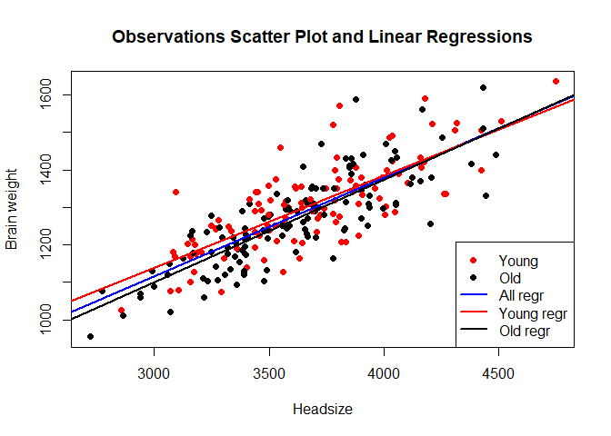<!-- -->

## Question 3.5 Investigate if the linear model with Gaussian noise is appropriate.

• plot the QQ-plot of the residuals against the normal distribution.

• plot the residuals versus the headsize variable.

``` r
qqnorm(resid(fit_head), 
       ylab = "Sample Quantiles", 
       xlab = "Theoretical Quantiles", 
       main = " Q-Q plot of the Residuals vs the Normal Quantiles")
qqline(resid(fit_head), col = "red")
```

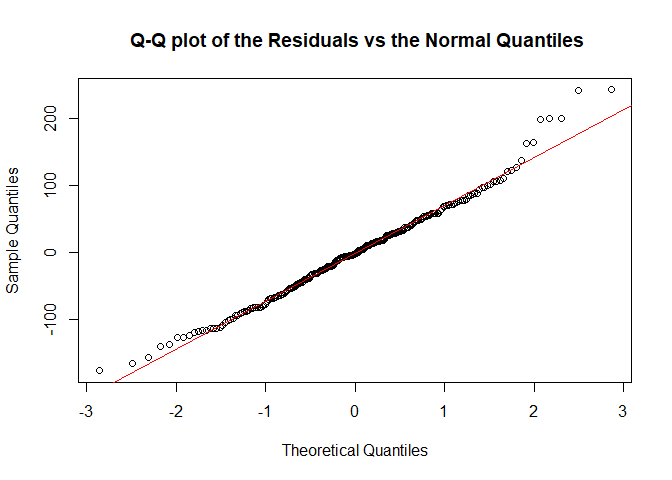<!-- -->

``` r
plot(brainhead$headsize, resid(fit_head), 
     xlab = "Predictors", 
     ylab = "Residuals", 
     main = "Redisuals vs Headsize Variable")
abline(0,0, col = "red")
```

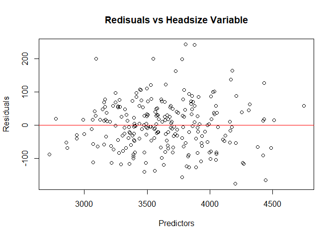<!-- -->

From both plots the model seems to fit quite well the data. In the Q-Q
plot most of the points fall along the reference line, and in residual
vs the headsize variable the residuals are homogeneously distributed
around the horizontal
line.

## Question 3.6 Consider the linear regression in Question 3.4 using all the data. Obtain an estimation of the mean square error using 10-fold cross validation.

``` r
calc_groups <- function(data = brainhead, key = 10) {
  k <- key
  groups <- list()
  m <- nrow(data) %/% k
  for (i in 1:k){
    groups[[i]] <- ((i-1) * m + 1):(i * m)
  }
  return(groups)
}

crossval <- function(object, 
                     data = brainhead,      
                     groups = as.list(1:nrow(data)),
                     kfold = FALSE,
                     key = 10,
                     shuffle = TRUE) {
  if (kfold) {
    groups = calc_groups(data, key = 10)
  }
  if (shuffle) {
    data <- data[sample(1:nrow(data)),]
  }
  res <- sapply(groups, function(ix) {
    modello <- lm(formula(object), data = data[-ix,])
    pr <- predict(modello, newdata = data[ix,])
    pred_error_sq <- (data[ix,]$brainweight - pr)^2
    return(pred_error_sq)
  })
  return(mean(res))
}

crossval(fit_head, kfold = TRUE, shuffle = FALSE)
```

    ## [1] 5386.891

## Question 3.7 Consider the polynomial regression model. Perform the appropriate model selection methods between the polynomial regression and the simple linear regression, is the simpler model sufficient?

``` r
fit_poly <- lm(brainweight ~ headsize + I(headsize^2), data = brainhead)
```

### I start by plotting the residuals vs headsize variable and the QQ-plot of the residuals against the normal distribution for the polynomial model.

``` r
qqnorm(resid(fit_head), 
       ylab = "Sample Quantiles", 
       xlab = "Theoretical Quantiles", 
       main = " Q-Q plot of the Residuals vs the Normal Quantiles, Poly Model")
qqline(resid(fit_poly), col = "red")
```

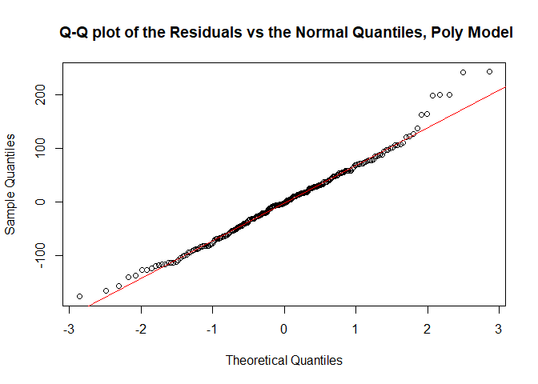<!-- -->

``` r
plot(brainhead$headsize, resid(fit_head), 
     xlab = "Predictors", 
     ylab = "Residuals", 
     main = "Redisuals vs Headsize Variable, Polynomial Model")
abline(0,0, col = "red")
```

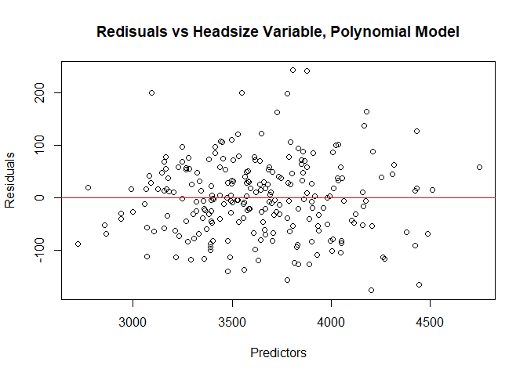<!-- -->

From the Q-Q plot and the residuals vs headsize variable I can’t really
state if a plot is better than the other, they both fit the data really
well.

### Since the models are nested I can also perform the likelihood ratio test.

``` r
# LRT
anova(fit_head, fit_poly, test = "LRT")
```

    ## Analysis of Variance Table
    ## 
    ## Model 1: brainweight ~ headsize
    ## Model 2: brainweight ~ headsize + I(headsize^2)
    ##   Res.Df     RSS Df Sum of Sq Pr(>Chi)
    ## 1    235 1232728                      
    ## 2    234 1224803  1    7924.7   0.2185

LRT is one of the most important and most relevant test I can perform if
we have nested models.

The p-value is large and so I do not have enough evidence to reject the
null hypothesis that the more complex model is significantly better than
the simple one. Therefore from the LRT I select the simple model.

### I can also compute the AIC and BIC scores for both models

``` r
# AIC and BIC
AIC(fit_head, fit_poly)
```

    ##          df      AIC
    ## fit_head  3 2706.510
    ## fit_poly  4 2706.982

``` r
BIC(fit_head, fit_poly)
```

    ##          df      BIC
    ## fit_head  3 2716.914
    ## fit_poly  4 2720.854

From both AIC and BIC scores the simple model is the one to
select.

### I can also estimate the mean square error using 10-fold cross validation.

``` r
crossval(fit_poly, kfold = TRUE, shuffle = FALSE)
```

    ## [1] 5393.467

As expected, in this test the polynomial model perform slightly better
(5393 vs 5386) but this difference in the mean square error should not
be really significant. It is important to consider that this test
doesn’t take into account the increase in complexity of the polynomial
model.

From the tests I performed I can state that the simple model is
sufficient.
