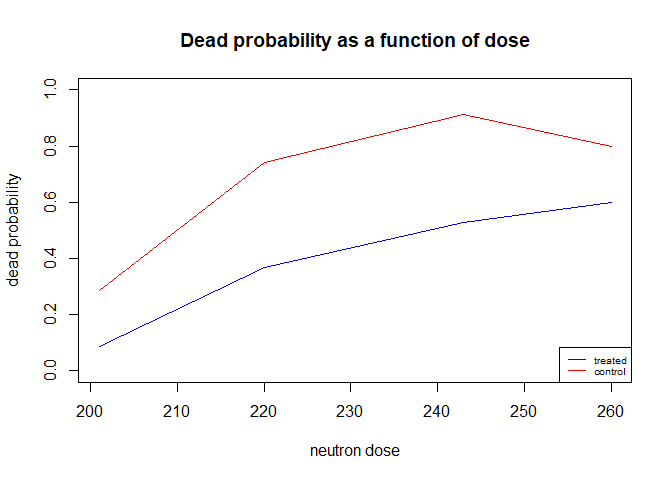
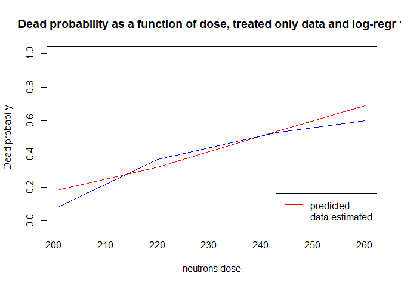
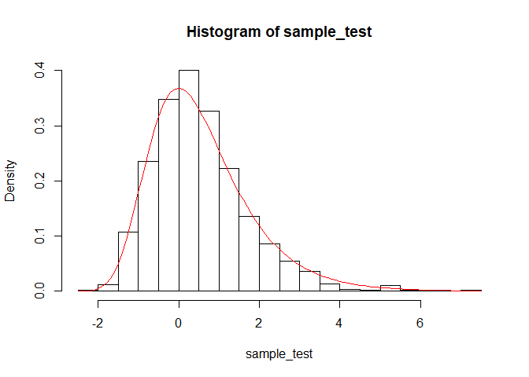
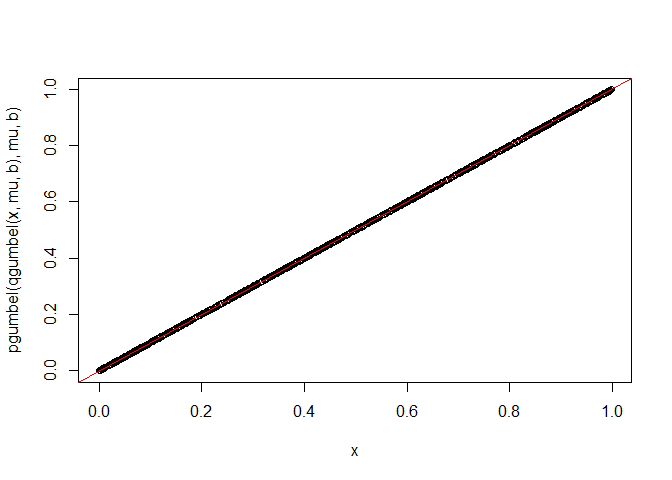
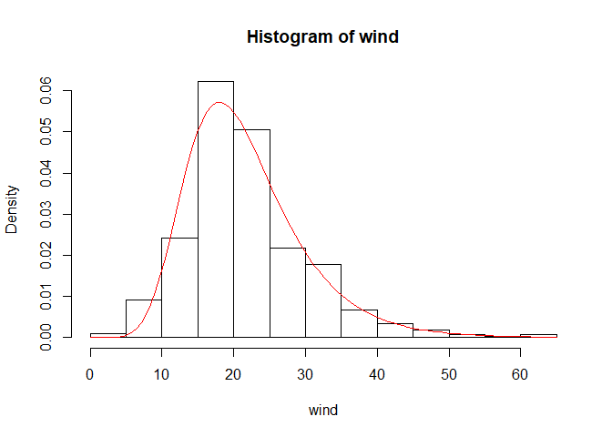
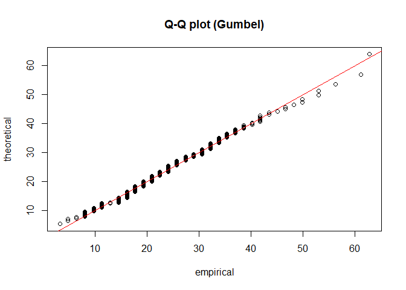
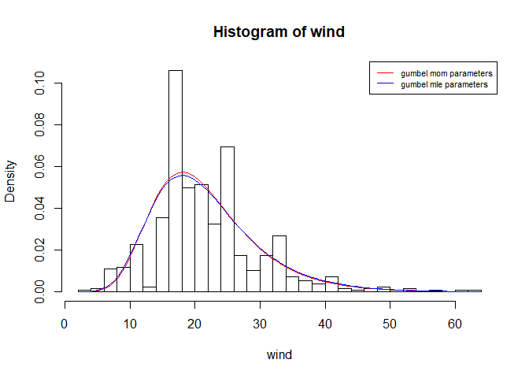
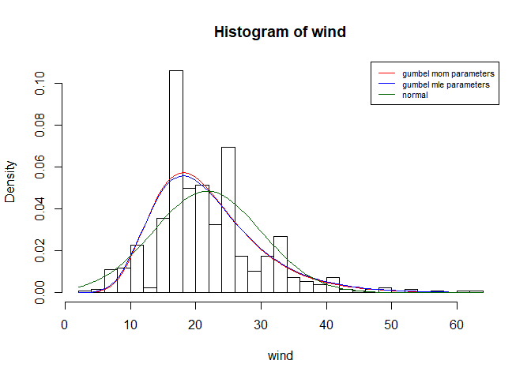
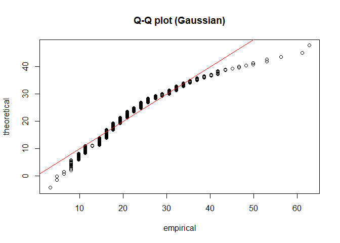
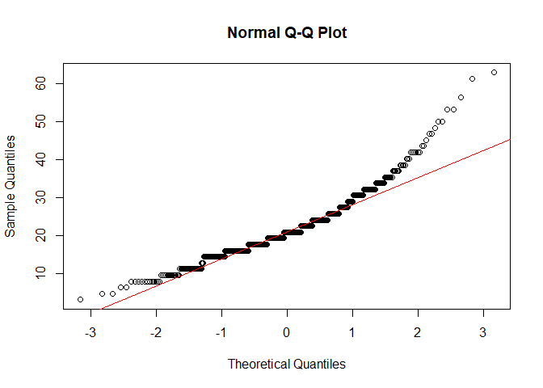

Practice 1
================
Stefano Pellegrini
1/5/2020

# Problem 1

## Ex 1.1 Compute the estimated probability of death for the 8 different combinations of neutron dose and treatment. Plot the estimated probabilities as a function of the neutron dose.

``` r
p.dead_calc <- function(neutrons, df){ 
  dose_f <- df$dose == neutrons                # set radiation dose here
  treated_f <- df$treatment == 1
  control_f <- df$treatment == 0
  died_f <- df$dead == 1
  
  dose_t_f <- dose_f & treated_f
  dose_c_f <- dose_f & control_f
  p.dead_t_f <- sum(dose_t_f & died_f) / sum(dose_t_f)
  p.dead_c_f <- sum(dose_c_f & died_f) / sum(dose_c_f)
  return(data.frame("treated" = p.dead_t_f, "control" = p.dead_c_f))
}

n = c(201, 220, 243, 260)

p.treated_data <- sapply(n, function(i) p.dead_calc(i, radiation)$treated)
p.treated_df_f <- data.frame(dose = c(201,220,243,260), p = p.treated_data)
p.treated_df_f
```

    ##   dose          p
    ## 1  201 0.08571429
    ## 2  220 0.36666667
    ## 3  243 0.52747253
    ## 4  260 0.60000000

``` r
p.control_data <- sapply(n, function(i) p.dead_calc(i, radiation)$control)
p.control_df_f <- data.frame(dose = c(201,220,243,260), p = p.control_data)
p.control_df_f
```

    ##   dose         p
    ## 1  201 0.2857143
    ## 2  220 0.7416667
    ## 3  243 0.9120879
    ## 4  260 0.8000000

``` r
plot(p.control_df_f$dose, p.control_df_f$p, 
     type = "l", ylab = "dead probability", xlab = "neutron dose", col = "red",
     main = "Dead probability as a function of dose", ylim = c(0, 1))
lines(p.treated_df_f$dose, p.treated_df_f$p, col = "blue")
legend("bottomright", legend = c("treated", "control"), col = c("blue", "red"), lty = 1,
       cex = 0.6) 
```

<!-- -->

## Ex 1.2 Perform the chi squared test for independence for the contingency tables of treatment and dead for different neutron doses.

``` r
table.dose201 <- table(radiation[radiation$dose == 201, c(2, 3)])
table.dose220 <- table(radiation[radiation$dose == 220, c(2, 3)])
table.dose243 <- table(radiation[radiation$dose == 243, c(2, 3)])
table.dose260 <- table(radiation[radiation$dose == 260, c(2, 3)])
```

``` r
alpha = 0.05
chisq201 <- chisq.test(table.dose201)
chisq201$p.value > alpha              
```

    ## [1] TRUE

``` r
chisq220 <- chisq.test(table.dose220) 
chisq220$p.value > alpha
```

    ## [1] FALSE

``` r
chisq243 <- chisq.test(table.dose243)
chisq243$p.value > alpha              # I get a warning because there are few
```

    ## [1] FALSE

``` r
chisq260 <- chisq.test(table.dose260) # observations relative to that table
```

    ## Warning in chisq.test(table.dose260): Chi-squared approximation may be incorrect

``` r
chisq260$p.value > alpha              
```

    ## [1] TRUE

If p-value \(> \alpha\) is TRUE we don’t reject the null and so they are
independent, if p-value \(> \alpha\) is FALSE they are dependent. For
220 and 243 dose we can reject the null hypothesis of independence, and
thus we can say that (at a level 0.05) there is a statistically
significant dependence between treatment and dead. For the lowest and
highest radiation dose we can not reject the null hypothesis of
independence.

## Ex 1.3 To compare probability of death for different treatment under the four possible neutron doses we perform now one-sided Wald tests, using the (asymptotically normal) statistic.

### How to bootstrap from a dataframe.

``` r
delta_bt_calc <- function(neutrons){   
  radiation_bt <- radiation[sample(seq_len(nrow(radiation)), nrow(radiation), replace=TRUE),] 
  dose_bt <- radiation_bt$dose == neutrons                # set radiation dose here
  treated_bt <- radiation_bt$treatment == 1
  control_bt <- radiation_bt$treatment == 0
  died_bt <- radiation_bt$dead == 1
  
  dose_t_bt <- dose_bt & treated_bt
  dose_c_bt <- dose_bt & control_bt
  p.dose_t <- sum(dose_t_bt & died_bt) / sum(dose_t_bt)
  p.dose_c <- sum(dose_c_bt & died_bt) / sum(dose_c_bt)
  delta <- p.dose_t - p.dose_c
  return(delta)
}

delta201_bt <- replicate(1000, delta_bt_calc(201))        # delta from bootstrap
delta220_bt <- replicate(1000, delta_bt_calc(220))
delta243_bt <- replicate(1000, delta_bt_calc(243))
delta260_bt <- replicate(1000, delta_bt_calc(260))

delta201 <- p.treated_df_f[1,2] - p.control_df_f[1,2]     # original delta
delta220 <- p.treated_df_f[2,2] - p.control_df_f[2,2]
delta243 <- p.treated_df_f[3,2] - p.control_df_f[3,2]
delta260 <- p.treated_df_f[4,2] - p.control_df_f[4,2]
paste(delta201, delta220, delta243, delta260)
```

    ## [1] "-0.2 -0.375 -0.384615384615385 -0.2"

### 1 side Wald test.

``` r
alpha = 0.05                            
z <- qnorm(1 - alpha)                   

# Dose 201
w_201 <- (delta201 / sd(delta201_bt))   
w_201 < -z                             
```

    ## [1] TRUE

``` r
pval_201 <- 1 - pnorm(-w_201)                                           
pval_201
```

    ## [1] 0.01490724

``` r
# Dose 220
w_220 <- (delta220 / sd(delta220_bt))
w_220 < -z
```

    ## [1] TRUE

``` r
pval_220 <- 1 - pnorm(-w_220)
pval_220
```

    ## [1] 1.938816e-11

``` r
# Dose 243
w_243 <- (delta243 / sd(delta243_bt))
w_243 < -z
```

    ## [1] TRUE

``` r
pval_243 <- 1 - pnorm(-w_243)
pval_243
```

    ## [1] 1.864103e-10

``` r
# Dose 260
w_260 <- (delta260 / sd(delta260_bt))
w_260 < -z
```

    ## [1] FALSE

``` r
pval_260 <- 1 - pnorm(-w_260) 
pval_260
```

    ## [1] 0.1198883

``` r
## It's the same of:
print("                    v They are the same ^")
```

    ## [1] "                    v They are the same ^"

``` r
alpha = 0.05                            
z <- qnorm(alpha)                   

# Dose 201
w_201 <- (delta201 / sd(delta201_bt))   
w_201 < z                             
```

    ## [1] TRUE

``` r
pval_201 <- pnorm(w_201)                                           
pval_201
```

    ## [1] 0.01490724

``` r
# Dose 220
w_220 <- (delta220 / sd(delta220_bt))
w_220 < z
```

    ## [1] TRUE

``` r
pval_220 <- pnorm(w_220)
pval_220
```

    ## [1] 1.938819e-11

``` r
# Dose 243
w_243 <- (delta243 / sd(delta243_bt))
w_243 < z
```

    ## [1] TRUE

``` r
pval_243 <- pnorm(w_243)
pval_243
```

    ## [1] 1.864103e-10

``` r
# Dose 260
w_260 <- (delta260 / sd(delta260_bt))
w_260 < z
```

    ## [1] FALSE

``` r
pval_260 <- pnorm(w_260) 
pval_260
```

    ## [1] 0.1198883

If \(W < -Z\) then we have an extreme value for the null hypothesis and
so I can reject it. If p-value \(< \alpha\) then I can reject the null
hypothesis.

I can reject the null hypothesis, with significante level of 0.05, that
the Streptomycin treated mice that receive radiation dose of 201, 220,
243 are equal or less probable to survive than mice treated with saline
control that receive the same amounth of radiation. So for these
radiation doses I can say that the Streptomycin is effective, while I
don’t have enough prove to reject the null hypothesis for radiation dose
of
260.

## Ex 1.4 We now perform logistic regression to predict the probability of death as a function of the neutron dose. Fit, using only the observations from mice treated with Streptomycin.

``` r
# To obtain a data.frame with treated only observations
treated.only_df <- radiation[radiation$treatment == 1,]
control.only_df <- radiation[radiation$treatment == 0,]
```

``` r
model_strept1 <- glm(dead ~ dose, family = binomial, data = treated.only_df)
summary(model_strept1)
```

    ## 
    ## Call:
    ## glm(formula = dead ~ dose, family = binomial, data = treated.only_df)
    ## 
    ## Deviance Residuals: 
    ##     Min       1Q   Median       3Q      Max  
    ## -1.5259  -0.8807  -0.6413   1.1200   1.8346  
    ## 
    ## Coefficients:
    ##              Estimate Std. Error z value Pr(>|z|)    
    ## (Intercept) -9.200832   1.959687  -4.695 2.67e-06 ***
    ## dose         0.038426   0.008517   4.512 6.43e-06 ***
    ## ---
    ## Signif. codes:  0 '***' 0.001 '**' 0.01 '*' 0.05 '.' 0.1 ' ' 1
    ## 
    ## (Dispersion parameter for binomial family taken to be 1)
    ## 
    ##     Null deviance: 350.99  on 260  degrees of freedom
    ## Residual deviance: 328.67  on 259  degrees of freedom
    ## AIC: 332.67
    ## 
    ## Number of Fisher Scoring iterations: 4

``` r
# Plot the probability of death predicted by the model (log-regr 1) 
# as a function of the neutron dose.
p.treated.only_pred1 <- sapply(n, function(i) predict(model_strept1, 
                                                      type = "response", 
                                                      data.frame(dose = i)))
predict(model_strept1, type = "response", data.frame(dose= 201))
```

    ##         1 
    ## 0.1858478

``` r
###XXX## example to ask to Gherardo:
# why prediction to a new dataset daesn't work if specify data.frame()?
model_all <- glm(dead ~ dose, family = binomial, data = radiation)
#predict(model_all, type = "response", newdata = treated.only_df, data.frame(dose = 221))
predict(model_all, type = "response", data.frame(dose = 221))
```

    ##         1 
    ## 0.5096087

``` r
# what the meaning of data= in prediction? it looks like daesn't change anything 
predict(model_all, type = "response", data = treated.only_df, data.frame(dose = 221))
```

    ##         1 
    ## 0.5096087

``` r
##XXX## 

p.treated.only_pred1_df <- data.frame(dose = c(201,220,243,260), p = p.treated.only_pred1)

p.treated.only_data <- sapply(n, function(i) p.dead_calc(i, treated.only_df)$treated)
p.treated.only_data_df <- data.frame(dose = c(201,220,243,260), p = p.treated.only_data)

plot(p.treated.only_pred1_df$dose, p.treated.only_pred1_df$p, type = "l", col = "red", 
     main = "Dead probability as a function of dose, treated only data and log-regr 1",
     ylab = "Dead probabily", xlab = "neutrons dose", ylim = c(0, 1))
lines(p.treated.only_data_df$dose, p.treated.only_data_df$p, col = "blue")
legend("bottomright", legend = c("predicted", "data estimated"), 
       col = c("red", "blue"), lty = 1)
```

<!-- -->

``` r
# Fit, using the data from mice treated with Streptomycin, 
# the other two logistic regressions models, now with polynomial terms
model_strept2 <- glm(dead ~ poly(dose, 2), family = binomial, data = treated.only_df)
coefficients(model_strept2)
```

    ##    (Intercept) poly(dose, 2)1 poly(dose, 2)2 
    ##      -0.487326      11.121451      -4.567853

``` r
model_strept3 <- glm(dead ~ poly(dose, 3), family = binomial, data = treated.only_df)
coefficients(model_strept3)
```

    ##    (Intercept) poly(dose, 3)1 poly(dose, 3)2 poly(dose, 3)3 
    ##     -0.5070594     11.7086215     -5.2174058      2.0268824

``` r
# Perform model selection using AIC and LRT
AIC(model_strept1, model_strept2, model_strept3)
```

    ##               df      AIC
    ## model_strept1  2 332.6737
    ## model_strept2  3 331.0922
    ## model_strept3  4 332.2617

``` r
anova(model_strept1, model_strept2, test = "LRT")
```

    ## Analysis of Deviance Table
    ## 
    ## Model 1: dead ~ dose
    ## Model 2: dead ~ poly(dose, 2)
    ##   Resid. Df Resid. Dev Df Deviance Pr(>Chi)  
    ## 1       259     328.67                       
    ## 2       258     325.09  1   3.5815  0.05843 .
    ## ---
    ## Signif. codes:  0 '***' 0.001 '**' 0.01 '*' 0.05 '.' 0.1 ' ' 1

p-value \(> alpha\), I don’t reject the H0 (\(H0 =\) advanced model is
not significantly better) so I choose the log-regr 1 according to the
LRT test.

According to the AIC scores the log-regr 2 model perform slightly better
than the log-regr 1.

``` r
BIC(model_strept1, model_strept2, model_strept3)
```

    ##               df      BIC
    ## model_strept1  2 339.8027
    ## model_strept2  3 341.7858
    ## model_strept3  4 346.5198

The BIC scores (not requested) confirm the result of the LRT
test.

# Problem 2

## Ex 2.1 Fit a linear regression model for the variable fat (percentage of body fat), using all the other body measurements in the data set as predictor variables. Can we reject that the coeffcient for knee is equal to 0?

``` r
model_fitall <- lm(fat ~ ., data = bodyfat)
summary(model_fitall)
```

    ## 
    ## Call:
    ## lm(formula = fat ~ ., data = bodyfat)
    ## 
    ## Residuals:
    ##      Min       1Q   Median       3Q      Max 
    ## -11.1596  -2.8548  -0.0893   3.2070  10.0482 
    ## 
    ## Coefficients:
    ##               Estimate Std. Error t value Pr(>|t|)    
    ## (Intercept) -20.492266  22.243941  -0.921  0.35786    
    ## age           0.062126   0.032416   1.916  0.05650 .  
    ## weight       -0.206398   0.136774  -1.509  0.13262    
    ## height       -1.754027   7.043080  -0.249  0.80354    
    ## neck         -0.463918   0.236396  -1.962  0.05088 .  
    ## chest        -0.019125   0.103370  -0.185  0.85338    
    ## abdomen       0.959094   0.090451  10.604  < 2e-16 ***
    ## hip          -0.205217   0.146878  -1.397  0.16366    
    ## thigh         0.240235   0.146783   1.637  0.10303    
    ## knee          0.006447   0.248244   0.026  0.97930    
    ## ankle         0.177386   0.222858   0.796  0.42685    
    ## biceps        0.185049   0.172728   1.071  0.28511    
    ## forearm       0.451047   0.199624   2.259  0.02476 *  
    ## wrist        -1.618680   0.536172  -3.019  0.00281 ** 
    ## ---
    ## Signif. codes:  0 '***' 0.001 '**' 0.01 '*' 0.05 '.' 0.1 ' ' 1
    ## 
    ## Residual standard error: 4.314 on 237 degrees of freedom
    ## Multiple R-squared:  0.7463, Adjusted R-squared:  0.7324 
    ## F-statistic: 53.64 on 13 and 237 DF,  p-value: < 2.2e-16

The most relevant predictor is the variable abdomen because it has the
lowest p-value, it has a positive estimated value, meaning that an
increase of abdomen circumference is correlated to an increase in body
fat percentage.

We can’t reject at \(\alpha = 0.05\) that the coefficient for knee is
equal to 0, that’s because it has a large p-value and we can reject the
\(H0: coefficient = 0\) only if the p-value is lower than
alpha.

## Ex 2.2 Perform model selection using both forward and backward stepwise regression using BIC as score.

``` r
model_intercept <- lm(fat ~ 1, data = bodyfat)

model_step_forward <- step(model_intercept, trace = 0, scope = formula(model_fitall),    
                           direction = ("forward"), k = log(nrow(bodyfat)))   

model_step_backward <- step(model_fitall,  
                           direction = ("backward"), trace = 0, k = log(nrow(bodyfat)))
```

``` r
summary(model_step_forward)
```

    ## 
    ## Call:
    ## lm(formula = fat ~ abdomen + weight + wrist + forearm, data = bodyfat)
    ## 
    ## Residuals:
    ##      Min       1Q   Median       3Q      Max 
    ## -10.6012  -3.2504  -0.0821   3.1295   9.0853 
    ## 
    ## Coefficients:
    ##              Estimate Std. Error t value Pr(>|t|)    
    ## (Intercept) -35.60134    7.28236  -4.889 1.83e-06 ***
    ## abdomen       0.99417    0.05609  17.726  < 2e-16 ***
    ## weight       -0.30228    0.05465  -5.531 8.14e-08 ***
    ## wrist        -1.44497    0.44669  -3.235  0.00138 ** 
    ## forearm       0.47419    0.18166   2.610  0.00960 ** 
    ## ---
    ## Signif. codes:  0 '***' 0.001 '**' 0.01 '*' 0.05 '.' 0.1 ' ' 1
    ## 
    ## Residual standard error: 4.343 on 246 degrees of freedom
    ## Multiple R-squared:  0.7332, Adjusted R-squared:  0.7289 
    ## F-statistic:   169 on 4 and 246 DF,  p-value: < 2.2e-16

``` r
summary(model_step_backward)
```

    ## 
    ## Call:
    ## lm(formula = fat ~ weight + abdomen + forearm + wrist, data = bodyfat)
    ## 
    ## Residuals:
    ##      Min       1Q   Median       3Q      Max 
    ## -10.6012  -3.2504  -0.0821   3.1295   9.0853 
    ## 
    ## Coefficients:
    ##              Estimate Std. Error t value Pr(>|t|)    
    ## (Intercept) -35.60134    7.28236  -4.889 1.83e-06 ***
    ## weight       -0.30228    0.05465  -5.531 8.14e-08 ***
    ## abdomen       0.99417    0.05609  17.726  < 2e-16 ***
    ## forearm       0.47419    0.18166   2.610  0.00960 ** 
    ## wrist        -1.44497    0.44669  -3.235  0.00138 ** 
    ## ---
    ## Signif. codes:  0 '***' 0.001 '**' 0.01 '*' 0.05 '.' 0.1 ' ' 1
    ## 
    ## Residual standard error: 4.343 on 246 degrees of freedom
    ## Multiple R-squared:  0.7332, Adjusted R-squared:  0.7289 
    ## F-statistic:   169 on 4 and 246 DF,  p-value: < 2.2e-16

In order to use the BIC score i add \(k = log(n)\). The two models are
the
same.

## Ex 2.3 Compute the body mass index for all the individuals in the data set. Fit the following linear model to estimate the percentage of body fat.

``` r
bodyfat$bmi <- bodyfat$weight / (bodyfat$height^2) 
model_bmi.age <- lm(fat ~ bmi + age, data = bodyfat)
sm_bmi.age <- summary(model_bmi.age)$coefficients
```

## Ex 2.4 Compute 95% percentile confidence intervals for the coefficients in the model of question 2.3 using non-parametric bootstrap. Compare it with the R built-in function confint.

``` r
# Bootstrap se estimation
n = nrow(bodyfat)
coeff_bt <- replicate(100, {
  tmp_model <- lm(formula(model_bmi.age), bodyfat[sample(1:n, replace = T),])
  return(coefficients(tmp_model))
})
intercept_bt <- coeff_bt[1,]
intercept_bt
```

    ##   [1] -29.89761 -32.01171 -28.73722 -37.20751 -32.78398 -30.09246 -23.00255
    ##   [8] -25.81384 -34.84511 -23.21482 -32.55795 -27.22642 -25.20581 -22.44397
    ##  [15] -20.86401 -24.58661 -32.28921 -18.58165 -37.07510 -25.03494 -31.65237
    ##  [22] -27.82389 -29.12306 -23.98308 -33.25181 -27.23357 -29.61380 -18.23142
    ##  [29] -28.27917 -26.43016 -29.95802 -23.93752 -28.39588 -31.36616 -28.10478
    ##  [36] -32.08092 -35.51960 -19.48430 -21.34926 -28.66165 -23.86686 -28.03012
    ##  [43] -28.56799 -27.24713 -32.62344 -35.30730 -25.54476 -29.20533 -32.70159
    ##  [50] -26.26776 -31.69685 -21.27859 -22.54483 -29.19939 -32.26731 -30.75538
    ##  [57] -23.57703 -34.76156 -31.66370 -29.31400 -29.50220 -31.68756 -31.41510
    ##  [64] -26.20518 -27.98641 -26.95001 -27.80668 -23.94687 -28.79542 -26.95195
    ##  [71] -28.99463 -24.61845 -27.10365 -21.33530 -33.58470 -30.23955 -26.51341
    ##  [78] -23.24137 -25.16020 -25.36977 -28.53905 -24.14185 -33.78978 -22.60721
    ##  [85] -29.69454 -31.16765 -34.54765 -18.74927 -28.92843 -34.50315 -28.72532
    ##  [92] -34.84363 -27.33456 -30.96333 -35.14519 -27.49337 -34.45250 -30.13012
    ##  [99] -23.16795 -30.72267

``` r
bmi_bt <- coeff_bt[2,]
age_bt <- coeff_bt[3,]
```

``` r
# Percentile method 
t(apply(coeff_bt, MARGIN = 1, quantile, probs = c(alpha/2, 1 - alpha/2)))
```

    ##                    2.5%       97.5%
    ## (Intercept) -35.4187586 -19.0984085
    ## bmi           1.2990710   1.9188517
    ## age           0.1042459   0.1860981

``` r
# or
quantile(intercept_bt, probs = c(alpha/2, 1 - alpha/2))
```

    ##      2.5%     97.5% 
    ## -35.41876 -19.09841

``` r
quantile(bmi_bt, probs = c(alpha/2, 1 - alpha/2))
```

    ##     2.5%    97.5% 
    ## 1.299071 1.918852

``` r
quantile(age_bt, probs = c(alpha/2, 1 - alpha/2))
```

    ##      2.5%     97.5% 
    ## 0.1042459 0.1860981

``` r
# Quantile method
alpha <- 0.05                    
z <- qnorm(1 - alpha/2)

se_intercept <- sd(intercept_bt)
k_intercept <- sm_bmi.age[1,1]
a_intercept <- k_intercept - se_intercept * z
b_intercept <- k_intercept + se_intercept * z
paste("95% Confidence Interval for the intercept: ( a =", a_intercept, 
      ", b= ", b_intercept, ")")
```

    ## [1] "95% Confidence Interval for the intercept: ( a = -36.2838971466421 , b=  -19.2156665526668 )"

``` r
k_bmi <- sm_bmi.age[2,1]
se_bmi <- sd(bmi_bt)
a_bmi <- k_bmi - se_bmi * z
b_bmi <- k_bmi + se_bmi * z
paste("95% Confidence Interval for the BMI: ( a =", a_bmi, ", b= ", b_bmi, ")")
```

    ## [1] "95% Confidence Interval for the BMI: ( a = 1.24099349080516 , b=  1.95262467930592 )"

``` r
k_age <- sm_bmi.age[3,1]
se_age <- sd(age_bt)
a_age <- k_age - se_age * z
b_age <- k_age + se_age * z
paste("95% Confidence Interval for the age: ( a =", a_age, ", b= ", b_age, ")")
```

    ## [1] "95% Confidence Interval for the age: ( a = 0.0950642442607927 , b=  0.186059735501583 )"

``` r
# Confint built-in R function
confint(model_bmi.age, level = 0.95)
```

    ##                    2.5 %      97.5 %
    ## (Intercept) -32.90604710 -22.5935166
    ## bmi           1.40860663   1.7850115
    ## age           0.08604041   0.1950836

## Ex 2.5 Compare the models obtained in question 2.2 and the model obtained in question 2.3 using BIC and errors estimated with leave-one-out cross validation.

``` r
cv_calc <- function(modello){ 
  pred_error_sq <- c(0)
  for(i in 1:nrow(bodyfat)) {        
    bodyfat_i <- bodyfat[-i,]             # remove the i'th observation
    cv_model <- lm(formula(modello), data = bodyfat_i)# model with i'th observation out
    
    y_pred <- predict(cv_model, newdata = bodyfat[i,]) 
                                          # predict i'th observation
    pred_error_sq <- pred_error_sq + (bodyfat[i,]$fat - y_pred)^2
  }                                       # cumulate squared prediction errors
  return(pred_error_sq)
}

cv_step <- cv_calc(model_step_forward)
cv_step
```

    ##        1 
    ## 4886.385

``` r
cv_bmi <- cv_calc(model_bmi.age)
cv_bmi
```

    ##        1 
    ## 7839.209

``` r
BIC(model_step_forward, model_bmi.age)
```

    ##                    df      BIC
    ## model_step_forward  6 1477.576
    ## model_bmi.age       4 1586.255

The model obtained with stepwise regression results to be the best from
both cross validation and BIC.

# Problem 3

## Ex 3.1

``` r
# PDF
dgumbel <- function(x, mu = 0, b = 1, log = FALSE){       
  temp <- (1 / b) * exp( (mu - x)/b - exp((mu - x)/b) )    
  if (log){                                                
    return(log(temp))
  }else{ 
    return(temp)
  }
}
  
# CDF
pgumbel <- function(q, mu = 0, b = 1){
  temp <- -exp(-( (q - mu) / b ))
  temp2 <- exp(temp)
return(temp2)
}
# Quantile F
qgumbel <- function(p, mu = 0, b = 1, lower.tail = TRUE){
  p <- log(p)
  temp <- mu - b * log( - p )
  if (lower.tail){
    return(temp)
  }else{
    p <- 1 - log(p)                 # if lower.tail = TRUE -> P(X <= 0)
    return(temp)                    # if lower.tail = FALSE -> P(X => 0)
  }                                 
}

# Sampling F
rgumbel <- function(n = 1, mu = 0, b = 1){
  qgumbel(runif(n), mu = mu, b = b)
}
```

### Test

``` r
# Plot
sample_test <- rgumbel(1000)
hist(sample_test, breaks = 30, probability = TRUE)
curve(dgumbel(x), add = TRUE, col = "red")
```

<!-- -->

``` r
# Check that dgumbel is positive
check_positive <- function(densita){
  for (mu in c(-100:100)){
    for (b in c(1:10)){
     return(all(densita(-1000:1000, mu = mu, b = b) >= 0))
    }  
  }
}
check_positive(dgumbel)
```

    ## [1] TRUE

``` r
# Check that dgumbel integrate to 1
check_integr.to1 <- function(densita){
  for (mu in c(-10:10)){
    for (b in c(1:10)){
      return(abs(integrate(densita, -Inf, Inf, mu = mu, b= b)$value - 1) < 1e-7)
    }  
  }
}
check_integr.to1(dgumbel)
```

    ## [1] TRUE

``` r
# Check that qgumbel is the inverse of pgumbel just one choice of the parameters
mu <- -5
b <- 4
x <- runif(1000)          #some random probabilities                
plot(x, pgumbel(qgumbel(x, mu, b), mu, b))                  
abline(0, 1, col = "red") #the points should be in this line
```

<!-- -->

``` r
# the inverse
x <- rnorm(1000, mean = mu, sd = 10)
all(qgumbel(pgumbel(x, mu, b), mu, b) - x < 1e-12)
```

    ## [1] TRUE

## Ex 3.2 Apply the method of moments estimators to fit a Gumbel distribution to the observations in the data set wind. Plot the histogram of the data in wind and the estimated Gumbel density corresponding to the method of moments estimators. Judge the estimation with a Q-Q plot.

``` r
# Estimate the parameters over the wind dataset
b_mom <- sqrt(var(wind) * 6) / pi
mu_mom <- mean(wind) - (-digamma(1) ) * b_mom
c(mu = mu_mom, b = b_mom)
```

    ##        mu         b 
    ## 18.043939  6.426868

``` r
# Plot
hist(wind, probability = TRUE)
curve(dgumbel(x, mu = mu_mom, b = b_mom), add = TRUE, col = "red")
```

<!-- -->

``` r
# Q-Q Plot (check if the Gumbel distribution seems to fit well the data)
th <- qgumbel(ppoints(wind), mu = mu_mom, b = b_mom)
plot(sort(wind), th, xlab = "empirical", ylab = "theoretical", main = "Q-Q plot (Gumbel)")
abline(0, 1, col = "red")
```

<!-- -->

The Gumbel distribution seems to fit well the
data.

## Ex 3.3 Implement in R the minus log-likelihood for the Gumbel model and obtain numerically the maximum-likelihood estimation of the parameters. Plot the estimated density on top of the histogram and compare it with the method of moments estimates.

``` r
mll_gumbel <- function(par, xvals){
  return(-sum(dgumbel(xvals, mu = par[1], b = par[2], log = TRUE))) }
gumbel_mle <- optim(f = mll_gumbel, par = c(mu_mom, b_mom), xvals = wind)
mu_mle_est <- gumbel_mle$par[1]
b_mle_est <- gumbel_mle$par[2]

hist(wind, probability = TRUE, breaks = 35)
curve(dgumbel(x, mu = mu_mom, b = b_mom), add = TRUE, col = "red")
curve(dgumbel(x, mu = mu_mle_est, b = b_mle_est), add = TRUE, col = "blue")
legend("topright", legend = c("gumbel mom parameters", "gumbel mle parameters"), 
                              col = c("red", "blue"), cex = 0.7, lty = 1)
```

<!-- -->

## Ex 3.4 Fit also a Gaussian model to the data in wind using maximum likelihood. Check how well the Gaussian model fits the data using the histogram and a Q-Q plot. Do you think the Gaussian model is appropriate? Compare the Gaussian and the Gumbel models for the wind data using both AIC and BIC. Can we use likelihood ratio test to compare Gaussian and Gumbel models?

``` r
mll_normal <- function(par, xvals){
  return(-sum(dnorm(xvals, mean = par[1], sd = par[2], log = TRUE)))
}
normal_mle <- optim(f = mll_normal, par = c(1, 1), xvals = wind)
mean_mle_est <- normal_mle$par[1]
sd_mle_est <- normal_mle$par[2]
```

``` r
# histogram
hist(wind, probability = TRUE, breaks = 35)
curve(dgumbel(x, mu = mu_mom, b = b_mom), add = TRUE, col = "red")
curve(dgumbel(x, mu = mu_mle_est, b = b_mle_est), add = TRUE, col = "blue")
curve(dnorm(x, mean = mean_mle_est, sd = sd_mle_est), add = TRUE, col = "dark green")
legend("topright", legend = c("gumbel mom parameters", "gumbel mle parameters", "normal"), 
       col = c("red", "blue", "dark green"), cex = 0.7, lty = 1)
```

<!-- -->

``` r
# Q-Q Plot
th <- qnorm(ppoints(wind), mean = mean_mle_est, sd = sd_mle_est)
plot(sort(wind), th, xlab = "empirical", ylab = "theoretical", main = "Q-Q plot (Gaussian)")
abline(0, 1, col = "red")
```

<!-- -->

``` r
    # or
qqnorm(wind)                                          
qqline(wind, col = "red")
```

<!-- --> The
gumbel model seems to fit better

``` r
k = length(gumbel_mle$par)
n = length(wind)
gumbel_AIC <- 2 * gumbel_mle$value + 2 * k              # I'm using the minimum log likelihood
normal_AIC <- 2 * normal_mle$value + 2 * k
gumbel_BIC <- 2 * gumbel_mle$value + 2 * log(n)
normal_BIC <- 2 * normal_mle$value + 2 * log(n)
data.frame(row.names = c("Gumbel", "Normal"), 
           minll = c(gumbel_mle$value, normal_mle$value),
           AIC = c(gumbel_AIC, normal_AIC),
           BIC = c(gumbel_BIC, normal_BIC))
```

    ##           minll      AIC      BIC
    ## Gumbel 2185.525 4375.050 4383.955
    ## Normal 2236.428 4476.855 4485.759

The gumbel model fits better the data since obtains always the lowest
score. We can’t use the LRT since the two models are not
nested.

## Ex 3.5 Use non-parametric bootstrap to estimate the standard error of mu and b (the MLE estimators for the Gumbel distribution) over the wind dataset. Compute 95% confidence intervals for the parameters using normal quantiles.

``` r
# Estimate se_gumbel_parameters with bootstrap
gumbel_par_bt <- replicate(1000, expr = {
  wind_bt <- sample(wind, size = length(wind), replace = TRUE)
  optim(f = mll_gumbel, par = c(mu_mom, b_mom), xvals = wind_bt)$par
})
mu_bt <- gumbel_par_bt[1,]
b_bt <- gumbel_par_bt[2,]
```

``` r
# Compute confidence interval using normal quantiles
alpha <- 0.05                    
z <- qnorm(1 - alpha/2)

se_mu <- sd(mu_bt)
a_mu <- mu_mle_est - se_mu * z
b_mu <- mu_mle_est + se_mu * z

se_b <- sd(b_bt)
a_b <- b_mle_est - se_b * z
b_b <- b_mle_est + se_b * z

data.frame(row.names = c("mu", "b"),
           a = c(a_mu, a_b),
           b = c(b_mu, b_b))
```

    ##            a         b
    ## mu 17.504283 18.605305
    ## b   6.171394  7.017699

``` r
# Compute confidence interval using percentile
t(apply(gumbel_par_bt, MARGIN = 1, quantile, probs = c(alpha/2, 1 - alpha/2)))
```

    ##           2.5%     97.5%
    ## [1,] 17.487720 18.603576
    ## [2,]  6.128647  7.000751

``` r
    # or
quantile(mu_bt, probs = c(alpha/2, 1 - alpha/2))
```

    ##     2.5%    97.5% 
    ## 17.48772 18.60358

``` r
quantile(b_bt, probs = c(alpha/2, 1 - alpha/2))
```

    ##     2.5%    97.5% 
    ## 6.128647 7.000751

## 3.6

We perform here some Bayesian inference over the parameters of the
Gumbel dsitribution.

To obtain the MAP estimators, we first of all define the (unnormalized)
minus log-posterior:

``` r
mlpost <- function(par, data){
mll_gumbel(par, data) - dnorm(par[1], 0, sqrt(10), log = TRUE) - dexp(par[2], rate = 1, log = TRUE)
}
```

Then we use optim:

``` r
par_map <- optim(c(mu_mom, b_mom), fn = mlpost, data = wind)$par
par_map
```

    ## [1] 17.902544  6.526501

They are very similar to the MLE parameters (we have a lot of data and
the prior is not very strong).

For the posterior mean we can use the Monte-Carlo method.

``` r
N <- 100000
mus <- rnorm(N, mean = 0, sd = sqrt(10))
bs <- rexp(N, rate = 1 )
lw <- sapply(1:N, function(i){
sum(dgumbel(wind, mu = mus[i], b = bs[i], log = TRUE))
})
b <- max(lw)
w <- exp(lw - b) / sum(exp(lw - b))
mu_pm <- sum(mus * w)
b_pm <- sum(bs * w)
c(mu_pm, b_pm)
```

    ## [1] 10.633274  6.020418
