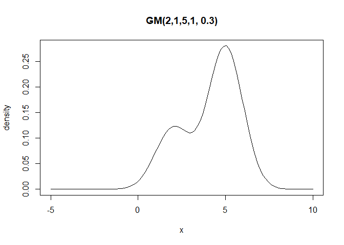
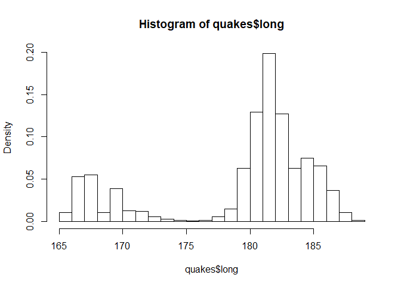
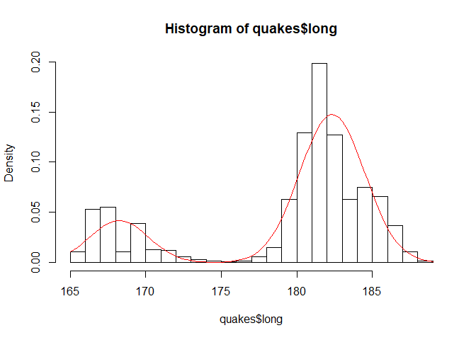
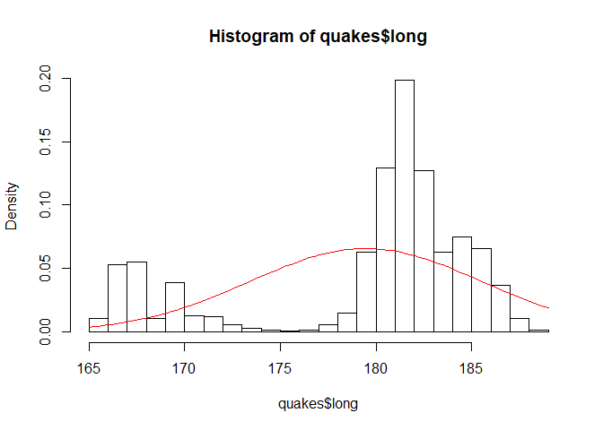
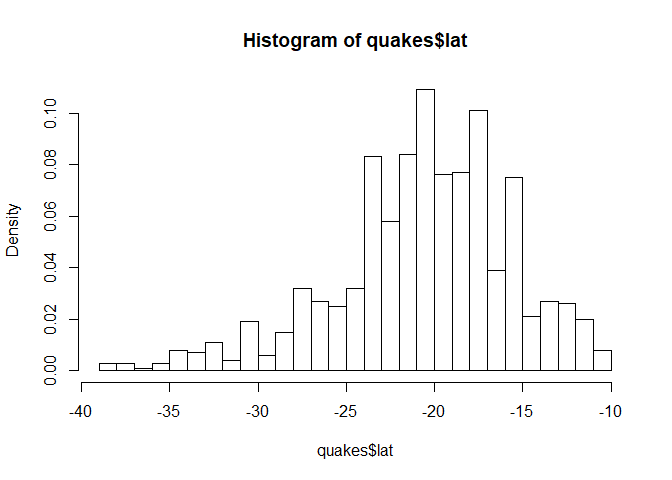
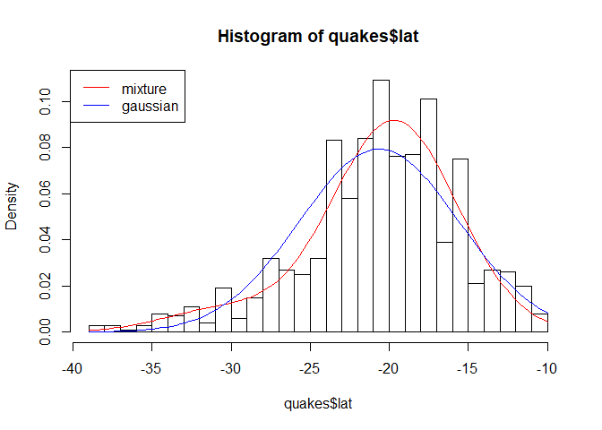
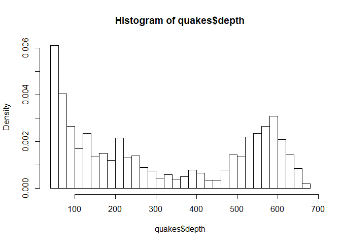
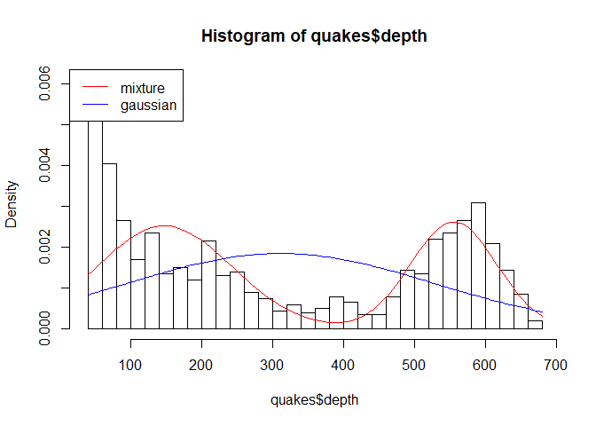

Practice 2 (partially completed)
================

# Problem 1

## Ex 1.1 Compute the mean tooth length for all six combinations of supplement types and levels. Also provide the standard error of the mean for each situation.

``` r
head(ToothGrowth)
```

    ##    len supp dose
    ## 1  4.2   VC  0.5
    ## 2 11.5   VC  0.5
    ## 3  7.3   VC  0.5
    ## 4  5.8   VC  0.5
    ## 5  6.4   VC  0.5
    ## 6 10.0   VC  0.5

``` r
ToothGrowth$dose <- as.factor(ToothGrowth$dose)

dose_0.5 <- ToothGrowth$dose == 0.5
dose_1.0 <- ToothGrowth$dose == 1.0
dose_2.0 <- ToothGrowth$dose == 2.0

supp_vc <- ToothGrowth$supp == "VC"
supp_oj <- ToothGrowth$supp == "OJ"

# supp VC
supp_0.5vc <- supp_vc & dose_0.5
supp_1.0vc <- supp_vc & dose_1.0
supp_2.0vc <- supp_vc & dose_2.0
# supp OJ
supp_0.5oj <- supp_oj & dose_0.5
supp_1.0oj <- supp_oj & dose_1.0
supp_2.0oj <- supp_oj & dose_2.0

# Split the dataframes
supp_0.5vc_df <- ToothGrowth[supp_0.5vc,]
supp_1.0vc_df <- ToothGrowth[supp_1.0vc,]
supp_2.0vc_df <- ToothGrowth[supp_2.0vc,]

supp_0.5oj_df <- ToothGrowth[supp_0.5oj,]
supp_1.0oj_df <- ToothGrowth[supp_1.0oj,]
supp_2.0oj_df <- ToothGrowth[supp_2.0oj,]

# list of df
list.df <- list(supp_0.5vc_df, supp_1.0vc_df, supp_2.0vc_df, 
             supp_0.5oj_df, supp_1.0oj_df, supp_2.0oj_df)
# get mean
mean.len <- sapply(list.df, function(x) mean(x$len))
# get se mean              # standard error of the mean = standard deviation of len / sqrt (n.data)
sd.len <- sapply(list.df, function(x) sd(x$len) / sqrt(nrow(x)))

data.frame(combinations = c("0.5 VC", "1 VC", "2 VC", 
                            "0.5 OJ", "1 OJ", "2 OJ"), 
           mean_len = mean.len, 
           mean_se = sd.len)
```

    ##   combinations mean_len   mean_se
    ## 1       0.5 VC     7.98 0.8685620
    ## 2         1 VC    16.77 0.7954104
    ## 3         2 VC    26.14 1.5171757
    ## 4       0.5 OJ    13.23 1.4102837
    ## 5         1 OJ    22.70 1.2367520
    ## 6         2 OJ    26.06 0.8396031

``` r
# or from Gherardo solution
combinations <- expand.grid(supp = levels(ToothGrowth$supp), dose = levels(ToothGrowth$dose))

temp <- apply(combinations, MARGIN = 1, function(x){ 
  ix <- ToothGrowth$supp == x[1] & ToothGrowth$dose == x[2]
return( c(mean = mean(ToothGrowth[ix, 1]), se = sd(ToothGrowth[ix, 1]) / sqrt(sum(ix) )))
} )

means <- cbind(combinations, t(temp) )
means
```

    ##   supp dose  mean        se
    ## 1   OJ  0.5 13.23 1.4102837
    ## 2   VC  0.5  7.98 0.8685620
    ## 3   OJ    1 22.70 1.2367520
    ## 4   VC    1 16.77 0.7954104
    ## 5   OJ    2 26.06 0.8396031
    ## 6   VC    2 26.14 1.5171757

# Ex 1.2 We will investigate whether different dose levels have the same effect. Perform 0.05-level two sample t-tests with unequal variances to check whether to reject the following null hypotheses, and explain the result for each hypothesis:

``` r
t.test(supp_0.5oj_df$len, supp_1.0oj_df$len, var.equal = FALSE)
```

    ## 
    ##  Welch Two Sample t-test
    ## 
    ## data:  supp_0.5oj_df$len and supp_1.0oj_df$len
    ## t = -5.0486, df = 17.698, p-value = 8.785e-05
    ## alternative hypothesis: true difference in means is not equal to 0
    ## 95 percent confidence interval:
    ##  -13.415634  -5.524366
    ## sample estimates:
    ## mean of x mean of y 
    ##     13.23     22.70

``` r
# or from gherardo
t.test(x = ToothGrowth[ToothGrowth$supp == "OJ" & ToothGrowth$dose == "0.5", 1],
y = ToothGrowth[ToothGrowth$supp == "OJ" & ToothGrowth$dose == "1", 1], var.equal = FALSE )
```

    ## 
    ##  Welch Two Sample t-test
    ## 
    ## data:  ToothGrowth[ToothGrowth$supp == "OJ" & ToothGrowth$dose == "0.5",  and ToothGrowth[ToothGrowth$supp == "OJ" & ToothGrowth$dose == "1",     1] and     1]
    ## t = -5.0486, df = 17.698, p-value = 8.785e-05
    ## alternative hypothesis: true difference in means is not equal to 0
    ## 95 percent confidence interval:
    ##  -13.415634  -5.524366
    ## sample estimates:
    ## mean of x mean of y 
    ##     13.23     22.70

# Problem 3

## Ex 3.1 Implement an R function for the PDF of the Gaussian mixture distribution, Plot the PDF of GM(2,1,5,1,0.3).

``` r
dgaussmix <- function(x, mean1, sd1, mean2, sd2, w){
  stopifnot(w <= 1 && w >= 0)
  stopifnot(sd1 > 0 && sd2 > 0)
  w * dnorm(x, mean1, sd1) + (1 - w) * dnorm(x, mean2, sd2)
}
curve(dgaussmix(x, 2, 1, 5, 1, 0.3), from = -5, to = 10, main = "GM(2,1,5,1, 0.3)", ylab = "density")
```

<!-- -->

## Ex 3.2 Estimate the five parameters of the Gaussian mixture using the 1000 observed longitude values. You can done this numerically in R with the optim function. Plot the fitted Gaussian mixture on top of the histogram of the longitude data.

To obtain initial guess for the parameter of the Gaussian mixture for
the longitude locations we plot the histogram

``` r
hist(quakes$long, probability = TRUE, breaks = "FD")
```

<!-- -->

We can divide the longitude location observations in two groups, before
and after 175.

``` r
before <- quakes$long[quakes$long < 175]
after <- quakes$long[quakes$long > 175]
```

We can now consider the following initial estimate for the Gaussian
mixture:

``` r
m1.init <- mean(before)        # Or just look at the histogram and try to think what the values of
sd1.init <- sd(before)         # the parameters can be
m2.init <- mean(after)
sd2.init <- sd(after)
w.init <- length(before) / length(after)
par.init <- c(m1.init, sd1.init, m2.init, sd2.init, w.init)
par.init
```

    ## [1] 168.2598049   1.9746871 182.3506415   2.1433270   0.2578616

We define now the minus log-likelihood and then start the optimization

``` r
gaussmix_mll <- function(par, data){
  if (par[5] > 1 || par[5] < 0 ){
    return(Inf)                         # why return inf?
  }
  if (par[2] < 0 || par[4] < 0){
    return(Inf)
  }
  -sum(log(dgaussmix(x = data, mean1 = par[1], sd1 = par[2], 
              mean2 = par[3], sd2 = par[4], w = par[5])))
}
par.est_gaussmix <- optim(f = gaussmix_mll, par = par.init, data = quakes$long)$par
par.est_gaussmix
```

    ## [1] 168.236709   1.944461 182.340729   2.153245   0.204089

I plot the density with estimated parameters.

``` r
hist(quakes$long, probability = TRUE, breaks = "FD")
curve(dgaussmix(x, par.est_gaussmix[1], par.est_gaussmix[2], 
      par.est_gaussmix[3], par.est_gaussmix[4], par.est_gaussmix[5]), add = TRUE, col = "red")
```

<!-- -->

## Ex 3.3 Consider now another model where the longitude locations are i.i.d. Gaussian distributed.

``` r
# Methods of moments
mu = mean(quakes$long)
sigma = sd(quakes$long)

# Minus log likelihood
gauss_mll <- function(par, data){
  -sum(dnorm(x = data, mean = par[1], sd = par[2]))
} 

par.est_gauss <- optim(f = gauss_mll, par = c(mu, sigma),          # optim daesn't work in this the
                 data = quakes$long, control = list(maxit = 10000))# pars estimated by moments m.
```

    ## Warning in dnorm(x = data, mean = par[1], sd = par[2]): NaNs produced
    
    ## Warning in dnorm(x = data, mean = par[1], sd = par[2]): NaNs produced
    
    ## Warning in dnorm(x = data, mean = par[1], sd = par[2]): NaNs produced
    
    ## Warning in dnorm(x = data, mean = par[1], sd = par[2]): NaNs produced
    
    ## Warning in dnorm(x = data, mean = par[1], sd = par[2]): NaNs produced
    
    ## Warning in dnorm(x = data, mean = par[1], sd = par[2]): NaNs produced
    
    ## Warning in dnorm(x = data, mean = par[1], sd = par[2]): NaNs produced
    
    ## Warning in dnorm(x = data, mean = par[1], sd = par[2]): NaNs produced
    
    ## Warning in dnorm(x = data, mean = par[1], sd = par[2]): NaNs produced
    
    ## Warning in dnorm(x = data, mean = par[1], sd = par[2]): NaNs produced
    
    ## Warning in dnorm(x = data, mean = par[1], sd = par[2]): NaNs produced
    
    ## Warning in dnorm(x = data, mean = par[1], sd = par[2]): NaNs produced
    
    ## Warning in dnorm(x = data, mean = par[1], sd = par[2]): NaNs produced
    
    ## Warning in dnorm(x = data, mean = par[1], sd = par[2]): NaNs produced
    
    ## Warning in dnorm(x = data, mean = par[1], sd = par[2]): NaNs produced
    
    ## Warning in dnorm(x = data, mean = par[1], sd = par[2]): NaNs produced
    
    ## Warning in dnorm(x = data, mean = par[1], sd = par[2]): NaNs produced
    
    ## Warning in dnorm(x = data, mean = par[1], sd = par[2]): NaNs produced
    
    ## Warning in dnorm(x = data, mean = par[1], sd = par[2]): NaNs produced
    
    ## Warning in dnorm(x = data, mean = par[1], sd = par[2]): NaNs produced
    
    ## Warning in dnorm(x = data, mean = par[1], sd = par[2]): NaNs produced
    
    ## Warning in dnorm(x = data, mean = par[1], sd = par[2]): NaNs produced
    
    ## Warning in dnorm(x = data, mean = par[1], sd = par[2]): NaNs produced
    
    ## Warning in dnorm(x = data, mean = par[1], sd = par[2]): NaNs produced
    
    ## Warning in dnorm(x = data, mean = par[1], sd = par[2]): NaNs produced
    
    ## Warning in dnorm(x = data, mean = par[1], sd = par[2]): NaNs produced
    
    ## Warning in dnorm(x = data, mean = par[1], sd = par[2]): NaNs produced
    
    ## Warning in dnorm(x = data, mean = par[1], sd = par[2]): NaNs produced
    
    ## Warning in dnorm(x = data, mean = par[1], sd = par[2]): NaNs produced
    
    ## Warning in dnorm(x = data, mean = par[1], sd = par[2]): NaNs produced
    
    ## Warning in dnorm(x = data, mean = par[1], sd = par[2]): NaNs produced
    
    ## Warning in dnorm(x = data, mean = par[1], sd = par[2]): NaNs produced
    
    ## Warning in dnorm(x = data, mean = par[1], sd = par[2]): NaNs produced
    
    ## Warning in dnorm(x = data, mean = par[1], sd = par[2]): NaNs produced
    
    ## Warning in dnorm(x = data, mean = par[1], sd = par[2]): NaNs produced
    
    ## Warning in dnorm(x = data, mean = par[1], sd = par[2]): NaNs produced
    
    ## Warning in dnorm(x = data, mean = par[1], sd = par[2]): NaNs produced
    
    ## Warning in dnorm(x = data, mean = par[1], sd = par[2]): NaNs produced
    
    ## Warning in dnorm(x = data, mean = par[1], sd = par[2]): NaNs produced
    
    ## Warning in dnorm(x = data, mean = par[1], sd = par[2]): NaNs produced
    
    ## Warning in dnorm(x = data, mean = par[1], sd = par[2]): NaNs produced
    
    ## Warning in dnorm(x = data, mean = par[1], sd = par[2]): NaNs produced
    
    ## Warning in dnorm(x = data, mean = par[1], sd = par[2]): NaNs produced
    
    ## Warning in dnorm(x = data, mean = par[1], sd = par[2]): NaNs produced
    
    ## Warning in dnorm(x = data, mean = par[1], sd = par[2]): NaNs produced
    
    ## Warning in dnorm(x = data, mean = par[1], sd = par[2]): NaNs produced
    
    ## Warning in dnorm(x = data, mean = par[1], sd = par[2]): NaNs produced
    
    ## Warning in dnorm(x = data, mean = par[1], sd = par[2]): NaNs produced
    
    ## Warning in dnorm(x = data, mean = par[1], sd = par[2]): NaNs produced
    
    ## Warning in dnorm(x = data, mean = par[1], sd = par[2]): NaNs produced
    
    ## Warning in dnorm(x = data, mean = par[1], sd = par[2]): NaNs produced
    
    ## Warning in dnorm(x = data, mean = par[1], sd = par[2]): NaNs produced
    
    ## Warning in dnorm(x = data, mean = par[1], sd = par[2]): NaNs produced
    
    ## Warning in dnorm(x = data, mean = par[1], sd = par[2]): NaNs produced
    
    ## Warning in dnorm(x = data, mean = par[1], sd = par[2]): NaNs produced
    
    ## Warning in dnorm(x = data, mean = par[1], sd = par[2]): NaNs produced
    
    ## Warning in dnorm(x = data, mean = par[1], sd = par[2]): NaNs produced
    
    ## Warning in dnorm(x = data, mean = par[1], sd = par[2]): NaNs produced
    
    ## Warning in dnorm(x = data, mean = par[1], sd = par[2]): NaNs produced
    
    ## Warning in dnorm(x = data, mean = par[1], sd = par[2]): NaNs produced
    
    ## Warning in dnorm(x = data, mean = par[1], sd = par[2]): NaNs produced
    
    ## Warning in dnorm(x = data, mean = par[1], sd = par[2]): NaNs produced
    
    ## Warning in dnorm(x = data, mean = par[1], sd = par[2]): NaNs produced
    
    ## Warning in dnorm(x = data, mean = par[1], sd = par[2]): NaNs produced
    
    ## Warning in dnorm(x = data, mean = par[1], sd = par[2]): NaNs produced
    
    ## Warning in dnorm(x = data, mean = par[1], sd = par[2]): NaNs produced
    
    ## Warning in dnorm(x = data, mean = par[1], sd = par[2]): NaNs produced
    
    ## Warning in dnorm(x = data, mean = par[1], sd = par[2]): NaNs produced
    
    ## Warning in dnorm(x = data, mean = par[1], sd = par[2]): NaNs produced
    
    ## Warning in dnorm(x = data, mean = par[1], sd = par[2]): NaNs produced
    
    ## Warning in dnorm(x = data, mean = par[1], sd = par[2]): NaNs produced
    
    ## Warning in dnorm(x = data, mean = par[1], sd = par[2]): NaNs produced
    
    ## Warning in dnorm(x = data, mean = par[1], sd = par[2]): NaNs produced

``` r
hist(quakes$long, probability = TRUE, breaks = "FD")
curve(dnorm(x, mean = mu, sd = sigma), add = TRUE, col = "red")
```

<!-- -->

## Ex 3.4 Compute the AIC and BIC values for the simple Gaussian model and the Gaussian mixture model for the longitude data. Which model should be selected?

``` r
mll.mixture <- gaussmix_mll(data = quakes$long, par = par.est_gaussmix)
mll.gauss <- (-sum(dnorm(x = quakes$long, mean = mu, sd = sigma, log = TRUE)))

# AIC
aic.mixture <- 2 * mll.mixture + 2 * length(par.est_gaussmix)
aic.gauss <- 2 * mll.gauss + 2 * 2
c(aic.mixture, aic.gauss)
```

    ## [1] 5349.808 6447.428

``` r
# BIC
n <- nrow(quakes)
bic.mixture <- 2 * mll.mixture + length(par.est_gaussmix) * log(n)
bic.gauss <- 2 * mll.gauss + 2 * log(n)
c(mixture = bic.mixture, gauss = bic.gauss)
```

    ##  mixture    gauss 
    ## 5374.347 6457.244

BIC and AIC scores indicates that the mixture model should be
selected.

## Ex 3.5 Repeat the above fitting procedure for the latitude and the depth data, and perform as usual model selection using AIC and BIC, which model should be used?

### Latitude data fit

``` r
hist(quakes$lat, probability = TRUE, breaks = "FD")
```

<!-- -->

``` r
# Parameters mixture
par.lat <- optim(par = c(-32, 7, -20, 7, 0.5), fn = gaussmix_mll, data = quakes$lat)$par

# Parameters gauss
mu.lat <- mean(quakes$lat)
sigma.lat <- sd(quakes$lat)

hist(quakes$lat, probability = TRUE, breaks = "FD")
curve(dgaussmix(x, par.lat[1], par.lat[2], par.lat[3], par.lat[4], par.lat[5]), 
                add = TRUE, col = "red")
curve(dnorm(x, mean = mu.lat, sd = sigma.lat), col = "blue", add = TRUE)
legend("topleft", legend = c("mixture", "gaussian"), col = c("red", "blue"), lty = 1)
```

<!-- -->

``` r
mll.mixture = gaussmix_mll(par.lat, data = quakes$lat)
mll.gauss = -sum(dnorm(quakes$lat, mu.lat, sigma.lat, log = TRUE))

# AIC
aic.mixture <- 2 * mll.mixture + 2 * length(par.lat)
aic.gauss <- 2 * mll.gauss + 2 * 2
c(mixture = aic.mixture, gauss = aic.gauss)
```

    ##  mixture    gauss 
    ## 5995.310 6071.236

``` r
# BIC
n = nrow(quakes)
bic.mixture <- 2 * mll.mixture + length(par.lat) * log(n)
bic.gauss <- 2 * mll.gauss + 2 * log(n)
c(mixture = bic.mixture, gauss = bic.gauss)
```

    ##  mixture    gauss 
    ## 6019.848 6081.052

The mixture model is to prefer (AIC and BIC).

### Latitude data fit

``` r
hist(quakes$depth, probability = TRUE, breaks = 30)
```

<!-- -->

``` r
# Parameters mixture
par.depth <- optim(par = c(110, 100, 600, 100, 0.5), fn = gaussmix_mll, data = quakes$depth)$par

# Parameters gauss
mu.depth <- mean(quakes$depth)
sigma.depth <- sd(quakes$depth)

hist(quakes$depth, probability = TRUE, breaks = 30)
curve(dgaussmix(x, par.depth[1], par.depth[2], par.depth[3], par.depth[4], par.depth[5]), 
                add = TRUE, col = "red")
curve(dnorm(x, mean = mu.depth, sd = sigma.depth), col = "blue", add = TRUE)
legend("topleft", legend = c("mixture", "gaussian"), col = c("red", "blue"), lty = 1)
```

<!-- -->

``` r
mll.mixture = gaussmix_mll(par.depth, data = quakes$depth)
mll.gauss = -sum(dnorm(quakes$depth, mu.depth, sigma.depth, log = TRUE))

# AIC
aic.mixture <- 2 * mll.mixture + 2 * length(par.depth)
aic.gauss <- 2 * mll.gauss + 2 * 2
c(mixture = aic.mixture, gauss = aic.gauss)
```

    ##  mixture    gauss 
    ## 12903.48 13587.13

``` r
# BIC
n = nrow(quakes)
bic.mixture <- 2 * mll.mixture + length(par.lat) * log(n)
bic.gauss <- 2 * mll.gauss + 2 * log(n)
c(mixture = bic.mixture, gauss = bic.gauss)
```

    ##  mixture    gauss 
    ## 12928.02 13596.94

## 3.6 In this question we consider a generalized linear model with the log link and stations follows a Gaussian distribution.

``` r
fit1 <- glm(stations ~ ., data = quakes, family = gaussian(link = "log"))
summary(fit1)
```

    ## 
    ## Call:
    ## glm(formula = stations ~ ., family = gaussian(link = "log"), 
    ##     data = quakes)
    ## 
    ## Deviance Residuals: 
    ##     Min       1Q   Median       3Q      Max  
    ## -67.512   -6.380   -1.474    4.391   46.943  
    ## 
    ## Coefficients:
    ##               Estimate Std. Error t value Pr(>|t|)    
    ## (Intercept) -4.2425771  0.2908656 -14.586  < 2e-16 ***
    ## lat          0.0079305  0.0018178   4.363 1.42e-05 ***
    ## long         0.0140097  0.0014976   9.355  < 2e-16 ***
    ## depth        0.0002845  0.0000392   7.257 7.94e-13 ***
    ## mag          1.1290611  0.0170562  66.197  < 2e-16 ***
    ## ---
    ## Signif. codes:  0 '***' 0.001 '**' 0.01 '*' 0.05 '.' 0.1 ' ' 1
    ## 
    ## (Dispersion parameter for gaussian family taken to be 107.1978)
    ## 
    ##     Null deviance: 479147  on 999  degrees of freedom
    ## Residual deviance: 106661  on 995  degrees of freedom
    ## AIC: 7519.5
    ## 
    ## Number of Fisher Scoring iterations: 5

``` r
fit2 <- glm(stations ~ . + I(mag^2), data = quakes, family = gaussian(link = "log"))
summary(fit2)
```

    ## 
    ## Call:
    ## glm(formula = stations ~ . + I(mag^2), family = gaussian(link = "log"), 
    ##     data = quakes)
    ## 
    ## Deviance Residuals: 
    ##     Min       1Q   Median       3Q      Max  
    ## -43.310   -5.327   -0.270    5.469   42.920  
    ## 
    ## Coefficients:
    ##               Estimate Std. Error t value Pr(>|t|)    
    ## (Intercept) -1.159e+01  7.478e-01 -15.501  < 2e-16 ***
    ## lat          9.271e-03  1.693e-03   5.475 5.53e-08 ***
    ## long         1.098e-02  1.391e-03   7.893 7.79e-15 ***
    ## depth        2.904e-04  3.628e-05   8.005 3.33e-15 ***
    ## mag          4.233e+00  2.891e-01  14.642  < 2e-16 ***
    ## I(mag^2)    -3.013e-01  2.811e-02 -10.716  < 2e-16 ***
    ## ---
    ## Signif. codes:  0 '***' 0.001 '**' 0.01 '*' 0.05 '.' 0.1 ' ' 1
    ## 
    ## (Dispersion parameter for gaussian family taken to be 94.54226)
    ## 
    ##     Null deviance: 479147  on 999  degrees of freedom
    ## Residual deviance:  93974  on 994  degrees of freedom
    ## AIC: 7394.9
    ## 
    ## Number of Fisher Scoring iterations: 5

``` r
fit3 <- glm(stations ~ . + I(mag^2), data = quakes, family = gaussian(link = "log"))
summary(fit2)
```

    ## 
    ## Call:
    ## glm(formula = stations ~ . + I(mag^2), family = gaussian(link = "log"), 
    ##     data = quakes)
    ## 
    ## Deviance Residuals: 
    ##     Min       1Q   Median       3Q      Max  
    ## -43.310   -5.327   -0.270    5.469   42.920  
    ## 
    ## Coefficients:
    ##               Estimate Std. Error t value Pr(>|t|)    
    ## (Intercept) -1.159e+01  7.478e-01 -15.501  < 2e-16 ***
    ## lat          9.271e-03  1.693e-03   5.475 5.53e-08 ***
    ## long         1.098e-02  1.391e-03   7.893 7.79e-15 ***
    ## depth        2.904e-04  3.628e-05   8.005 3.33e-15 ***
    ## mag          4.233e+00  2.891e-01  14.642  < 2e-16 ***
    ## I(mag^2)    -3.013e-01  2.811e-02 -10.716  < 2e-16 ***
    ## ---
    ## Signif. codes:  0 '***' 0.001 '**' 0.01 '*' 0.05 '.' 0.1 ' ' 1
    ## 
    ## (Dispersion parameter for gaussian family taken to be 94.54226)
    ## 
    ##     Null deviance: 479147  on 999  degrees of freedom
    ## Residual deviance:  93974  on 994  degrees of freedom
    ## AIC: 7394.9
    ## 
    ## Number of Fisher Scoring iterations: 5

``` r
fit3 <- glm(stations ~ lat + long + depth + exp(mag) + 
              I(exp(mag)^2), data = quakes, family = gaussian(link = "log"))
summary(fit3)
```

    ## 
    ## Call:
    ## glm(formula = stations ~ lat + long + depth + exp(mag) + I(exp(mag)^2), 
    ##     family = gaussian(link = "log"), data = quakes)
    ## 
    ## Deviance Residuals: 
    ##     Min       1Q   Median       3Q      Max  
    ## -45.060   -6.508   -1.353    4.451   77.861  
    ## 
    ## Coefficients:
    ##                 Estimate Std. Error t value Pr(>|t|)    
    ## (Intercept)    6.818e-01  2.529e-01   2.696  0.00713 ** 
    ## lat            9.407e-03  1.768e-03   5.322 1.27e-07 ***
    ## long           8.423e-03  1.470e-03   5.731 1.32e-08 ***
    ## depth          2.534e-04  3.837e-05   6.605 6.48e-11 ***
    ## exp(mag)       1.465e-02  3.701e-04  39.577  < 2e-16 ***
    ## I(exp(mag)^2) -1.935e-05  8.130e-07 -23.796  < 2e-16 ***
    ## ---
    ## Signif. codes:  0 '***' 0.001 '**' 0.01 '*' 0.05 '.' 0.1 ' ' 1
    ## 
    ## (Dispersion parameter for gaussian family taken to be 104.8708)
    ## 
    ##     Null deviance: 479147  on 999  degrees of freedom
    ## Residual deviance: 104240  on 994  degrees of freedom
    ## AIC: 7498.6
    ## 
    ## Number of Fisher Scoring iterations: 11

## Ex 3.7 Perform the log likelihood ratio test selection between model 1 and model 2.

``` r
anova(fit1, fit2, test = "LRT")
```

    ## Analysis of Deviance Table
    ## 
    ## Model 1: stations ~ lat + long + depth + mag
    ## Model 2: stations ~ lat + long + depth + mag + I(mag^2)
    ##   Resid. Df Resid. Dev Df Deviance  Pr(>Chi)    
    ## 1       995     106661                          
    ## 2       994      93974  1    12688 < 2.2e-16 ***
    ## ---
    ## Signif. codes:  0 '***' 0.001 '**' 0.01 '*' 0.05 '.' 0.1 ' ' 1

The p-value is very small and we thus reject the null hypothesis
(e.g. at a level 0.0005) that the simpler model fit1 is
sufficient.

### Use instead AIC and BIC to perform model selection between model 1, model 2 and model 3.

``` r
models <- list(fit1 = fit1, fit2 = fit2, fit3 = fit3)
sapply(models, function(m){
  c(AIC = AIC(m), BIC = BIC(m))
})
```

    ##         fit1     fit2     fit3
    ## AIC 7519.536 7394.894 7498.570
    ## BIC 7548.983 7429.248 7532.924

``` r
AIC(fit1, fit2, fit3)
```

    ##      df      AIC
    ## fit1  6 7519.536
    ## fit2  7 7394.894
    ## fit3  7 7498.570

``` r
BIC(fit1, fit2, fit3)
```

    ##      df      BIC
    ## fit1  6 7548.983
    ## fit2  7 7429.248
    ## fit3  7 7532.924

Model 2 is selected by both AIC and BIC.

## 3.8 Fit the Poisson regression models with the log link function.

``` r
fit4 <- glm(stations ~ ., data = quakes, family = poisson(link = "log"))
summary(fit4)
```

    ## 
    ## Call:
    ## glm(formula = stations ~ ., family = poisson(link = "log"), data = quakes)
    ## 
    ## Deviance Residuals: 
    ##     Min       1Q   Median       3Q      Max  
    ## -7.3543  -1.1201  -0.1238   0.9457   5.9071  
    ## 
    ## Coefficients:
    ##               Estimate Std. Error z value Pr(>|z|)    
    ## (Intercept) -3.9057762  0.1848110 -21.134  < 2e-16 ***
    ## lat          0.0068245  0.0011614   5.876  4.2e-09 ***
    ## long         0.0098097  0.0009717  10.095  < 2e-16 ***
    ## depth        0.0002722  0.0000257  10.591  < 2e-16 ***
    ## mag          1.2088383  0.0118700 101.840  < 2e-16 ***
    ## ---
    ## Signif. codes:  0 '***' 0.001 '**' 0.01 '*' 0.05 '.' 0.1 ' ' 1
    ## 
    ## (Dispersion parameter for poisson family taken to be 1)
    ## 
    ##     Null deviance: 12198.5  on 999  degrees of freedom
    ## Residual deviance:  2764.3  on 995  degrees of freedom
    ## AIC: 7950.4
    ## 
    ## Number of Fisher Scoring iterations: 4

``` r
fit5 <- glm(stations ~ . + I(mag^2), data = quakes, 
            family = poisson(link = "log"))
summary(fit5)
```

    ## 
    ## Call:
    ## glm(formula = stations ~ . + I(mag^2), family = poisson(link = "log"), 
    ##     data = quakes)
    ## 
    ## Deviance Residuals: 
    ##     Min       1Q   Median       3Q      Max  
    ## -6.6110  -1.0989  -0.0992   0.9355   5.9666  
    ## 
    ## Coefficients:
    ##               Estimate Std. Error z value Pr(>|z|)    
    ## (Intercept) -8.774e+00  5.158e-01 -17.011  < 2e-16 ***
    ## lat          7.597e-03  1.163e-03   6.529 6.61e-11 ***
    ## long         9.576e-03  9.686e-04   9.887  < 2e-16 ***
    ## depth        2.868e-04  2.565e-05  11.180  < 2e-16 ***
    ## mag          3.209e+00  1.979e-01  16.216  < 2e-16 ***
    ## I(mag^2)    -2.014e-01  1.991e-02 -10.113  < 2e-16 ***
    ## ---
    ## Signif. codes:  0 '***' 0.001 '**' 0.01 '*' 0.05 '.' 0.1 ' ' 1
    ## 
    ## (Dispersion parameter for poisson family taken to be 1)
    ## 
    ##     Null deviance: 12198.5  on 999  degrees of freedom
    ## Residual deviance:  2657.2  on 994  degrees of freedom
    ## AIC: 7845.3
    ## 
    ## Number of Fisher Scoring iterations: 4

``` r
fit6 <- glm(stations ~ lat + long + depth + exp(mag) + I(exp(mag)^2), 
            data = quakes, family = poisson(link = "log"))
summary(fit6)
```

    ## 
    ## Call:
    ## glm(formula = stations ~ lat + long + depth + exp(mag) + I(exp(mag)^2), 
    ##     family = poisson(link = "log"), data = quakes)
    ## 
    ## Deviance Residuals: 
    ##     Min       1Q   Median       3Q      Max  
    ## -7.0498  -1.2112  -0.1699   0.8832   8.6805  
    ## 
    ## Coefficients:
    ##                 Estimate Std. Error z value Pr(>|z|)    
    ## (Intercept)    8.342e-01  1.675e-01   4.980 6.36e-07 ***
    ## lat            6.868e-03  1.157e-03   5.938 2.88e-09 ***
    ## long           6.846e-03  9.692e-04   7.064 1.62e-12 ***
    ## depth          2.497e-04  2.567e-05   9.727  < 2e-16 ***
    ## exp(mag)       1.523e-02  2.403e-04  63.390  < 2e-16 ***
    ## I(exp(mag)^2) -1.981e-05  5.629e-07 -35.187  < 2e-16 ***
    ## ---
    ## Signif. codes:  0 '***' 0.001 '**' 0.01 '*' 0.05 '.' 0.1 ' ' 1
    ## 
    ## (Dispersion parameter for poisson family taken to be 1)
    ## 
    ##     Null deviance: 12198.5  on 999  degrees of freedom
    ## Residual deviance:  2818.3  on 994  degrees of freedom
    ## AIC: 8006.4
    ## 
    ## Number of Fisher Scoring iterations: 4

Perform model selection between model 4 and model 5 using the anova
function. Perform model selection between the three Poisson regression
models using AIC and BIC.

``` r
anova(fit4, fit5, test = "LRT")
```

    ## Analysis of Deviance Table
    ## 
    ## Model 1: stations ~ lat + long + depth + mag
    ## Model 2: stations ~ lat + long + depth + mag + I(mag^2)
    ##   Resid. Df Resid. Dev Df Deviance  Pr(>Chi)    
    ## 1       995     2764.3                          
    ## 2       994     2657.2  1   107.05 < 2.2e-16 ***
    ## ---
    ## Signif. codes:  0 '***' 0.001 '**' 0.01 '*' 0.05 '.' 0.1 ' ' 1

``` r
models <- list(fit4 = fit4, fit5 = fit5, fit6 = fit6) 
sapply(models, function(m){
  c(AIC = AIC(m), BIC = BIC(m))
})
```

    ##         fit4     fit5     fit6
    ## AIC 7950.386 7845.340 8006.409
    ## BIC 7974.925 7874.787 8035.855

Model 5 (fit5) is selected by both AIC and
BIC.

``` r
fit7 <- glm(stations ~ . + I(mag^2), data = quakes, family = Gamma(link = "inverse" ))
summary(fit7)
```

    ## 
    ## Call:
    ## glm(formula = stations ~ . + I(mag^2), family = Gamma(link = "inverse"), 
    ##     data = quakes)
    ## 
    ## Deviance Residuals: 
    ##      Min        1Q    Median        3Q       Max  
    ## -1.09679  -0.22536  -0.02369   0.16825   1.03649  
    ## 
    ## Coefficients:
    ##               Estimate Std. Error t value Pr(>|t|)    
    ## (Intercept)  6.310e-01  2.573e-02  24.519  < 2e-16 ***
    ## lat         -1.483e-04  5.194e-05  -2.856 0.004384 ** 
    ## long        -1.517e-04  4.290e-05  -3.536 0.000425 ***
    ## depth       -5.664e-06  1.101e-06  -5.144 3.24e-07 ***
    ## mag         -2.038e-01  9.891e-03 -20.603  < 2e-16 ***
    ## I(mag^2)     1.740e-02  9.739e-04  17.865  < 2e-16 ***
    ## ---
    ## Signif. codes:  0 '***' 0.001 '**' 0.01 '*' 0.05 '.' 0.1 ' ' 1
    ## 
    ## (Dispersion parameter for Gamma family taken to be 0.0913272)
    ## 
    ##     Null deviance: 355.601  on 999  degrees of freedom
    ## Residual deviance:  92.448  on 994  degrees of freedom
    ## AIC: 7148.8
    ## 
    ## Number of Fisher Scoring iterations: 5

``` r
?family
```

    ## starting httpd help server ... done
